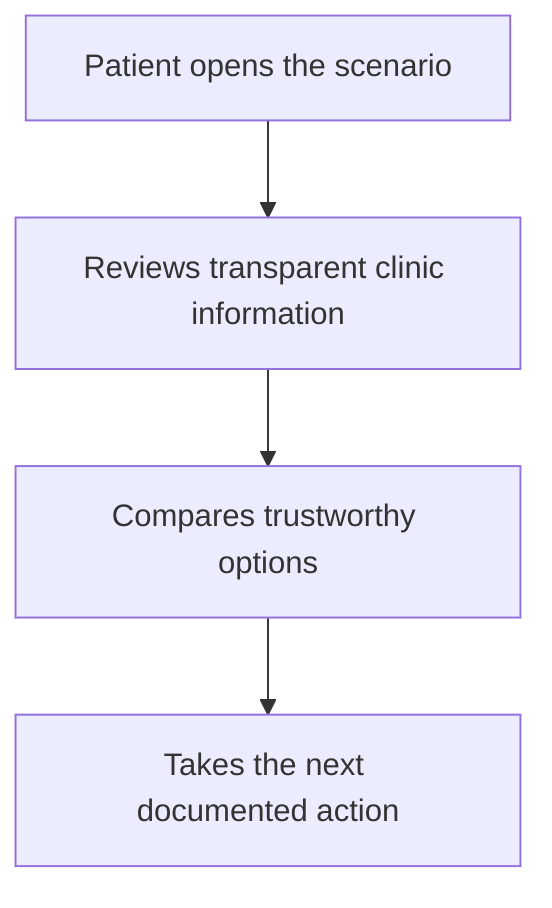

# Design Plan Contract

Use this contract for every `docs/roadmap/<topic-slug>/<scenario-slug>/README.md` created with the findmydoc design planner.

## Required Folder

```text
docs/roadmap/<topic-slug>/<scenario-slug>/
├── README.md
├── mobile.png
├── tablet.png
└── desktop.png
```

The image files must be final generated mockups copied into the scenario folder. Do not reference images that remain only under `$CODEX_HOME/generated_images`.

When meaningful runtime states exist, add separate state mockups beside the required primary files:

```text
docs/roadmap/<topic-slug>/<scenario-slug>/
├── mobile-empty.png
├── tablet-empty.png
├── desktop-empty.png
├── mobile-error.png
└── desktop-pending.png
```

Use only state files that are relevant to the scenario. Do not mix populated, empty, pending, or error states in the same mockup unless the UI genuinely renders them together.

## README Structure

### Executive Summary

State the scenario goal, patient problem, target patient decision, and expected trust/transparency outcome.

### Current State

List the current implementation facts that ground the plan:

- routes, components, collections, or docs inspected
- current UX behavior
- seed or fixture command used for data-driven screenshots, including success counts or the exact blocker
- limitations or missing capabilities
- authentication, account, or route-chrome state that affects visible UI
- reference screenshots used, if any
- Playwright or Storybook branding screenshots captured before image generation, including their paths under `output/playwright/`
- logo reference used, if the mockups show the findmydoc logo: `public/fmd-logo-1-dark.png`

### User Journey

Describe the patient journey from entry point to completed decision. Include:

- patient intent
- important decision moments
- trust-building moments
- failure or uncertainty states
- final outcome

### Mermaid Flow

Use a Mermaid diagram matching the written journey:



### Functional Requirements

Use requirement language:

- `Must`: required for implementation
- `Should`: expected unless explicitly descoped
- `Must not`: prohibited behavior
- `Out of scope`: not part of this scenario

### Visual Mockups

For each image, include:

| Mockup  | File          | Purpose | Functions shown | Notes |
| ------- | ------------- | ------- | --------------- | ----- |
| Mobile  | `mobile.png`  |         |                 |       |
| Tablet  | `tablet.png`  |         |                 |       |
| Desktop | `desktop.png` |         |                 |       |

If state-specific mockups exist, include them in the same table with explicit state names such as `Mobile empty` or `Desktop error`.

### State Coverage

Document which runtime states are covered visually and which are documented text-only:

| State     | Mobile evidence | Tablet evidence | Desktop evidence | Notes |
| --------- | --------------- | --------------- | ---------------- | ----- |
| Populated | `mobile.png`    | `tablet.png`    | `desktop.png`    |       |
| Empty     |                 |                 |                  |       |
| Pending   |                 |                 |                  |       |
| Error     |                 |                 |                  |       |

### Visible UI Contract

Every visible or implied feature must appear in this table:

| UI element | Patient value | Trust/transparency purpose | Data source | Component ownership | Allowed behavior |
| ---------- | ------------- | -------------------------- | ----------- | ------------------- | ---------------- |
|            |               |                            |             |                     |                  |

If a row cannot name a real source, write `Data Gap` and do not treat the element as implementable.

If the findmydoc logo is visible, include a row for it. The data source must be `public/fmd-logo-1-dark.png` for imagegen mockup reference and `public/fmd-logo-1-dark.svg` or the existing `Logo` component for implementation.

If global chrome appears, include rows for visible header navigation, account triggers, mobile menu triggers, footer elements, repeated CTAs, helper copy, and decorative or status icons. Mark reused chrome as reused and issue-owned UI as issue-owned so implementation does not accidentally add new navigation, auth, or account-dashboard scope.

### Data Model Plan

Document every required collection or data source:

| Collection/source | Needed fields | Relationship | Permissions | Provenance/freshness | Status |
| ----------------- | ------------- | ------------ | ----------- | -------------------- | ------ |
|                   |               |              |             |                      |        |

State whether this is supported by the current implementation, requires extending an existing collection, or requires a new collection.

### Component Plan

Map each feature to implementation ownership:

| Feature | Reuse/change/new | Candidate component or module | Notes |
| ------- | ---------------- | ----------------------------- | ----- |
|         |                  |                               |       |

### Differences From Current Implementation

Explain what each mockup intentionally changes from the current UI and why the change improves patient trust, transparency, or decision quality.

### Acceptance Criteria

Write concrete checks for implementation and QA. Include mobile, tablet, desktop, data source, and accessibility checks.

### Specialist Review Handoff

State which reviewers should run after implementation:

- `mobile_ui_reviewer`: required for responsive or touch behavior
- `accessibility_reviewer`: required for interactive controls, forms, dialogs, tabs, menus, or icon-only actions
- `security_reviewer`: required for auth, permissions, patient data, clinic data, API, hooks, or collection access changes
- `seo_reviewer`: required for public indexable routes, metadata, structured data, canonical behavior, or headings
- `web_vitals_reviewer`: required for image-heavy, animation-heavy, bundle, hydration, LCP, INP, or CLS-sensitive changes

### Assumptions and Data Gaps

List assumptions separately from facts. Every unresolved source, permission, freshness, or backend capability issue must be marked as `Data Gap`.
