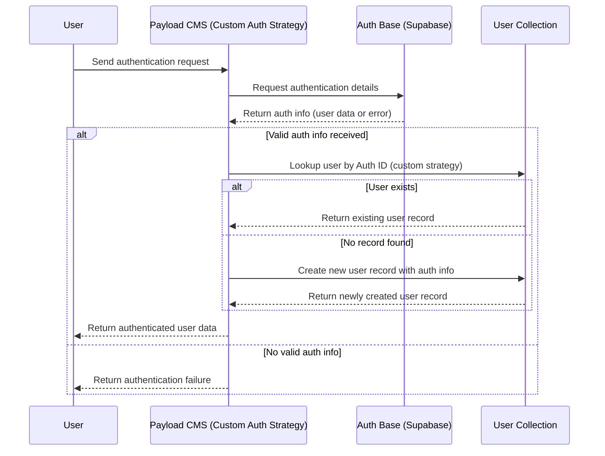

# ADR: Custom Authentication Strategy Integration with Supabase and Payload CMS

## Status (Table)

Name        | Content
------------|-------------------------------
Author      | Sebastian Schütze
Version     | 1.0
Date        | 02.04.2025
Status      | Approved

## Background

Our healthcare comparison platform leverages Payload CMS for content and user management, and Supabase as our external authentication provider. To ensure a consistent and secure authentication process, we integrate a custom authentication strategy directly into our user collections within Payload CMS.

*Terminology:*
- [**Payload CMS**](https://payloadcms.com/docs/getting-started/what-is-payload): Our headless CMS managing user and content data.
- [**Auth Base (Supabase)**](https://supabase.com/docs/guides/auth): The external system responsible for authentication and session management.
- [**Custom Auth Strategy**](https://payloadcms.com/docs/authentication/custom-strategies): A tailored approach within Payload CMS that uses Supabase for user authentication.

## Problem Description

We need a robust authentication mechanism that seamlessly combines the capabilities of Supabase and Payload CMS. The goal is to authenticate users through Supabase and manage their records centrally in a dedicated Payload CMS collection using our custom authentication strategy. Alternatives such as Payload's built-in authentication or other providers exist, but they do not offer the same level of integration and centralized user management required for our platform.

## Considerations

- **Payload CMS Built-in Authentication**:
  - *Pros*: Direct integration; minimal configuration.
  - *Cons*: Lacks advanced security features (e.g., MFA) and fine-grained control; not optimized for our scale.

- **External Providers (e.g., Firebase)**:
  - *Pros*: Robust security features; mature solutions.
  - *Cons*: Vendor lock-in; less seamless integration with our PostgreSQL-based user management.

- **Custom Auth Strategy using Supabase** (Chosen Option):
  - *Pros*: Leverages Supabase's secure authentication and session management, centralized user management via Payload CMS collections, and flexibility to extend to any user collection.
  - *Cons*: Increased initial setup and maintenance overhead.

This decision aligns with our previous ADRs, including the "[Authentication Provider for Payload CMS](002-adr-auth-provider-payloadcms-supabase-firebase.md)" and the "[Technology Stack for Web Development](001-adr-technology-stack-web-react-payloadcms.md)", ensuring consistency across our system.

## Decision with Rationale

We have decided to implement a custom authentication strategy embedded within a dedicated user collection in Payload CMS. This strategy uses Supabase for verifying user credentials and managing sessions. When a user authenticates, Payload CMS uses the custom strategy to:

- Retrieve authentication details from Supabase.
- Search the user collection for a matching record.
- Create a new record if none exists.

This approach provides centralized user management across all collections, improves security by leveraging Supabase’s authentication, and maintains consistency with our overall architecture.

### Authentication Sequence Diagram

## Technical Debt

- **Maintenance Overhead:** The custom authentication strategy adds complexity that must be maintained, especially when updating Payload CMS or Supabase.
- **Error Handling:** Robust error handling and logging must be implemented to manage synchronization between Supabase and Payload CMS.

## Risks

- **Service Dependency:** Relying on Supabase means our authentication is subject to its availability and performance.
- **Data Consistency:** Ensuring that user data remains consistent between the two systems requires diligent monitoring and periodic reviews.

## Deprecated

N/A

## Superseded by

N/A