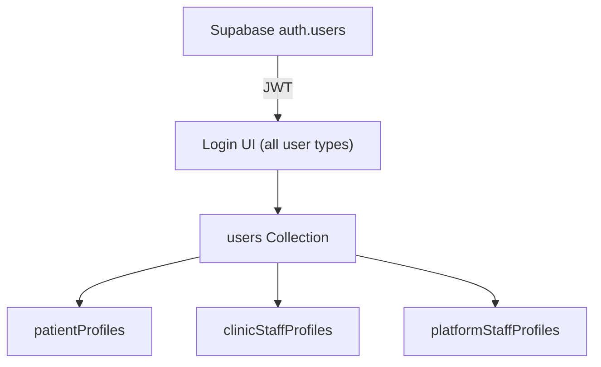
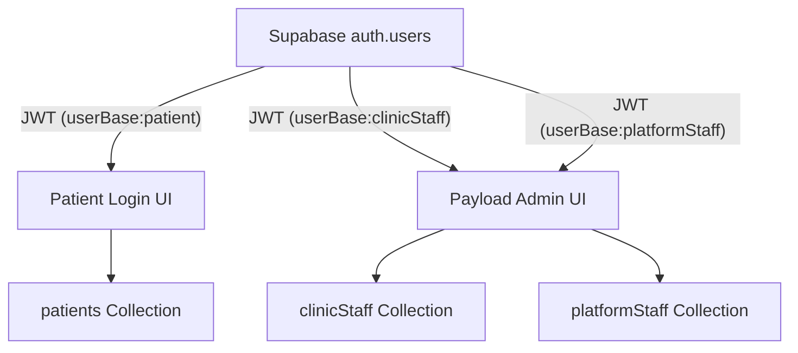
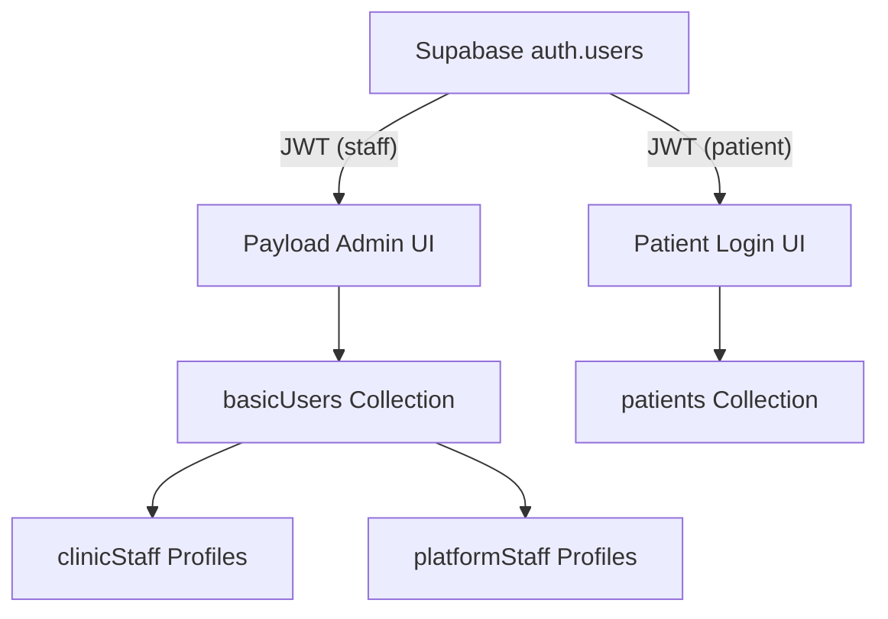

# ADR 006 – Multi-User Collection Architecture with Supabase Auth & Payload CMS

## Metadata

| Field       | Value             |
| ----------- | ----------------- |
| **Status**  | Accepted          |
| **Date**    | 20 May 2025       |
| **Version** | 2.1               |
| **Author**  | Sebastian Schütze |

---

## 1. Context

Our platform must securely manage three fundamentally different user bases:

* **Patients:** Use a custom login UI, interact only with their own profile/data, and never see the Payload Admin UI.
* **Clinic Owners (Clinic Staff):** Login via Payload Admin UI, manage their clinic data, but are not global admins.
* **Platform Staff:** Are global administrators, access the Payload Admin UI, and can manage all platform data and settings.

Strict user base separation is required:

* **No user can belong to more than one base/collection.**
* **Clinic Staff and Platform Staff both use the Admin UI, but have strictly separated permissions and never share accounts.**
* **Patients must have no access or visibility into the Admin UI.**

Authentication is managed by Supabase Auth. Authorization and business data are handled by Payload CMS, deployed with PostgreSQL.

**Key Technical Constraint:** PayloadCMS only allows one collection to be configured as the admin user collection (`admin.user` config). This means only users from that single collection can access the Payload Admin UI.

---

## 2. Decision

We will implement **Option D: Hybrid approach with single staff auth collection plus separate patients collection**:

* `basicUsers` (auth-enabled collection for both clinic and platform staff)
* `patients` (separate auth-enabled collection)
* `clinicStaff` (profile collection linked to basicUsers)
* `platformStaff` (profile collection linked to basicUsers)

**Rationale:**
The PayloadCMS technical constraint requires both clinic and platform staff to share the same auth collection to access the Admin UI. A hybrid approach provides the necessary admin access while maintaining patient separation and staff role clarity through profile collections.

**Access control in Payload ensures:**

* Patients can only access their own profile/data and never see the Admin UI.
* Clinic Staff can access the Admin UI, but only collections and data associated with their clinic/business context.
* Platform Staff have unrestricted access to all admin features.

---

## 3. Technical Implementation

**Supabase Auth:**

* All user registrations and logins occur via Supabase Auth.
* Each Payload user collection record includes a reference to its Supabase `user_id` to allow secure lookups.
* Staff users authenticate against `basicUsers` collection, patients against `patients` collection.

**Payload Configuration:**

```typescript
export default buildConfig({
  admin: {
    user: 'basicUsers', // Only staff can access admin UI
  },
  collections: [
    BasicUsers, // Auth-enabled for staff
    ClinicStaff, // Profile collection
    PlatformStaff, // Profile collection  
    Patients, // Auth-enabled, separate from admin UI
    // ...other collections
  ],
})
```

**Access Control:**

* All collection access in Payload is governed by the user's type and profile.
  * Patients: can only access their own profile/data.
  * Clinic Staff: can access/manage their own clinic data and any permitted B2B resources.
  * Platform Staff: full access (can view/edit all data).
* The Payload Admin UI only displays collections to users based on their permissions. Patients never see the Admin UI.

**Session Management:**

* Staff users are authenticated through `basicUsers` collection and access admin UI.
* Patients are authenticated through `patients` collection with separate UI.
* PayloadCMS manages authenticated sessions for both collections independently.

---

## 4. Alternatives Considered

### A. Single Auth Collection with Roles/Profiles

**Description:**
All users are stored in a single `users` collection (auth-enabled). Their type (`patient`, `clinicStaff`, `platformStaff`) is tracked via a `userType` or `role` field, and additional business data is stored either directly or in linked profile collections.

**Mermaid Diagram:**



**Pros:**

* Simple to implement; only one authentication/lookup flow.
* Built-in Payload Admin UI login and session logic works out of the box.
* Easier maintenance, fewer places to update code.

**Cons:**

* **No true physical separation** of user bases—logical only.
* Patients technically exist in the same user table as B2B and platform staff; any admin with full access could see all users.
* Enforcing per-type business logic and access requires very careful and sometimes complex access control logic (higher risk of security oversights).
* Unique constraints (e.g., email) apply globally.
* Any migration to stricter physical separation later will require downtime and effort.

---

### B. Single Auth Collection + Three Non-Auth Profile Collections

**Description:**
All users are in one `users` collection (auth-enabled), but each user has a one-to-one relation to a profile in a type-specific collection (e.g., `patientProfiles`, `clinicStaffProfiles`, `platformStaffProfiles`).

**Mermaid Diagram:**


**Pros:**

* Separation of business data schemas for each user type.
* Clean profile models for complex or diverging user group data.
* Still easy to manage login/session logic in Payload.

**Cons:**

* Still only **logical separation** of user bases at the authentication level.
* All users share the same authentication and appear in the same user list in Payload.
* Some risk of accidental overexposure remains.
* Slightly more complex to enforce profile creation and integrity.

---

### C. Three Auth-Enabled User Collections with JWT-Based Collection Routing

**Description:**
Each user group (patients, clinic staff, platform staff) has its own auth-enabled collection. Supabase issues a JWT with a custom claim indicating which collection to use. Payload's custom authentication strategy uses this claim to authenticate users and control access.

This can be implemented by [using Supabase Custom Claims with RBAC](https://supabase.com/docs/guides/database/postgres/custom-claims-and-role-based-access-control-rbac).

**Mermaid Diagram:**



**Pros:**

* **True physical and logical separation** of user bases at the collection level.
* Only users in the correct base can authenticate into their respective UI.
* Cleanest possible audit and compliance story.
* Admin UI access and permissions can be limited on a per-group basis with high confidence.
* Adding or removing user groups is straightforward and does not impact unrelated collections.

**Cons:**

* Custom implementation is required: Supabase Auth hooks, JWT claim logic, and Payload custom strategy.
* Slightly higher maintenance, especially around token lifecycle and cross-system user creation/deletion.
* **PayloadCMS constraint: Only one collection can be used for admin UI authentication.**
* Admins who need access to multiple user bases would require multiple accounts/browsers.

---

### D. Hybrid: Single Staff Auth Collection + Profile Collections + Separate Patients Collection (**Chosen**)

**Description:**
Staff users (clinic and platform) share a single auth-enabled collection (`basicUsers`) that provides Admin UI access. Each staff type has a separate profile collection (`clinicStaff`, `platformStaff`) linked to their `basicUsers` record. Patients are in a completely separate auth-enabled collection (`patients`) with no Admin UI access.

**Mermaid Diagram:**



**Pros:**

* **Leverages PayloadCMS Admin UI** for both staff types without custom development.
* **Complete patient isolation** - patients cannot access admin systems.
* **Clear role separation** through profile collections while maintaining unified admin access.
* **Reduced development time** - uses Payload's generated admin UI for staff management.
* **Supports different approval workflows** - clinic staff need approval, platform staff don't.
* **Maintainable** - minimal custom authentication code required.

**Cons:**

* **Shared staff authentication** - clinic and platform staff are not physically separated at auth level.
* **Access control complexity** - must implement careful logic to ensure staff can only access appropriate resources.
* **Profile relationship management** - requires maintaining links between users and profiles.

---

## 5. Rationale

**Motivation for the chosen architecture (D - Hybrid):**

**Primary Technical Constraint:**
PayloadCMS only allows one collection to authenticate as admin for the admin UI (`admin.user` config). Both clinic and platform staff need access to the admin UI, but separating them into completely different auth collections would mean only one staff type could use the admin UI, requiring significant custom UI development for the other.

**Key Decision Factors:**

1. **Admin UI Efficiency:** By using a single `basicUsers` collection for all staff authentication, both clinic and platform staff can leverage Payload's powerful generated admin UI, saving substantial development time and maintenance overhead.

2. **Patient Isolation:** Patients are kept in a completely separate `patients` collection with their own authentication, ensuring strict security separation from all staff systems and preventing any admin UI access.

3. **Role Clarity:** Profile collections (`clinicStaff`, `platformStaff`) provide clear business logic separation and role-specific data while maintaining unified admin access.

4. **Approval Workflows:** The hybrid approach supports different approval workflows - clinic staff require approval via their profile status, while platform staff have immediate access.

5. **Maintainability:** Minimal custom authentication code required, leveraging PayloadCMS native features wherever possible.

---

## 6. Consequences

**Positive:**
* **Reduced Development Time:** Both staff types can use the generated admin UI without custom development.
* **Strong Patient Isolation:** Patients cannot access admin systems and are completely separated.
* **Scalable:** Easy to add new staff types or modify existing ones through profile collections.
* **Maintainable:** Leverages PayloadCMS native features, reducing custom code maintenance.
* **Flexible Access Control:** Can implement granular permissions based on user type and profile data.

**Negative:**
* **Shared Staff Authentication:** Clinic and platform staff share the same authentication collection, providing less isolation than completely separate collections.
* **Access Control Complexity:** Must implement careful access control logic to ensure staff can only access appropriate resources.
* **Profile Management:** Requires maintaining relationships between users and their profiles.

**Mitigation Strategies:**
* Implement robust access control functions (`isClinicStaff`, `isPlatformStaff`) to enforce proper data isolation.
* Use collection-level access controls and field-level permissions to restrict data access.
* Implement approval workflows through profile status fields.
* Regular security audits to ensure access controls are working correctly.
