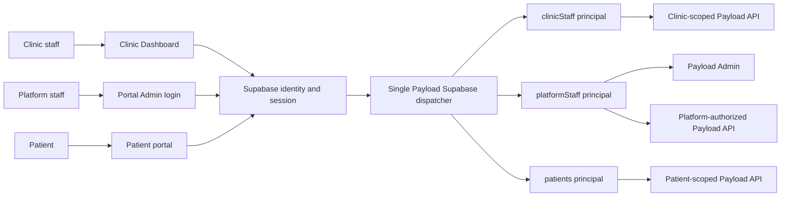
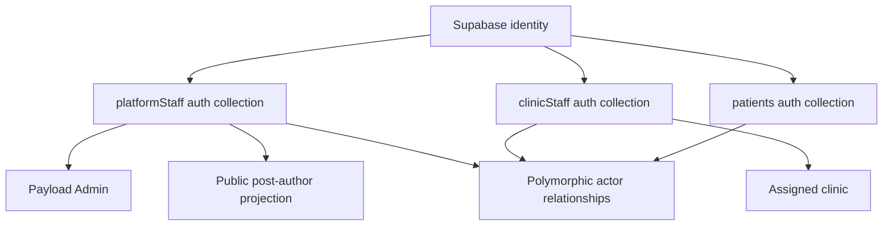

# ADR: Direct Staff Authentication Collections

## Status

| Name | Content |
| --- | --- |
| Author | Sebastian Schütze |
| Version | 1.0 |
| Date | 14.07.2026 |
| Status | accepted |

## Background

The platform serves three distinct authenticated user groups:

- **Platform staff** operate the Payload Admin interface and manage platform content and operational data.
- **Clinic staff** work in a standalone Clinic Dashboard and use the Payload API for clinic-scoped business actions.
- **Patients** use patient-facing portal surfaces and the Payload API for their own data.

Supabase owns user identity and browser session state. Payload validates Supabase identities, resolves them to business
records, and enforces authorization for Admin and API requests.

The previous staff architecture used one auth-enabled `basicUsers` collection for platform and clinic staff, with
separate `platformStaff` and `clinicStaff` profile collections. That structure existed because both staff groups were
expected to use Payload Admin, while Payload allows only one configured Admin user collection.

Clinic staff no longer use Payload Admin. Their only authenticated product surface is the standalone Clinic Dashboard.
The portal may expose one ordinary navigation link to that dashboard, but it does not render clinic login, invitation,
password-completion, password-reset, or account-management interfaces. Platform staff continue to sign in through the
Payload Admin entry point, and patient authentication and public clinic registration remain portal responsibilities.

The Payload backend still accepts authenticated API requests from the Clinic Dashboard. Separating the login interface
from the API boundary does not remove clinic authentication from Payload; it removes clinic access to Payload Admin and
the portal's clinic authentication UI.

## Problem Description

Keeping `basicUsers` after the clinic Admin requirement has disappeared creates an unnecessary indirection at every
security boundary:

- Supabase identities first resolve to `basicUsers` and then require a second profile lookup.
- Staff classification depends on a mutable `userType` field instead of the authenticated collection.
- Clinic authorization depends on a linked profile for approval and clinic assignment.
- Platform roles and platform email policy live apart from the authenticated record.
- Actor relationships point to the shared staff collection even when only one staff type is valid.
- Clinic identities remain structurally eligible for the shared Admin login path.

The target architecture needs physically separate staff principals, one unambiguous Admin user collection, direct
clinic authorization, and explicit actor relationships without introducing another identity registry.

## Considerations

### Keep `basicUsers` and the profile collections

This would minimize immediate schema change, but it would retain the indirection and the Admin-oriented assumption that
caused it. Authorization would continue to rely on `userType` plus profile lookups, and actor relationships would remain
less precise than the domain requires.

### Use one universal auth collection with roles

This would simplify token lookup but weaken physical separation between platform staff, clinic staff, and patients. It
would also make collection membership insufficient for authorization and expand the impact of a role-classification
mistake.

### Add an identity registry in front of direct auth collections

A central registry could enforce cross-collection identity uniqueness, but it would replace `basicUsers` with another
indirection and introduce a second lifecycle that has no independent business value. Supabase already supplies the
stable external identity.

### Use direct auth collections with one Supabase dispatcher

This keeps each principal in the collection that owns its authorization data. A single custom strategy validates the
Supabase identity and returns a collection-qualified Payload user. Collection membership selects the authorization
model, while current Payload fields determine permissions. This option is chosen.

## Decision with Rationale

### Login and application boundary

The Clinic Dashboard is the only clinic authentication interface. Clinic sign-in, sign-out, invitation completion,
password completion, password reset, and account lifecycle interfaces belong there.

The portal does not expose a clinic login form or clinic role selector. It may expose one plain link to the Clinic
Dashboard. That link performs no authentication, does not transfer a clinic session, and does not make the portal a
second clinic entry point.

The Payload Admin login remains available to platform staff. Patient login and public clinic registration remain
available through their existing portal surfaces.

The exact dashboard origin, browser token transport, and cross-origin request configuration are separate application
integration decisions. They do not change the identity and authorization model defined here.

### Direct auth collections

Payload uses these auth-enabled collections:

| Collection | Purpose | Payload Admin |
| --- | --- | --- |
| `platformStaff` | Platform operations and content administration | Allowed |
| `clinicStaff` | Clinic Dashboard and clinic-scoped API access | Denied |
| `patients` | Patient-facing API access | Denied |

`platformStaff` is the only configured Payload Admin user collection. Its Admin access function accepts a valid
platform principal. `clinicStaff` and `patients` deny Admin access even when Supabase authentication succeeds.

All three collections disable Payload's local password strategy and Payload-managed sessions. Supabase remains the
identity and session provider.

Payload executes the shared Supabase custom strategy as one dispatcher. The dispatcher:

1. validates the Supabase access token or session material;
2. reads the server-controlled `app_metadata.user_type` classification;
3. maps `platform`, `clinic`, or `patient` to exactly one Payload collection;
4. looks up the Payload record by `supabaseUserId` in that collection; and
5. returns the record with its collection slug as the authenticated principal.

The classification claim selects a collection only. It never grants a platform role, clinic assignment, approval
state, or record-level permission. Those values are read from the current Payload record for every authorized request.
Missing, invalid, or conflicting classifications fail closed. Authentication does not fall back to another collection.

One Supabase identity may exist in only one direct auth collection. Every record-creation path, including patient
ensure-on-auth, checks all three collections before creating or reclassifying an identity. Category changes are
explicit provisioning operations, not edits to a staff `userType` field.

### Collection fields

`platformStaff` directly owns:

- `stableId`
- `supabaseUserId`
- `email`
- `firstName`
- `lastName`
- `profileImage`
- `role`

Platform staff email addresses must use the `@findmydoc.eu` domain. This policy is enforced on the direct record and
before authentication lookup. New platform records use `support` as the default role. Administrative roles, including
the first platform administrator, are assigned explicitly.

`clinicStaff` directly owns:

- `stableId`
- `supabaseUserId`
- `email`
- `firstName`
- `lastName`
- `profileImage`
- `clinic`
- `status`

A clinic principal receives business API access only when `status` is `approved` and `clinic` is present. Every other
current or future status is denied by default. Authorization derives the clinic from the authenticated principal and
never trusts a caller-provided clinic identifier.

Clinic staff may read their own private identity and update only explicitly permitted non-authorization profile fields.
The clinic assignment, approval status, Supabase identity, and account classification remain platform- or
system-controlled. `clinicStaff` is not a public clinic-team model.

The `patients` collection keeps its existing direct-authentication model and patient-specific fields.

### Provisioning and lifecycle

Staff records must exist before authentication. The authentication strategy does not create missing platform or clinic
staff records.

Platform staff are created through controlled platform provisioning. Clinic staff are created through the approved
clinic onboarding lifecycle. Each direct collection owns the relevant Supabase invitation, provisioning, and deletion
behavior instead of routing lifecycle work through `basicUsers`.

Patients retain their established ensure-on-auth behavior. This narrows the automatic record-creation statement in
[ADR 004](./004-adr-custom-authentication-strategy-supabase-payloadcms.md): automatic creation may remain for patients,
but not for staff.

### Actor relationships

Relationships use the narrowest valid target:

| Relationship | Target collection or collections |
| --- | --- |
| Post authors | `platformStaff` |
| Patient-inquiry assignment | `platformStaff` |
| Platform-content media creator | `platformStaff` |
| Review editor | `platformStaff` |
| Clinic media creator | `platformStaff`, `clinicStaff` |
| Clinic-gallery media creator | `platformStaff`, `clinicStaff` |
| Clinic-gallery entry creator | `platformStaff`, `clinicStaff` |
| Doctor media creator | `platformStaff`, `clinicStaff` |
| Personal profile-media owner and creator | `platformStaff`, `clinicStaff`, `patients` |

A polymorphic relationship stores both the collection slug and document identifier as `{ relationTo, value }`. Creator
hooks derive both values from the authenticated principal and overwrite caller-provided creator data.

The `clinicStaff.user` and `platformStaff.user` profile links are removed. Clinic-application linkage no longer stores a
`basicUsers` relationship; it may retain a direct `clinicStaff` relationship where a provisioned clinic identity is
needed.

No generic Actor or identity-registry collection is introduced.

### Public profile media and post authors

Personal profile media is private by default. Public reads are allowed only for platform-staff media needed by the safe
public post-author projection. Clinic and patient profile media remain private.

Post authors reference `platformStaff` directly. The public projected author shape remains:

- `id`
- `name`
- `avatar`

This preserves the contract defined by [ADR 017](./017-adr-payload-virtual-fields-post-populated-authors.md) while
changing its persisted author source.

### Cache and revalidation

Authentication, sessions, staff records, clinic assignment, and approval are `private-live`: they are read from the
current authorized source and are never stored in a shared persistent public cache.

The post-author dependency is `public-cached` because platform-staff name and profile-image changes can alter published
post output. Changes to those fields identify affected published posts and reuse the existing post revalidation owner,
tags, and paths. Seed completion performs the same bounded post-surface flush.

This follows [ADR 023](./023-adr-public-website-cache-and-revalidation-strategy.md). It introduces no new cache class,
tag family, invalidation owner, or cache storage layer.

### Greenfield transition

There are no productive clinic accounts or clinic sessions that require compatibility. Existing non-production staff
records, identifiers, and test data are disposable.

The transition therefore uses a controlled non-production rebuild rather than a business-data backfill:

1. introduce the direct auth collections and switch authentication, authorization, relationships, and seeds;
2. verify that the target environment is explicitly non-production;
3. rebuild that environment from the migration chain and target-state seeds; and
4. remove legacy fields and the `basicUsers` table in a separately reviewed destructive contract stage.

There is no dual-read, dual-write, legacy-session bridge, or actor-ID preservation requirement. Seeds recreate the
platform administrator, clinic identities, post authors, and media actors directly in the target model.

## Authentication Flow

## Collection Model

## Consequences

### Positive

- Collection membership now expresses the staff category directly.
- Clinic authorization no longer requires a `basicUsers`-to-profile lookup.
- Clinic identities cannot enter Payload Admin through a shared staff collection.
- Actor relationships state which user groups are valid.
- Platform role, email policy, and identity live on one authenticated record.
- The Clinic Dashboard can use the Payload API without creating a second durable business-data store.

### Negative

- Shared authentication utilities must support three direct auth collection types.
- Actor hooks and relationship schemas must handle polymorphic values where both staff groups can act.
- Cross-collection Supabase identity uniqueness remains a provisioning invariant rather than one table constraint.
- Platform-author changes become an explicit public cache dependency.

## Technical Debt

- The dashboard origin, browser token transport, and cross-origin request policy require a separate application-boundary
  decision before live dashboard integration.
- Staff lifecycle operations need consistent reconciliation and observability across Supabase and Payload.
- A future Payload authentication upgrade must revalidate the single-dispatcher registration behavior.

## Risks and Mitigations

- **Stale classification claims:** the claim selects only the collection; current Payload role, clinic, and status fields
  authorize every request.
- **Accidental clinic Admin access:** only `platformStaff` is configured as the Admin user collection, and clinic Admin
  access is denied explicitly.
- **Tenant spoofing:** clinic identifiers from requests are ignored for authorization; the authenticated clinic
  assignment is authoritative.
- **Duplicate identities:** controlled provisioning checks all direct auth collections and rejects conflicts.
- **Private profile-media exposure:** public access is limited to platform-author media.
- **Seed drift:** target-state seeds and contract tests assert direct principals and collection-qualified actor values.

## Relationship to Existing Decisions

- This ADR narrows [ADR 004](./004-adr-custom-authentication-strategy-supabase-payloadcms.md) by prohibiting automatic
  staff creation during authentication.
- This ADR supersedes [ADR 006](./006-adr-supabase-payloadcms-multi-user-auth-strategy.md), whose shared staff auth
  collection depended on clinic access to Payload Admin.
- This ADR preserves the public projection defined by
  [ADR 017](./017-adr-payload-virtual-fields-post-populated-authors.md).
- This ADR applies the cache classes and invalidation ownership defined by
  [ADR 023](./023-adr-public-website-cache-and-revalidation-strategy.md).

## Superseded by

Not superseded.
