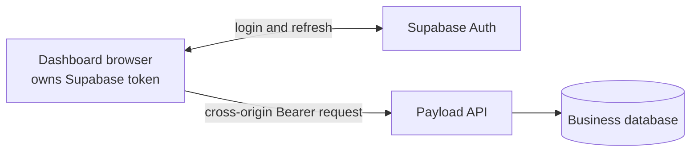
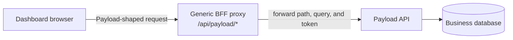
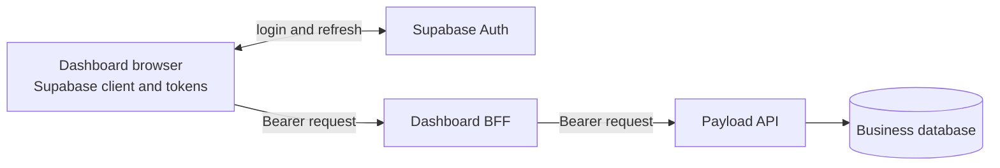
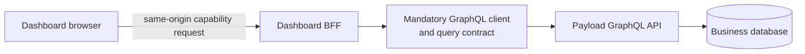
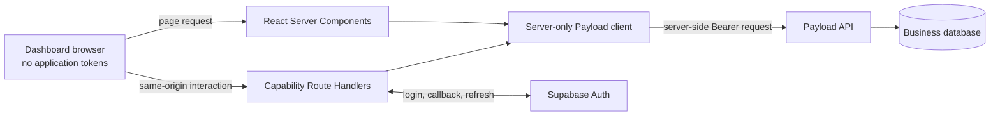

# ADR: Standalone Clinic Dashboard BFF Architecture

## Status

| Name | Content |
| --- | --- |
| Author | Sebastian Schütze |
| Version | 1.0 |
| Date | 16.07.2026 |
| Status | Approved |

## Background

Clinic staff use a standalone Next.js application outside the public website and Payload Admin. Supabase owns their
identity and browser session. Payload remains the business API and resolves every authenticated request to the current
`clinicStaff` principal, clinic assignment, approval state, and permissions. Only Payload accesses the shared business
database.

The Dashboard has no durable business storage of its own. It needs a clear application boundary for rendering,
browser-initiated interactions, session handling, preview callbacks, Payload access, failures, and caching without
exposing bearer tokens to browser application code or granting the browser direct access to Payload.

## Problem Description

A direct browser-to-Payload design would require browser-readable access tokens, Payload CORS expansion, and two public
application boundaries for every Dashboard interaction. A generic proxy would hide Payload without defining stable
capabilities, while a mandatory GraphQL layer would add a second contract without solving session or authorization
ownership.

The architecture must keep the Dashboard stateless, preserve Payload as the authorization boundary, support React
Server Components and interactive browser flows, isolate environments, and prevent authenticated data from entering
shared caches.

## Decision Drivers

- Browser application code must not receive Supabase access or refresh tokens.
- Payload must remain the only business authorization and database boundary.
- Clinic and permission scope must be resolved from the current Payload principal for every request.
- Server-rendered reads must not make avoidable HTTP calls back into the same application.
- Browser-facing APIs must express Dashboard capabilities rather than Payload internals.
- Local, preview, and production authentication must not cross environment boundaries.
- Session and clinic data must never enter public or shared caches.

## Considerations

### Browser calls Payload directly

The browser obtains a Supabase token and sends it across origins to Payload. This minimizes the Dashboard server layer,
but exposes the token to browser application code and requires Payload CORS for every Dashboard origin. Rejected.



### Generic Dashboard-to-Payload proxy

The browser calls a generic same-origin proxy that forwards Payload paths, queries, and documents. Tokens remain on the
server, but the proxy reproduces Payload's interface instead of defining stable Dashboard capabilities. Rejected.



### Browser-managed Supabase session

A Supabase client in the browser owns access and refresh tokens and attaches an access token to Dashboard requests.
This follows the standard browser-client model but expands the browser trust boundary. Rejected.



### Mandatory GraphQL integration

Every Dashboard capability uses a prescribed GraphQL layer between the BFF and Payload. This provides one query
language but adds a mandatory contract where REST resources and focused endpoints already express the required
capabilities. Rejected as a universal requirement.



### Same-origin Backend for Frontend

The browser communicates only with the Dashboard origin. React Server Components and capability-specific Route
Handlers share a server-only Payload client, while the BFF owns the Supabase session in `HttpOnly` cookies. This keeps
the browser boundary narrow and supports server rendering at the cost of an explicit session and route layer. Chosen.



## Decision with Rationale

### Application and trust boundaries

The Clinic Dashboard remains a standalone, stateless Next.js application without its own database. The browser requests
application data only from the Dashboard origin. The Dashboard acts as a Backend for Frontend (BFF):

- React Server Components read through a server-only Payload access layer.
- Browser-initiated reads and mutations use capability-specific Route Handlers on the Dashboard origin.
- Server Components call the server-only access layer directly and do not make internal HTTP requests to Route
  Handlers.
- The BFF does not expose a generic Payload proxy.

Payload remains the sole business API, tenant, permission, and database boundary. The Dashboard may reshape authorized
Payload responses into purpose-specific data transfer objects, but it does not persist business data or replace Payload
authorization. The public portal may link to the Dashboard but does not transfer a session. Payload Admin remains
restricted to platform staff, consistent with [ADR 025](./025-adr-direct-staff-auth-collections.md).

### Session and Supabase boundary

Supabase owns identity and the access and refresh session. The Dashboard stores the session in secure, host-bound,
`HttpOnly` cookies. Browser application code receives neither token and does not instantiate a Supabase browser client.
Login, callback, refresh, and logout are BFF operations. Redirect-based authentication uses Proof Key for Code Exchange
(PKCE).

The browser may navigate to Supabase or an identity provider during authentication, but it never calls Payload
directly. The Dashboard uses a Supabase publishable key only; a service-role key is prohibited. Supabase clients and
user-specific state are created per request and are never shared across requests.

Every response that reads, refreshes, or writes a session is private and not cacheable. When session handling returns
cookies or cache-control headers, the BFF preserves all of them on the final response.

### Vercel preview URLs and Supabase callbacks

The existing automatically generated Vercel deployment URLs remain unchanged. Supabase Staging accepts the exact local
callback and the project-specific Vercel preview wildcard on the exact callback path:

```text
https://clinic-dashboard-*-findmydoc.vercel.app/auth/callback
```

Supabase Production accepts only:

```text
https://clinics.findmydoc.eu/auth/callback
```

Local development and pull-request previews use Supabase Staging and the preview Payload API. Production uses the
production Supabase project and production Payload API. Cross-environment combinations are invalid.

The callback origin comes from validated environment configuration or trusted Vercel deployment metadata, never from
an unchecked `Host` header. Post-authentication destinations are restricted to validated relative Dashboard paths;
arbitrary or external `next` destinations are rejected. This callback allowlist is an operational Supabase Auth
requirement for the existing deployment URLs, not an application-architecture alternative or a Payload CORS rule.

### Payload API contract

The Dashboard server sends the current Supabase access token to Payload as a Bearer token. Payload validates it against
the Supabase project for that environment and resolves the current `clinicStaff` record on every request. The Supabase
classification selects only the principal collection; clinic assignment, approval, role, and capabilities come from
Payload.

The Dashboard uses Payload REST resources and focused custom endpoints with typed data transfer objects. A dedicated
self-and-capability bootstrap returns the minimum principal, clinic, status, and capability data required to initialize
the Dashboard. It never forwards internal Payload documents without an explicit projection.

[ADR 003](./003-adr-api-layer-graphql-vs-server-actions.md) remains valid for its API-first boundary and its rejection of
Server Actions as public backend contracts. Its universal GraphQL requirement does not apply to the Clinic Dashboard:
REST and capability-specific endpoints are the selected integration contract.

Payload CORS remains unchanged because no Dashboard browser request reaches Payload. State-changing BFF routes validate
the session, input, request origin, and cross-site request forgery protection and fail closed. The Dashboard applies
this protection centrally through one shared mutation guard. It uses a stateless HMAC-signed CSRF token bound to the
current Supabase session; Staging and Production store that token in a host-only `__Host-` cookie. Payload requires no
CSRF-specific change.

The server-only Payload client accepts only the exact HTTPS Payload origin configured for the active environment.
Authenticated requests do not follow redirects to another origin and never replay the Bearer token to a redirected
host.

### Failure contract

- A missing session, or a session that remains invalid after one controlled refresh, returns `401`, clears invalid
  session cookies, and produces a controlled login state.
- A clinic principal that is not approved, has no clinic assignment, or lacks a requested capability returns `403`
  without exposing clinic data.
- An invalid callback code produces a sanitized authentication error and no session.
- A rejected origin or cross-site request forgery check returns `403`.
- Payload or Supabase unavailability is a temporary upstream failure. It does not clear an otherwise valid session or
  present the failure as an intentional logout.

### Cache contract

Authentication, session, principal, clinic, capability, and authenticated Dashboard reads are private live data under
[ADR 023](./023-adr-public-website-cache-and-revalidation-strategy.md). BFF responses use private, no-store semantics.
ISR, public shared caches, durable Dashboard caches, and the Vercel Data Cache are excluded for these data paths.

Request-local deduplication is allowed because it does not outlive or cross the authenticated request. This decision
creates no new public cache class, cache tag, revalidation event, invalidation owner, or public route. An authorized
Dashboard mutation can still change data rendered on the public website; in that case Payload must execute the existing
ADR 023 invalidation contract for the affected public surfaces. The private BFF response does not replace or suppress
that public revalidation. Any future shared Dashboard cache requires a separate architecture decision.

## Consequences

- **Positive:** The browser has one application-data origin and no access to Supabase tokens or Payload.
- **Positive:** Payload remains the current, authoritative tenant and permission boundary without a second Dashboard
  database.
- **Positive:** React Server Components can render through direct server code while interactive clients use explicit,
  testable same-origin routes.
- **Negative:** The Dashboard must implement and test a complete server-side cookie, refresh, callback, origin, and
  cross-site request forgery boundary.
- **Negative:** Purpose-specific routes and data transfer objects require deliberate contract maintenance across the
  Dashboard and Payload applications.
- **Neutral:** The Dashboard does not use Payload GraphQL by default and does not require Payload CORS expansion.

## Relationship to Existing Decisions

- This ADR partially supersedes [ADR 003](./003-adr-api-layer-graphql-vs-server-actions.md) for the Clinic Dashboard by
  replacing the universal GraphQL requirement with REST and capability-specific endpoints. Its API-first boundary and
  rejection of Server Actions as public backend contracts remain valid.
- This ADR applies the private-live cache boundary from
  [ADR 023](./023-adr-public-website-cache-and-revalidation-strategy.md).
- This ADR completes the external Dashboard integration boundary left open by
  [ADR 025](./025-adr-direct-staff-auth-collections.md).

## Superseded by

Not superseded.
