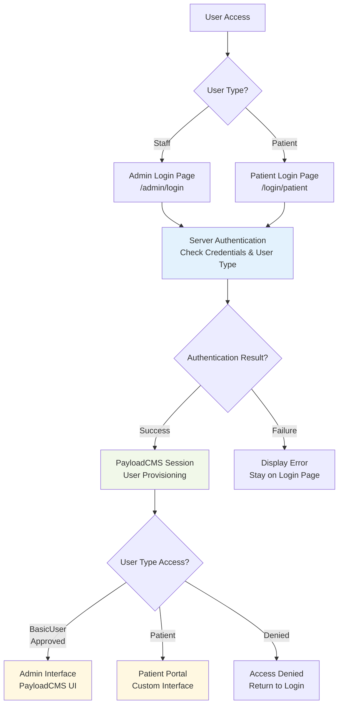
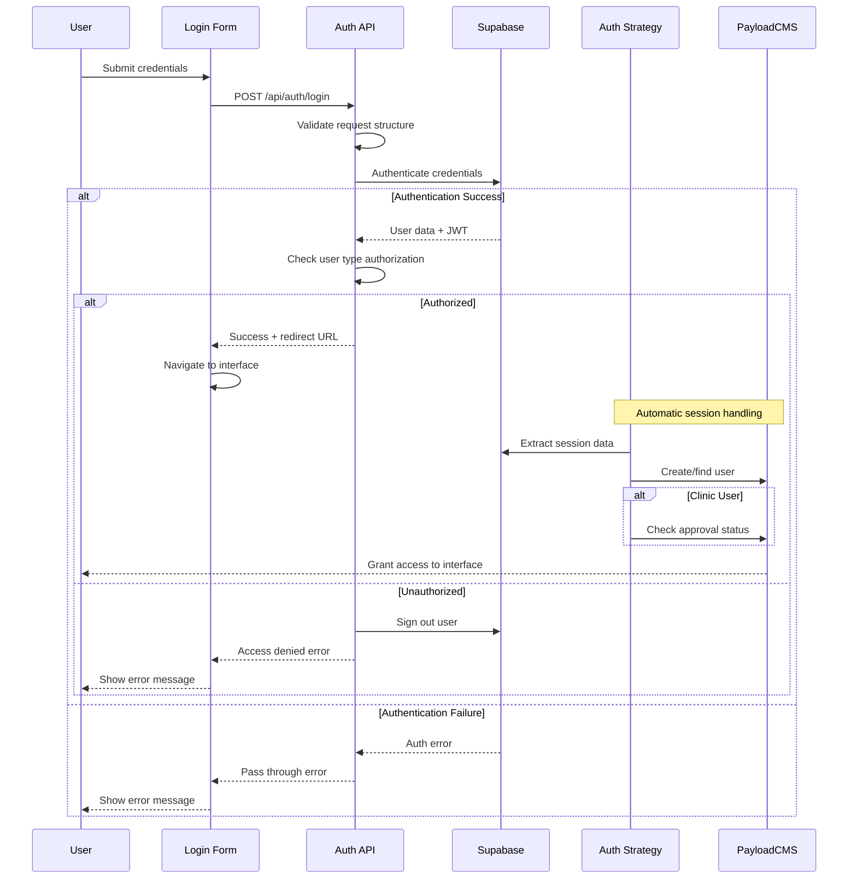

# Authentication System Architecture

## Overview

The FindMyDoc Portal uses a server-side authentication architecture that combines Supabase authentication with PayloadCMS user management. The system is designed to be minimal, secure, and leverage Supabase's built-in capabilities.

## Architecture Principles

1. **Server-Side First**: Authentication validation occurs on the server
2. **Trust Supabase**: Leverage Supabase for credential validation and error handling (error handling may change in the future to more UI-friendly messages)
3. **Minimal Custom Logic**: Only implement business-specific validation
4. **Single Source of Truth**: Server defines authentication flow and responses

## User Types & Collections

### User Type Mapping
- **Clinic Staff**: `basicUsers` collection with `clinicStaff` profile
- **Platform Staff**: `basicUsers` collection with `platformStaff` profile
- **Patients**: `patients` collection (no additional profile)

### Access Control
- **Admin UI**: Available to `basicUsers` collection (clinic + platform staff)
- **Patient Portal**: Available to `patients` collection
- **API Access**: Controlled by collection-level access rules

## System Components

### Authentication API
- **Endpoint**: `/api/auth/login`
- **Purpose**: Server-side credential validation and user type authorization
- **Validation**: Structural validation via Zod, credential validation via Supabase
- **Authorization**: User type matching against allowed types per endpoint

### Login Forms
- **Universal Component**: `BaseLoginForm` supports single or multiple user types
- **Admin Login**: Accepts clinic and platform staff (`/admin/login`)
- **Patient Login**: Accepts patients only (`/login/patient`)
- **Validation**: Server-side only, no client-side pre-validation

### PayloadCMS Integration
- **Auth Strategy**: `supabaseStrategy` handles session management
- **User Provisioning**: Automatic creation of users in appropriate collections
- **Approval System**: Clinic users require approval in `clinicStaff` collection
- **Session Management**: PayloadCMS manages authenticated sessions

## Security Model

### User Type Separation
- Server validates user type against endpoint requirements
- Unauthorized access attempts result in automatic sign-out
- Each login endpoint restricted to specific user types

### Approval Workflow
- Clinic users must be approved before accessing admin interface
- Platform users have immediate access upon authentication
- Patients access patient portal without additional approval

### Session Security
- Server-side session management via PayloadCMS
- No client-side token exposure
- Automatic cleanup on authentication failures

## File Structure

```
src/
├── app/api/auth/login/route.ts        # Authentication API endpoint
├── components/Auth/
│   ├── BaseLoginForm.tsx              # Universal login form
│   └── types/loginTypes.ts            # Type definitions
├── auth/
│   ├── strategies/supabaseStrategy.ts # PayloadCMS auth integration
│   └── utilities/loginHandler.ts      # Client utilities
└── app/(frontend)/
    ├── admin/login/page.tsx           # Staff login page
    └── login/patient/page.tsx         # Patient login page
```

## Authentication Flow

### User Journey
1. User visits appropriate login page based on role
2. Credentials submitted to server-side authentication API
3. Server validates credentials with Supabase
4. User type authorization check against endpoint requirements
5. Successful authentication redirects to appropriate interface
6. PayloadCMS auth strategy manages session and user provisioning

### Error Handling
- Supabase handles credential validation errors
- Server provides user type mismatch errors
- Client displays server-provided error messages without transformation

---

## System Flow Diagram



## Sequence Diagram - Authentication Process

