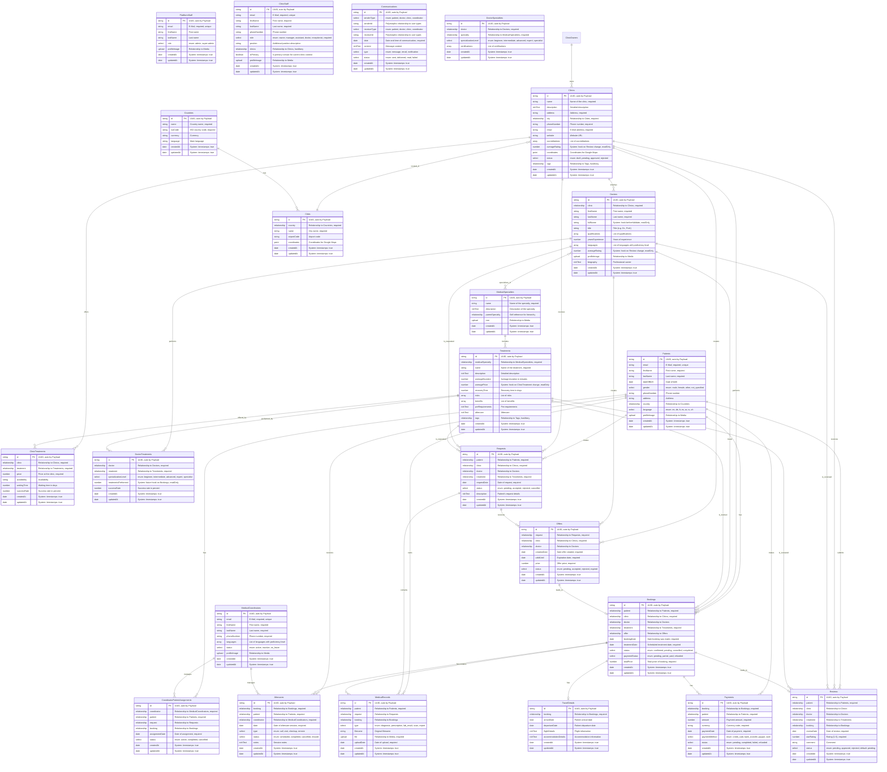

```mermaid
erDiagram
    %% User Collections with Authentication
    PlattformStaff {
        string id PK "UUID, auto by Payload"
        string email "E-Mail, required, unique"
        string firstName "First name"
        string lastName "Last name"
        select role "enum: admin, super-admin"
        upload profileImage "Relationship to Media"
        date createdAt "System: timestamps: true"
        date updatedAt "System: timestamps: true"
    }

    Patients {
        string id PK "UUID, auto by Payload"
        string email "E-Mail, required, unique"
        string firstName "First name, required"
        string lastName "Last name, required"
        date dateOfBirth "Date of birth"
        select gender "enum: male, female, other, not_specified"
        string phoneNumber "Phone number"
        string address "Address"
        relationship country "Relationship to Countries"
        select language "enum: en, de, fr, es, ar, ru, zh"
        upload profileImage "Relationship to Media"
        date createdAt "System: timestamps: true"
        date updatedAt "System: timestamps: true"
    }

    ClinicStaff {
        string id PK "UUID, auto by Payload"
        string email "E-Mail, required, unique"
        string firstName "First name, required"
        string lastName "Last name, required"
        string phoneNumber "Phone number"
        select role "enum: owner, manager, assistant, doctor, receptionist, required"
        string position "Additional position description"
        relationship clinics "Relationship to Clinics, hasMany"
        boolean isPrimary "Is primary contact for current clinic context"
        upload profileImage "Relationship to Media"
        date createdAt "System: timestamps: true"
        date updatedAt "System: timestamps: true"
    }

    %% Main Collections
    Clinics {
        string id PK "UUID, auto by Payload"
        string name "Name of the clinic, required"
        richText description "Detailed description"
        string address "Address, required"
        relationship city "Relationship to Cities, required"
        string phoneNumber "Phone number, required"
        string email "E-Mail address, required"
        string website "Website URL"
        array accreditations "List of accreditations"
        number averageRating "System: hook on Review change, readOnly"
        point coordinates "Coordinates for Google Maps"
        select status "enum: draft, pending, approved, rejected"
        relationship tags "Relationship to Tags, hasMany"
        date createdAt "System: timestamps: true"
        date updatedAt "System: timestamps: true"
    }

    Doctors {
        string id PK "UUID, auto by Payload"
        relationship clinic "Relationship to Clinics, required"
        string firstName "First name, required"
        string lastName "Last name, required"
        string fullName "System: hook beforeValidate, readOnly"
        string title "Title (e.g. Dr., Prof.)"
        array qualifications "List of qualifications"
        number yearsExperience "Years of experience"
        array languages "List of languages with proficiency level"
        number averageRating "System: hook on Review change, readOnly"
        upload profileImage "Relationship to Media"
        richText biography "Professional career"
        date createdAt "System: timestamps: true"
        date updatedAt "System: timestamps: true"
    }

    MedicalSpecialties {
        string id PK "UUID, auto by Payload"
        string name "Name of the specialty, required"
        richText description "Description of the specialty"
        relationship parentSpecialty "Self-reference for hierarchy"
        upload icon "Relationship to Media"
        date createdAt "System: timestamps: true"
        date updatedAt "System: timestamps: true"
    }

    Treatments {
        string id PK "UUID, auto by Payload"
        relationship medicalSpecialty "Relationship to MedicalSpecialties, required"
        string name "Name of the treatment, required"
        richText description "Detailed description"
        number averageDuration "Average duration in minutes"
        number averagePrice "System: hook on ClinicTreatment change, readOnly"
        number recoveryTime "Recovery time in days"
        array risks "List of risks"
        array benefits "List of benefits"
        richText preRequirements "Pre-requirements"
        richText aftercare "Aftercare"
        relationship tags "Relationship to Tags, hasMany"
        date createdAt "System: timestamps: true"
        date updatedAt "System: timestamps: true"
    }

    ClinicTreatments {
        string id PK "UUID, auto by Payload"
        relationship clinic "Relationship to Clinics, required"
        relationship treatment "Relationship to Treatments, required"
        number price "Price at the clinic, required"
        string availability "Availability"
        number waitingTime "Waiting time in days"
        number successRate "Success rate in percent"
        date createdAt "System: timestamps: true"
        date updatedAt "System: timestamps: true"
    }

    DoctorTreatments {
        string id PK "UUID, auto by Payload"
        relationship doctor "Relationship to Doctors, required"
        relationship treatment "Relationship to Treatments, required"
        select specializationLevel "enum: beginner, intermediate, advanced, expert, specialist"
        number treatmentsPerformed "System: future hook on Bookings, readOnly"
        number successRate "Success rate in percent"
        date createdAt "System: timestamps: true"
        date updatedAt "System: timestamps: true"
    }

    Requests {
        string id PK "UUID, auto by Payload"
        relationship patient "Relationship to Patients, required"
        relationship clinic "Relationship to Clinics, required"
        relationship doctor "Relationship to Doctors"
        relationship treatment "Relationship to Treatments, required"
        date requestDate "Date of request, required"
        select status "enum: pending, accepted, rejected, cancelled"
        richText description "Patient's request details"
        date createdAt "System: timestamps: true"
        date updatedAt "System: timestamps: true"
    }

    Offers {
        string id PK "UUID, auto by Payload"
        relationship request "Relationship to Requests, required"
        relationship clinic "Relationship to Clinics, required"
        relationship doctor "Relationship to Doctors"
        date creationDate "Date offer created, required"
        date validUntil "Expiration date, required"
        number price "Offer price, required"
        select status "enum: pending, accepted, rejected, expired"
        date createdAt "System: timestamps: true"
        date updatedAt "System: timestamps: true"
    }

    Bookings {
        string id PK "UUID, auto by Payload"
        relationship patient "Relationship to Patients, required"
        relationship clinic "Relationship to Clinics, required"
        relationship doctor "Relationship to Doctors"
        relationship treatment "Relationship to Treatments, required"
        relationship offer "Relationship to Offers"
        date bookingDate "Date booking was made, required"
        date treatmentDate "Scheduled treatment date, required"
        select status "enum: confirmed, pending, cancelled, completed"
        select paymentStatus "enum: pending, partial, paid, refunded"
        number totalPrice "Total price of booking, required"
        date createdAt "System: timestamps: true"
        date updatedAt "System: timestamps: true"
    }

    TravelDetails {
        string id PK "UUID, auto by Payload"
        relationship booking "Relationship to Bookings, required"
        date arrivalDate "Patient arrival date"
        date departureDate "Patient departure date"
        richText flightDetails "Flight information"
        richText accommodationDetails "Accommodation information"
        date createdAt "System: timestamps: true"
        date updatedAt "System: timestamps: true"
    }

    Reviews {
        string id PK "UUID, auto by Payload"
        relationship patient "Relationship to Patients, required"
        relationship clinic "Relationship to Clinics"
        relationship doctor "Relationship to Doctors"
        relationship treatment "Relationship to Treatments"
        relationship booking "Relationship to Bookings"
        date reviewDate "Date of review, required"
        number starRating "Rating (1-5), required"
        string comment "Comment"
        select status "enum: pending, approved, rejected, default: pending"
        date createdAt "System: timestamps: true"
        date updatedAt "System: timestamps: true"
    }

    MedicalCoordinators {
        string id PK "UUID, auto by Payload"
        string email "E-Mail, required, unique"
        string firstName "First name, required"
        string lastName "Last name, required"
        string phoneNumber "Phone number, required"
        array languages "List of languages with proficiency level"
        select status "enum: active, inactive, on_leave"
        upload profileImage "Relationship to Media"
        date createdAt "System: timestamps: true"
        date updatedAt "System: timestamps: true"
    }

    CoordinatorPatientAssignments {
        string id PK "UUID, auto by Payload"
        relationship coordinator "Relationship to MedicalCoordinators, required"
        relationship patient "Relationship to Patients, required"
        relationship request "Relationship to Requests"
        relationship booking "Relationship to Bookings"
        date assignmentDate "Date of assignment, required"
        select status "enum: active, completed, cancelled"
        date createdAt "System: timestamps: true"
        date updatedAt "System: timestamps: true"
    }

    Aftercares {
        string id PK "UUID, auto by Payload"
        relationship booking "Relationship to Bookings, required"
        relationship patient "Relationship to Patients, required"
        relationship coordinator "Relationship to MedicalCoordinators, required"
        date date "Date of aftercare session, required"
        select type "enum: call, visit, checkup, remote"
        select status "enum: scheduled, completed, cancelled, missed"
        richText notes "Session notes"
        date createdAt "System: timestamps: true"
        date updatedAt "System: timestamps: true"
    }

    Payments {
        string id PK "UUID, auto by Payload"
        relationship booking "Relationship to Bookings, required"
        relationship patient "Relationship to Patients, required"
        number amount "Payment amount, required"
        string currency "Currency code, required"
        date paymentDate "Date of payment, required"
        select paymentMethod "enum: credit_card, bank_transfer, paypal, cash"
        select status "enum: pending, completed, failed, refunded"
        date createdAt "System: timestamps: true"
        date updatedAt "System: timestamps: true"
    }

    Countries {
        string id PK "UUID, auto by Payload"
        string name "Country name, required"
        string isoCode "ISO country code, required"
        string currency "Currency"
        string language "Main language"
        date createdAt "System: timestamps: true"
        date updatedAt "System: timestamps: true"
    }

    Cities {
        string id PK "UUID, auto by Payload"
        relationship country "Relationship to Countries, required"
        string name "City name, required"
        string airportCode "Airport code"
        point coordinates "Coordinates for Google Maps"
        date createdAt "System: timestamps: true"
        date updatedAt "System: timestamps: true"
    }

    MedicalRecords {
        string id PK "UUID, auto by Payload"
        relationship patient "Relationship to Patients, required"
        relationship request "Relationship to Requests"
        relationship booking "Relationship to Bookings"
        select type "enum: diagnosis, prescription, lab_result, scan, report"
        string filename "Original filename"
        upload file "Relationship to Media, required"
        date uploadDate "Date of upload, required"
        date createdAt "System: timestamps: true"
        date updatedAt "System: timestamps: true"
    }

    Communications {
        string id PK "UUID, auto by Payload"
        select senderType "enum: patient, doctor, clinic, coordinator"
        string senderId "Polymorphic relationship to user types"
        select receiverType "enum: patient, doctor, clinic, coordinator"
        string receiverId "Polymorphic relationship to user types"
        date date "Date and time of communication, required"
        richText content "Message content"
        select type "enum: message, email, notification"
        select status "enum: sent, delivered, read, failed"
        date createdAt "System: timestamps: true"
        date updatedAt "System: timestamps: true"
    }

    DoctorSpecialties {
        string id PK "UUID, auto by Payload"
        relationship doctor "Relationship to Doctors, required"
        relationship specialty "Relationship to MedicalSpecialties, required"
        select specializationLevel "enum: beginner, intermediate, advanced, expert, specialist"
        array certifications "List of certifications"
        date createdAt "System: timestamps: true"
        date updatedAt "System: timestamps: true"
    }

    %% Relationships
    Patients ||--o{ Requests : makes
    Patients ||--o{ Bookings : has
    Patients ||--o{ Reviews : submits
    Patients ||--o{ MedicalRecords : owns
    Patients ||--o{ CoordinatorPatientAssignments : has
    Patients ||--o{ Aftercares : receives
    Patients ||--o{ Payments : makes

    ClinicOwners ||--o{ Clinics : owns

    Clinics ||--o{ Doctors : employs
    Clinics ||--o{ ClinicTreatments : offers
    Clinics ||--o{ Requests : receives
    Clinics ||--o{ Offers : creates
    Clinics ||--o{ Bookings : performs
    Clinics ||--o{ Reviews : receives
    Clinics }o--|| Cities : located_in

    Doctors ||--o{ DoctorTreatments : performs
    Doctors ||--o{ Requests : is_requested
    Doctors ||--o{ Offers : creates
    Doctors ||--o{ Bookings : treats
    Doctors ||--o{ Reviews : is_reviewed
    Doctors }o--o{ MedicalSpecialties : specializes_in

    MedicalSpecialties ||--o{ Treatments : includes

    Treatments ||--o{ ClinicTreatments : offered_by
    Treatments ||--o{ DoctorTreatments : performed_by
    Treatments ||--o{ Requests : is_requested
    Treatments ||--o{ Bookings : is_booked
    Treatments ||--o{ Reviews : is_reviewed

    Requests ||--o{ Offers : receives
    Requests ||--o{ MedicalRecords : contains

    Offers ||--o| Bookings : leads_to

    Bookings ||--o| TravelDetails : has
    Bookings ||--o| Reviews : leads_to
    Bookings ||--o{ Aftercares : has
    Bookings ||--o{ Payments : has
    Bookings ||--o{ MedicalRecords : contains

    Countries ||--o{ Cities : has

    MedicalCoordinators ||--o{ CoordinatorPatientAssignments : manages
    MedicalCoordinators ||--o{ Aftercares : manages
```