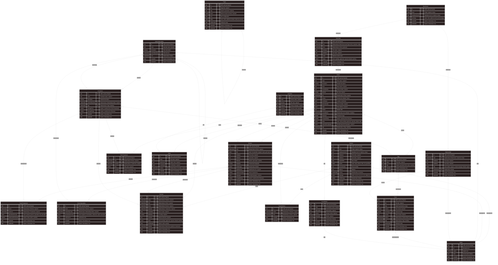

```mermaid
---
config:
  theme: neo-dark
---
erDiagram
    direction TB

    BasicUsers {
        text id PK "UUID, auto by Payload"
        email email "E-Mail, required, unique"
        text supabaseUserId "Supabase user id, required, unique"
        select userType "enum: clinic, platform (set by auth strategy)"
        date createdAt "System: timestamps: true"
        date updatedAt "System: timestamps: true"
    }

    PlatformStaff {
        text id PK "UUID, auto by Payload"
        relationship user FK "Relationship to BasicUsers, required, unique"
        text firstName "First name, required"
        text lastName "Last name, required"
        select role "enum: admin, support, content-manager, default: support"
        upload profileImage FK "Relationship to Media"
        date createdAt "System: timestamps: true"
        date updatedAt "System: timestamps: true"
    }

    ClinicStaff {
        text id PK "UUID, auto by Payload"
        relationship user FK "Relationship to BasicUsers (userType=clinic), required, unique"
        relationship clinic FK "Relationship to Clinics (optional)"
        text firstName "First name, required"
        text lastName "Last name, required"
        email email "Optional contact email"
        select status "enum: pending, approved, rejected, default: pending"
        date createdAt "System: timestamps: true"
        date updatedAt "System: timestamps: true"
    }

    Patients {
        text id PK "UUID, auto by Payload"
        email email "E-Mail, required, unique"
        text supabaseUserId "Supabase user id, required, unique"
        text firstName "First name, required"
        text lastName "Last name, required"
        date dateOfBirth "Date of birth"
        select gender "enum: male, female, other, not_specified"
        text phoneNumber "Phone number"
        text address "Address"
        relationship country FK "Relationship to Countries"
        select language "enum: en, de, fr, es, ar, ru, zh, default: en"
        upload profileImage FK "Relationship to Media"
        date createdAt "System: timestamps: true"
        date updatedAt "System: timestamps: true"
    }

    Clinics {
        text id PK "UUID, auto by Payload"
        text name "Clinic name, required"
        richText description "Detailed description"
        text street "Street name, required"
        text houseNumber "House number, required"
        number zipCode "Zip code, required"
        relationship city FK "Relationship to Cities, required"
        text country "Country text, default: Turkey"
        point coordinates "Location coordinates"
        text phoneNumber "Phone number, required"
        email email "Email address, required"
        text website "Website URL"
        relationship accreditations FK "Relationship to Accreditation, hasMany"
        upload thumbnail FK "Thumbnail image"
        number averageRating "System: readonly (from Reviews)"
        select status "enum: draft, pending, approved, rejected, default: draft"
        select supportedLanguages "Select[] supported languages, required"
        relationship tags FK "Relationship to Tags, hasMany"
        date createdAt "System: timestamps: true"
        date updatedAt "System: timestamps: true"
    }

    Doctors {
        text id PK "UUID, auto by Payload"
        relationship clinic FK "Relationship to Clinics, required"
        select title "enum: dr, specialist, surgeon, assoc_prof, prof_dr"
        text firstName "First name, required"
        text lastName "Last name, required"
        text fullName "System: generated, readonly"
        richText biography "Professional biography"
        upload profileImage FK "Relationship to Media"
        array qualifications "Qualifications list, required"
        number experienceYears "Years of experience"
        select languages "Select[] languages, required"
        number averageRating "System: readonly (from Reviews)"
        date createdAt "System: timestamps: true"
        date updatedAt "System: timestamps: true"
    }

    MedicalSpecialties {
        text id PK "UUID, auto by Payload"
        text name "Specialty name, required"
        textarea description "Short description"
        relationship parentSpecialty FK "Self-reference"
        relationship icon FK "Relationship to Media"
        date createdAt "System: timestamps: true"
        date updatedAt "System: timestamps: true"
    }

    Treatments {
        text id PK "UUID, auto by Payload"
        text name "Treatment name, required"
        richText description "Detailed description"
        relationship medicalSpecialty FK "Relationship to MedicalSpecialties, required"
        relationship tags FK "Relationship to Tags, hasMany"
        number averagePrice "System: readonly (from ClinicTreatments)"
        number averageRating "System: readonly (from Reviews)"
        date createdAt "System: timestamps: true"
        date updatedAt "System: timestamps: true"
    }

    ClinicTreatments {
        text id PK "UUID, auto by Payload"
        relationship clinic FK "Relationship to Clinics, required"
        relationship treatment FK "Relationship to Treatments, required"
        number price "Clinic price, required"
        date createdAt "System: timestamps: true"
        date updatedAt "System: timestamps: true"
    }

    DoctorTreatments {
        text id PK "UUID, auto by Payload"
        relationship doctor FK "Relationship to Doctors, required"
        relationship treatment FK "Relationship to Treatments, required"
        select specializationLevel "enum: general_practice, specialist, sub_specialist"
        number treatmentsPerformed "System: future metric, readonly"
        date createdAt "System: timestamps: true"
        date updatedAt "System: timestamps: true"
    }

    DoctorSpecialties {
        text id PK "UUID, auto by Payload"
        relationship doctor FK "Relationship to Doctors, required"
        relationship medicalSpecialty FK "Relationship to MedicalSpecialties, required"
        select specializationLevel "enum: beginner, intermediate, advanced, expert, specialist"
        array certifications "Certifications list"
        date createdAt "System: timestamps: true"
        date updatedAt "System: timestamps: true"
    }

    Reviews {
        text id PK "UUID, auto by Payload"
        relationship patient FK "Relationship to Patients, required"
        relationship clinic FK "Relationship to Clinics, required"
        relationship doctor FK "Relationship to Doctors, required"
        relationship treatment FK "Relationship to Treatments, required"
        date reviewDate "Set on create, required"
        number starRating "1-5 rating, required"
        text comment "Review comment, required"
        select status "enum: pending, approved, rejected, default: pending"
        date lastEditedAt "System: audit, readonly"
        relationship editedBy FK "Relationship to BasicUsers (platform moderator)"
        date createdAt "System: timestamps: true"
        date updatedAt "System: timestamps: true"
    }

    Countries {
        text id PK "UUID, auto by Payload"
        text name "Country name, required"
        text isoCode "ISO code, required"
        text language "Primary language, required"
        text currency "Currency code, required"
        date createdAt "System: timestamps: true"
        date updatedAt "System: timestamps: true"
    }

    Cities {
        text id PK "UUID, auto by Payload"
        text name "City name, required"
        text airportcode "Airport code, required"
        point coordinates "Coordinates, required"
        relationship country FK "Relationship to Countries, required"
        date createdAt "System: timestamps: true"
        date updatedAt "System: timestamps: true"
    }

    Media {
        text id PK "UUID, auto by Payload"
        text alt "Alternative text"
        richText caption "Caption text"
        text prefix "Internal prefix (hidden)"
        date createdAt "System: timestamps: true"
        date updatedAt "System: timestamps: true"
    }

    Tags {
        text id PK "UUID, auto by Payload"
        text name "Tag name, required"
        text slug "System: generated from name, readonly"
        date createdAt "System: timestamps: true"
        date updatedAt "System: timestamps: true"
    }

    FavoriteClinics {
        text id PK "UUID, auto by Payload"
        relationship patient FK "Relationship to Patients, required"
        relationship clinic FK "Relationship to Clinics, required"
        date createdAt "System: timestamps: true"
        date updatedAt "System: timestamps: true"
    }

    Accreditation {
        text id PK "UUID, auto by Payload"
        text name "Accreditation name, required"
        text abbreviation "Abbreviation, required"
        text country "Issuing country, required"
        richText description "Details, required"
        upload icon FK "Relationship to Media"
        date createdAt "System: timestamps: true"
        date updatedAt "System: timestamps: true"
    }

    Pages {
        text id PK "UUID, auto by Payload"
        text title "Page title, required"
        text slug "System: generated, readonly"
        blocks layout "Blocks (content sections), required"
        hero hero "Hero configuration"
        select status "enum: draft, published, default: draft (via versions)"
        date publishedAt "Publication date"
        date createdAt "System: timestamps: true"
        date updatedAt "System: timestamps: true"
    }

    Posts {
        text id PK "UUID, auto by Payload"
        text title "Post title, required"
        text slug "System: generated, unique"
        richText content "Post content, required"
        upload heroImage FK "Featured image"
        text excerpt "Short excerpt, required"
        relationship authors FK "Relationship to PlatformStaff, hasMany"
        relationship tags FK "Relationship to Tags, hasMany"
        date publishedAt "Publication date"
        date createdAt "System: timestamps: true"
        date updatedAt "System: timestamps: true"
    }

    %% Relationships
    BasicUsers ||--o{ PlatformStaff : "has profile"
    BasicUsers ||--o{ ClinicStaff : "has profile"

    Patients ||--o{ FavoriteClinics : "saves"
    Patients ||--o{ Reviews : "writes"
    Patients }o--|| Media : "profile image"

    ClinicStaff }o--o{ Clinics : "assigned to"

    Clinics ||--o{ Doctors : "employs"
    Clinics ||--o{ ClinicTreatments : "offers"
    Clinics ||--o{ Reviews : "receives"
    Clinics ||--o{ FavoriteClinics : "is favorited"
    Clinics }o--|| Cities : "located in"
    Clinics }o--o{ Tags : "tagged"
    Clinics ||--o{ Accreditation : "has"

    Doctors ||--o{ DoctorTreatments : "performs"
    Doctors ||--o{ DoctorSpecialties : "specializes"
    Doctors ||--o{ Reviews : "is reviewed"
    Doctors }o--|| Clinics : "works at"
    Doctors }o--|| Media : "profile image"

    MedicalSpecialties ||--o{ MedicalSpecialties : "parent of"
    MedicalSpecialties ||--o{ Treatments : "includes"
    MedicalSpecialties ||--o{ DoctorSpecialties : "practiced by"
    MedicalSpecialties }o--|| Media : "icon"

    Treatments ||--o{ ClinicTreatments : "priced at"
    Treatments ||--o{ DoctorTreatments : "performed by"
    Treatments ||--o{ Reviews : "reviewed"
    Treatments }o--|| MedicalSpecialties : "belongs to"
    Treatments }o--o{ Tags : "tagged"

    Countries ||--o{ Cities : "has"
    Countries ||--o{ Patients : "residence of"

    Tags }o--o{ Posts : "categorizes"
    PlatformStaff ||--o{ Posts : "authors"
    PlatformStaff }o--|| Media : "profile image"

    Pages ||--o{ Pages : "subpage"

    Posts }o--|| Media : "featured image"

    Accreditation }o--|| Media : "icon"
```
