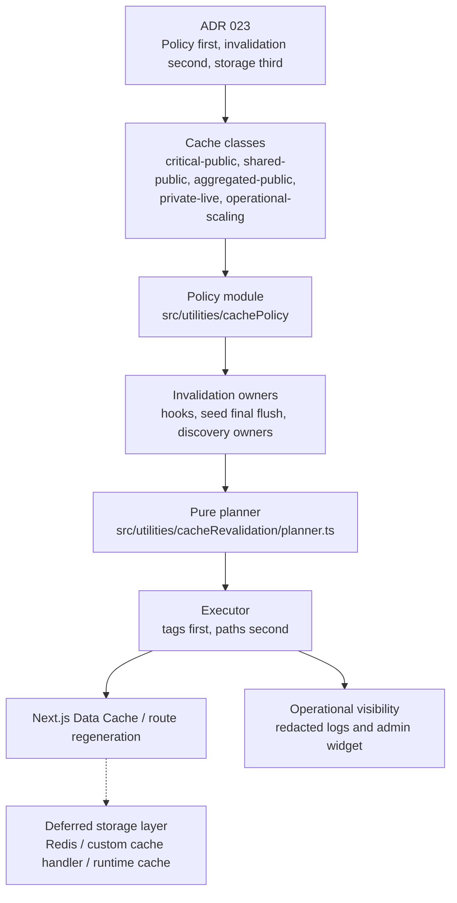
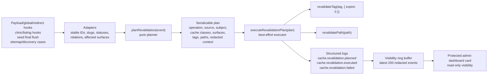
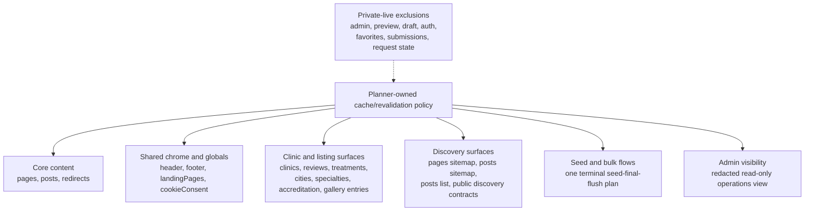

# Cache Revalidation Runtime Architecture

This guide is the operational entry point for the implemented public website cache and revalidation stack.

Architecture decisions remain governed by [ADR 023](../adrs/023-adr-public-website-cache-and-revalidation-strategy.md). This guide is the current documentation reference for runtime behavior.

## Strategy

The cache stack follows the ADR principle:

```text
Policy first, invalidation second, storage third.
```

The first stack uses Next.js cache primitives and Payload-driven invalidation. It does not introduce Redis, a custom cache handler, or remote cache storage. Those tools remain valid later for scale, cross-instance coordination, locks, dedupe, rate limits, external API response caching, or expensive shared computations, but not as a substitute for clear ownership and tag policy.



## Runtime Building Blocks

`src/utilities/cachePolicy/**` is the vocabulary and builder layer. It defines cache classes, tag families, operations, known collections, globals, surfaces, discovery IDs, fixed public paths, cache policy entries, tag builders, and public path builders.

`src/utilities/cacheRevalidation/**` is the planning and execution layer. It accepts normalized revalidation events, maps them to deduplicated plans, normalizes identifiers, executes `revalidateTag` before `revalidatePath`, logs redacted summaries, and records a bounded in-memory visibility history.

Hook adapters convert Payload hook context into stable normalized events. They own guards such as `context.disableRevalidate` and avoid passing raw Payload documents into the planner.

Read-side cached data uses Next.js `unstable_cache` only where the data is public and has a matching invalidation owner. Current cache-backed public reads include globals, redirects, pages/posts sitemaps, public post list and latest-post reads, Clinic Detail public server data, and Listing Comparison public server data.

Private, draft, preview, admin, auth, patient-specific, cookie-bound, and request-bound data stays live. It does not receive persistent public cache entries.

## Revalidation Flow



The planner is strict about invalid public-cache inputs. Missing required IDs, slugs, statuses, unsupported operations, or unknown public-cache cases fail fast instead of inventing tags locally.

The executor is best-effort after a valid plan exists. It attempts every tag and path, records failures, returns a summary, and does not break CMS writes only because a cache revalidation call failed.

## Cache Classes

| Cache class | Runtime meaning | Default behavior |
| --- | --- | --- |
| `critical-public` | Stale output can mislead users, damage trust, or break canonical SEO state. | Event-driven invalidation; concrete public routes also get path invalidation. |
| `shared-public` | Public data appears across many routes. | Tag-first invalidation through shared tags. |
| `aggregated-public` | Lists, landing content, comparison data, sitemaps, and discovery surfaces. | Tag-first invalidation with bounded short staleness; avoid arbitrary query path matrices. |
| `private-live` | Admin, preview, draft, auth, private, personalized, or request-bound state. | No persistent public cache. |
| `operational-scaling` | Bulk imports, expensive coordination, locks, dedupe, or operational visibility. | Local deterministic behavior first; batch invalidation through the planner. |

Canonical tag families are built centrally:

```text
entity:<collection>:<id>
slug:<collection>:<slug>
collection:<collection>
global:<slug>
surface:<name>
surface:sitemap:<name>
surface:discovery:<name>
```

Runtime code should call policy builders instead of constructing cache tag strings locally.

## Surface Ownership



Pages and posts use entity, slug, collection, sitemap, surface, and concrete public path invalidation. Slug changes invalidate both old and new public identifiers when known.

Globals use `global:*` tags and known consuming surfaces. Header and Footer are shared public chrome. LandingPages and CookieConsent add declared surface ownership without caching private consent state.

Redirect rules are cached at rule level, while reference redirect targets resolve live by ID. The removed generic cached document helper is intentionally not replaced by another broad document cache.

Clinic Detail and Listing Comparison public server data are cached with canonical tags. Draft clinic reads, private favorites, cookies, auth state, preview reads, and request-bound data remain live.

Post list, latest-post teasers, and sitemap reads use canonical aggregated-public tags. Paginated post lists do not maintain a path matrix; freshness is owned by tags plus bounded route/Data Cache behavior.

Seed imports suppress per-record public revalidation through `disableRevalidate`. A run that wrote public-affecting data emits one terminal `seed-final-flush` plan that aggregates affected collections, globals, surfaces, sitemaps, and discovery IDs.

## Operational Visibility

Cache revalidation visibility is operational observability, not product analytics. The stack does not emit PostHog business events for cache decisions.

The executor records redacted summaries for planned, executed, and failed revalidation events. The in-memory history keeps the latest 200 events per runtime instance. The protected endpoint and admin dashboard card expose only redacted operational fields after platform admin/support access checks pass.

Visibility data must never include raw Payload documents, hook args, request bodies, headers, cookies, tokens, auth data, private data, draft or preview content, CMS field payloads, medical free text, seed fixture payloads, or raw error stacks.

## Public Discovery And SEO

Sitemaps and public discovery outputs participate in the same cache model as other public surfaces. Sitemap cache tags use `surface:sitemap:*`, and sitemap timestamps remain source-backed.

`/llms.txt` and `/.well-known/llms.txt` remain static public-discovery contract routes unless a future ADR or work order assigns CMS-backed dependencies. Search indexing and canonical/noindex policy remain route/config policy, not ad hoc document invalidation.

## Deferred Boundaries

Direct media dependency resolution remains a bounded follow-up. Media inherits the cache class of the surface where it appears, and referencing documents or relations own invalidation in the first stack.

Redis, custom cache handlers, remote cache storage, locale/domain cache dimensions, and broader public route families are future architecture work. They should extend the policy and planner model instead of bypassing it.

## Validation And Debugging

Runtime changes to cache policy, planner behavior, hooks, routes, seed flushing, visibility, or read-side `unstable_cache` usage require focused unit tests for the touched behavior, `pnpm format`, `pnpm check`, and `pnpm build` when route output, Payload config, admin UI, or generated output can change.

Docs-only changes to this guide require `pnpm format`. They do not require `pnpm check` or a build unless the scope expands beyond documentation.

Useful runtime test areas include:

- `tests/unit/utilities/cacheRevalidation`
- hook adapter tests for Pages, Posts, Redirects, Globals, and clinic-related collections
- sitemap, posts list, Clinic Detail, and Listing Comparison contract tests
- seed endpoint/import/global/task tests for terminal flush behavior
- cache revalidation visibility endpoint, history, and dashboard card tests
