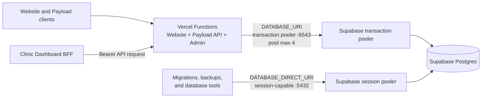

# Database Runtime Connections

This document is the operational contract for Website database connections. For the architectural rationale, see
[ADR 027](../adrs/027-adr-database-runtime-connection-modes.md).

## Current Topology



The Website runtime is the only database boundary for Clinic Dashboard business data. The Dashboard has no database
connection of its own.

## Environment Contract

| Variable | Owner | Allowed consumers | Hosted value shape | Prohibited use |
| --- | --- | --- | --- | --- |
| `DATABASE_URI` | Website runtime | Payload and Website runtime code | Supabase transaction pooler URL on port `6543` | Direct database URL in Vercel preview or production |
| `DATABASE_DIRECT_URI` | Release and database operations | Guarded migrations, backups, and focused database tools | Session-capable Supabase URL, using the session pooler on port `5432` for GitHub-hosted runners | Website runtime, Vercel runtime variables, browser code, logs, or command arguments |

Local development normally points `DATABASE_URI` at the Docker Postgres service. Local and local-Postgres CI migration
commands may fall back to that value when `DATABASE_DIRECT_URI` is not set. The Vercel runtime guard rejects a
`DATABASE_URI` that does not explicitly use port `6543`.

## Payload Pool Policy

The initial policy is fixed in `src/features/databaseAvailability/runtimePool.ts`:

| Setting | Value | Purpose |
| --- | ---: | --- |
| `max` | `4` | Bounds the number of `pg` clients created by one function instance |
| `connectionTimeoutMillis` | `3000` | Fails a connection acquisition before the Clinic Dashboard's five-second upstream timeout |
| `idleTimeoutMillis` | `10000` | Releases idle clients from warm function instances |

The values are not environment variables. Change them only with production connection evidence and a review of the
database connection budget. The cap applies per function instance and to all Payload consumers, including REST,
GraphQL, Local API, and the Admin UI. It is not a platform-wide limit.

## Transaction Mode Compatibility

Supabase transaction mode is intended for serverless workloads and does not support prepared statements. The locked
Payload, Drizzle, and `pg` versions use unnamed queries on the inspected runtime path, so no adapter override is needed.
Recheck this contract after a database-adapter upgrade, and do not add explicitly named prepared statements to runtime
code.

## Failure Contract

When Payload cannot acquire a database connection because the connection limit is reached, acquisition times out, or
Postgres is temporarily unavailable:

- the REST boundary returns HTTP `503` and `{ "error": { "code": "DATABASE_TEMPORARILY_UNAVAILABLE" } }`;
- the GraphQL boundary returns `DATABASE_TEMPORARILY_UNAVAILABLE` and `statusCode: 503` in the formatted error
  extensions;
- a REST or GraphQL initialization failure that occurs before Payload can run its Root hook returns the matching API
  error with HTTP `503`;
- the response is private and non-cacheable;
- database authentication, application validation, and other unrelated errors keep their native behavior;
- the server does not replay the request;
- a read may be retried by the user;
- a write retains its input and requires explicit resubmission.

Payload's Root `afterError` hook owns request-time REST and GraphQL response mapping. The Payload REST and GraphQL route
files are template entrypoints that Payload does not regenerate automatically. They remain minimal re-exports of
feature-owned handler adapters, which add only the initialization-failure protection needed before Root hooks are
available. findmydoc-specific database and error policy stays in `src/features/databaseAvailability`.

Payload Admin uses the same runtime pool policy but keeps Payload's native initialization-error behavior. Do not wrap
the Admin route or edit `src/app/(payload)/admin/importMap.js` manually.

The Clinic Dashboard's Website client already has a five-second timeout and maps a Website `503` to its
temporarily-unavailable state. A database outage therefore does not become a false login failure.

## Logs and PostHog

Filter structured logs and PostHog exceptions by:

```text
event=database.runtime.connection_unavailable
```

Useful dimensions are `databaseFailureKind`, `databaseMode`, and `phase`. Telemetry receives a newly created sanitized
error, not the original database exception. Never attach connection strings, SQL, request bodies, authorization data,
patient data, or raw database messages.

## Migration and Tool Commands

Use the guarded helper for commands that connect to the database:

```bash
bash .codex/scripts/payload-migration.sh migrate
bash .codex/scripts/payload-migration.sh migrate:status
```

The helper selects `DATABASE_DIRECT_URI` when present, maps it to `DATABASE_URI` only for the Payload child process, and
removes `DATABASE_DIRECT_URI` from that child's environment. It also sets the process-local
`PAYLOAD_DATABASE_OPERATION=migration` marker so Payload config accepts the operational connection for that child. Never persist
this internal marker in Vercel or GitHub environment configuration. Without it, the Vercel runtime still rejects any
`DATABASE_URI` that does not use port `6543`.

Hosted commands fail before Payload starts if the operations variable is missing. Local and local-Postgres CI commands may
use `DATABASE_URI` as a documented fallback.

Backups and other native database tools must read `DATABASE_DIRECT_URI` through their approved secret boundary. Do not
copy the value into files, shell arguments, logs, screenshots, tickets, or documentation.

## Preview Release Flow

The Preview workflow reads `DATABASE_DIRECT_URI` from the GitHub `Preview` environment. It runs
`vercel build --target preview` on the GitHub runner, where `pnpm run ci` applies the guarded migration before building
the application. The workflow then uploads only the prebuilt Vercel artifact.

The Vercel Preview project supplies the transaction-pooled `DATABASE_URI` to the deployed runtime. The prebuilt deploy
command receives neither database URL nor `PAYLOAD_SECRET` as a command argument. Production keeps its separate operator
gate until the same release boundary is approved and configured there.

The Preview operations secret uses the Supabase session pooler on port `5432`. Supabase recommends session mode when a
runner needs an operational Postgres session but cannot rely on direct IPv6 connectivity.
