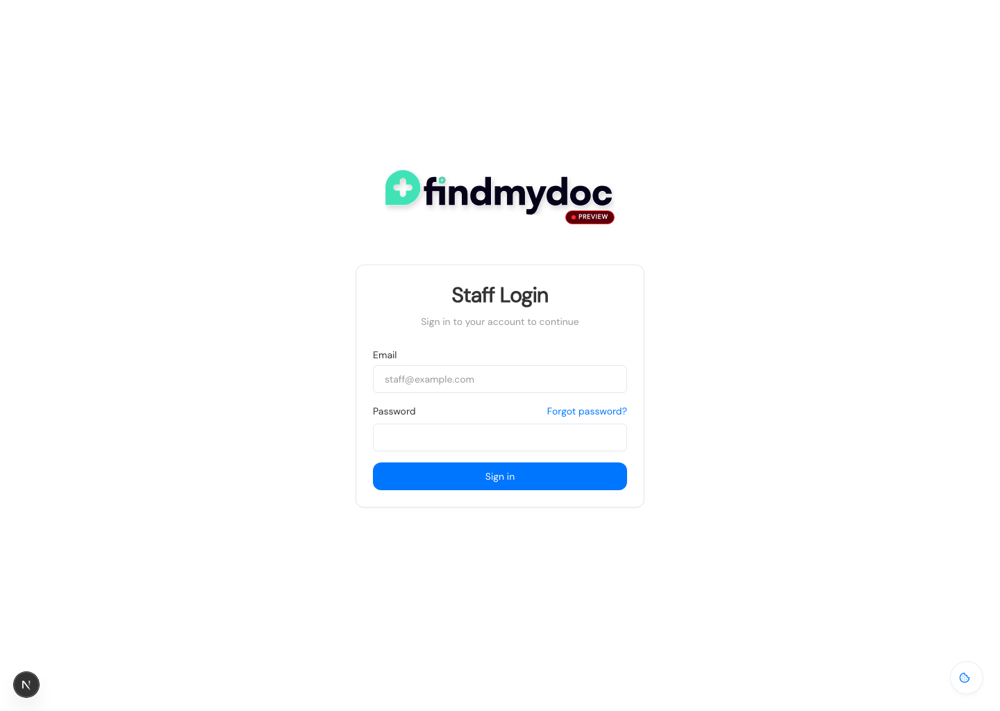
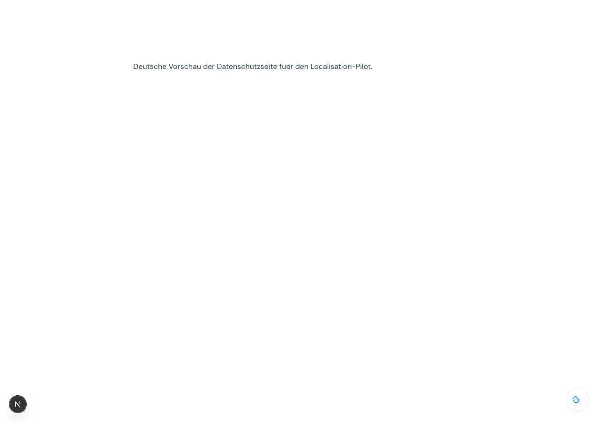

# Seiten und Beiträge auf Englisch und Deutsch pflegen

## Ziel

Du legst englische Inhalte in `Pages` oder `Posts` an, ergänzt danach die deutsche Übersetzung im selben Dokument und prüfst die deutsche Vorschau über die Locale-URL.

## Voraussetzungen

- Du bist als `Platform Staff` im CMS freigeschaltet.
- Die Basissprache bleibt `en`. Die zweite gepflegte Sprache ist `de`.
- `Slug`, Veröffentlichungsstatus, Veröffentlichungsdatum, Bilder sowie Beziehungsfelder wie Kategorien, Tags, Autoren und verwandte Beiträge gelten für beide Sprachen gemeinsam.
- Wenn du ein deutsches Feld leer lässt, zeigt die Vorschau an dieser Stelle weiter den englischen Wert.
- Getestet im Browser bis zur Staff-Login-Seite und für den Frontend-Aufruf einer deutschen Vorschau-URL. Die Schritte im eingeloggten CMS folgen der aktuellen Payload-Locale-Oberfläche, konnten hier ohne gültige lokale Admin-Zugangsdaten nicht vollständig im Browser durchgeklickt werden.

## Schritt-für-Schritt-Anleitung

1. Öffne `/admin/login` und melde dich mit deinem Staff-Konto an.

   

2. Öffne links die Sammlung `Pages` oder `Posts`.

3. Öffne einen bestehenden Eintrag oder klicke oben rechts auf `Create new`.

4. Pflege zuerst die englische Basisversion in `en`.
   Bei `Pages` gehören dazu vor allem `Title`, der `Layout`-Inhalt sowie optional `Meta Title` und `Meta Description`.
   Bei `Posts` gehören dazu vor allem `Title`, `Content`, `Excerpt` sowie optional `Meta Title` und `Meta Description`.

5. Speichere den Eintrag einmal, damit die gemeinsame Dokumentbasis steht.

6. Wechsle oben im Dokument in der Locale-Auswahl von `en` auf `de`.

7. Trage jetzt nur die übersetzbaren deutschen Inhalte ein.
   Übersetze also Titel, Inhaltsfelder und SEO-Texte.
   Lasse gemeinsame Felder wie `Slug`, Veröffentlichungsstatus, Bilder, Kategorien, Tags, Autoren und verwandte Beiträge unverändert.

8. Wenn ein deutscher Text noch fehlt, lasse das Feld leer.
   In der Vorschau fällt dieses Feld dann vorerst auf den englischen Inhalt zurück.

9. Öffne die Vorschau über die Aktion `Preview` im Dokumentkopf.
   Prüfe dort, dass die URL den Parameter `?locale=de` enthält und dass der sichtbare Inhalt deutsch ist.

   

10. Veröffentliche den Eintrag erst dann, wenn der gemeinsame Status für beide Sprachen so gesetzt werden soll.
    Der Veröffentlichungsstatus ist nicht pro Sprache getrennt.

## Prüfergebnis

Die deutsche Vorschau läuft auf derselben öffentlichen Route wie die englische Version, ergänzt aber `?locale=de`. Gemeinsame Felder bleiben identisch, und leere deutsche Felder zeigen weiter den englischen Fallback.
