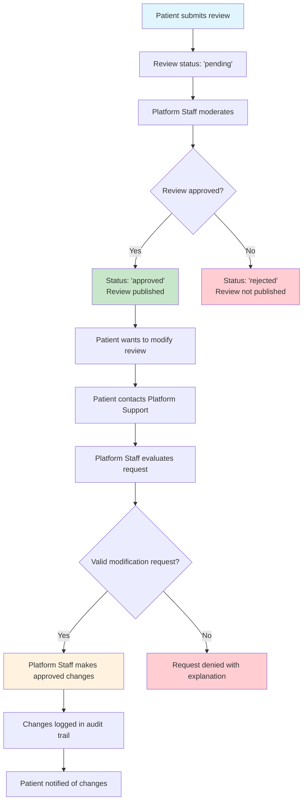

# Review Modification Process

## Overview

Once patients submit reviews, they cannot edit them directly. All review modifications must go through Platform Staff to maintain review integrity and prevent abuse.

## Process Flow

## Rules

1. **No Patient Editing**: Once submitted, patients cannot edit reviews directly
2. **Platform Staff Only**: Only Platform Staff can modify reviews
3. **Support Process**: Patients contact support for legitimate correction requests
4. **Audit Trail**: All changes are logged with timestamps and staff member ID

## Valid Modification Requests

- Factual errors (wrong treatment date, procedure name)
- Typos or grammatical mistakes
- Privacy concerns (removing personal information)
- Updated medical outcomes

## Invalid Modification Requests

- Rating changes without factual basis
- Retaliation against clinic/doctor
- Changes under pressure from healthcare providers
- Emotional changes without valid reason

## Technical Implementation

- **Update Access**: Platform Staff only
- **Audit Fields**: `lastEditedAt`, `editedBy`
- **Logging**: All modifications logged for compliance
- **Status Control**: Only Platform Staff can approve/reject reviews
