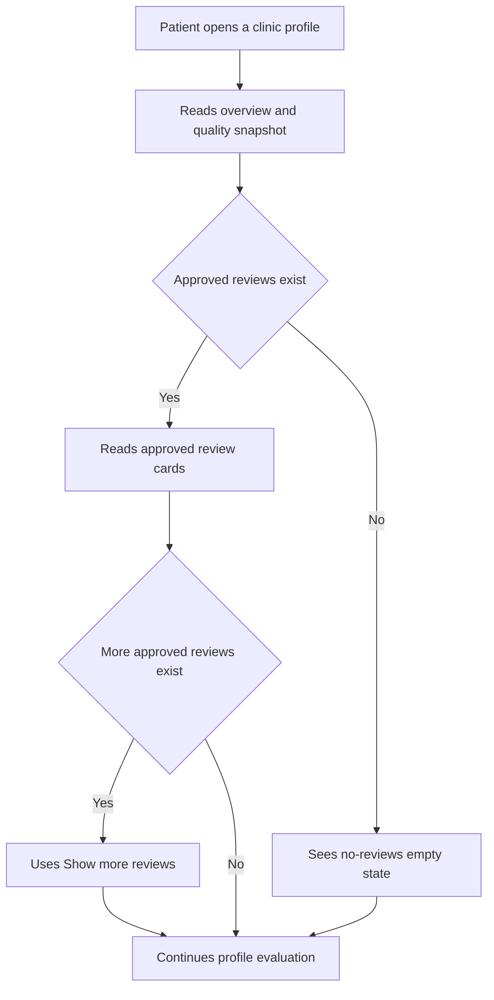

# Clinic Profile Customer Reviews Section

## Executive Summary

- Scenario: add a review section to the public clinic profile page for GitHub issue `#150`, "Display Customer Reviews".
- Patient problem: the current clinic profile exposes aggregate rating and review counts, but patients cannot read the approved review text behind those aggregates.
- Patient decision: use moderated patient feedback to decide whether the clinic feels credible enough to inspect treatments, doctors, location, or contact options.
- Trust/transparency outcome: patients see only approved, source-backed review text with review date, author label, rating, and total approved count; unapproved reviews and private author data stay hidden.

## Current State

- Inspected routes/components/collections: GitHub issue `#150`, `src/app/(frontend)/clinics/[slug]/page.tsx`, `src/components/templates/ClinicDetailConcepts/ClinicDetail.tsx`, `src/components/organisms/ClinicDetail/HeroOverviewSection.tsx`, `src/components/templates/ClinicDetailConcepts/types.ts`, `src/utilities/clinicDetail/serverData/getClinicDetailServerData.ts`, `src/utilities/clinicDetail/serverData/repositories.ts`, `src/utilities/clinicDetail/serverData/mappers.ts`, `src/collections/Reviews.ts`, `src/access/scopeFilters.ts`, `src/hooks/calculations/updateAverageRatings.ts`, and `src/stories/templates/ClinicDetailConcepts.stories.tsx`.
- Issue facts: issue `#150` is open and asks for a `Reviews` section on clinic profiles, approved text-based reviews, user name, review date, and a total displayed-review count. A comment on September 15, 2025 says this is "Not for MVP for now."
- Current UX behavior: clinic detail renders a `Patient Reviews` section with approved review cards, count near the title, moderated-copy text, and an empty state.
- Current data behavior: `getClinicDetailServerData` calls `countApprovedClinicReviews`, `countApprovedDoctorReviews`, and `findApprovedClinicReviewsByClinicId`, then maps approved review comments into `ClinicDetailData.reviews`.
- Current review model: `reviews` has `status`, `starRating`, `comment`, `reviewDate`, `patient`, `authorVisibility`, `publicAuthorName`, `clinic`, `doctor`, and `treatment`; `patient` relates to `patients`; public read access is filtered to approved reviews through `platformOnlyOrApprovedReviews`; average-rating hooks update clinic, doctor, and treatment averages after review changes.
- Current author policy: anonymous reviews display `Verified patient`; opted-in reviews display the `publicAuthorName` snapshot generated from patient first name plus last-name initial.
- Seed/runtime status: demo seeds create real Patient records before Reviews and regenerate Review seeds against `patients`.
- Visual grounding screenshots used before mockups:
  - `output/playwright/customer-reviews-design/clinic-detail-story-mobile-390.png`
  - `output/playwright/customer-reviews-design/clinic-detail-story-tablet-834.png`
  - `output/playwright/customer-reviews-design/clinic-detail-story-desktop-1280.png`
- Logo reference: `public/fmd-logo-1-dark.png` was inspected, but the final mockups intentionally do not show the logo or global chrome. Implementation should reuse the existing global `Header`, `Footer`, and `Logo` unchanged.
- Mockup generation note: the first imagegen pass was rejected because it introduced unsupported CTA and trust-copy elements. Final repo-bound mockups are deterministic Playwright-rendered bitmap design artifacts grounded in the Storybook screenshots and the documented UI contract.

## User Journey

1. Patient opens a public clinic profile from search, listing comparison, or a shared link.
2. Patient reads the clinic overview and aggregate quality snapshot.
3. Patient reaches `Patient reviews` and sees the total approved review count plus source-backed review cards.
4. Patient scans each card for author label, date, rating, and text; if more approved reviews exist, they can reveal more without leaving the profile.
5. If no approved reviews exist, the section remains present and explains that approved text reviews will appear after moderation.
6. Patient continues to doctors, treatments, location, or contact only after understanding what review evidence exists.

## Mermaid Flow

## Functional Requirements

### Must

- Render a `Reviews` section on every approved clinic profile page, including the zero-review state.
- Display only approved reviews. Pending, rejected, soft-deleted, or inaccessible review records must not appear.
- Show the total approved review count on the clinic profile page.
- For each visible populated review card, show a public author display label, the review date, and the text review comment.
- Treat author display labels as privacy-sensitive. Public UI must use `reviews.publicAuthorName` only when `authorVisibility = firstNameInitial`; otherwise it must show `Verified patient`.
- Keep reusable UI components Payload-free; Payload mapping belongs in route/server-data adapters.
- Sort populated reviews newest first by `reviewDate`.
- Keep the initial mobile list short enough to scan; use `Show more reviews` only when more approved reviews exist than the initial visible slice.
- Preserve the current clinic detail visual language from Storybook: light site canvas, navy headings, bright blue accents, pill controls, soft cards, and mobile-first stacking.
- Keep the section public-route safe and deterministic for SEO: no client-only loading shell for the initial approved reviews already fetched server-side.

### Should

- Show `starRating` when available because it is already source-backed in `reviews`.
- Use first name plus last initial only from the stored `publicAuthorName` snapshot.
- Include treatment or doctor context only in a future extension; issue `#150` only requires user name, date, count, and text.
- Add Storybook states for populated, empty, long comment, long author label, and many-review pagination/reveal behavior.
- Keep `Show more reviews` as a secondary action below the review cards instead of competing with treatment/contact CTAs.

### Must Not

- Show unapproved, rejected, pending, or deleted review text.
- Expose patient email, full private profile, date of birth, phone number, address, Supabase ID, or other private patient fields.
- Display fabricated reviews, fake patient names, unsupported badges, or external trust claims.
- Change review creation, editing, or moderation workflows as part of this component design.
- Add recommendation, ranking, comparison, booking, inquiry, or contact workflow copy to the Reviews section.
- Use a hover-only control for revealing more reviews.
- Use generated or approximate findmydoc logo assets in this section.

### Out of Scope

- Review submission UI.
- Patient review editing or support-contact workflow.
- Admin moderation UI changes.
- Booking verification, treatment-outcome proof, or before/after proof linking.
- Structured review schema markup unless SEO approves the public-content model.
- A full patient testimonials carousel.

## Visual Mockups

| Mockup | File | Purpose | Functions shown | Notes |
| --- | --- | --- | --- | --- |
| Mobile | `mobile.png` | Shows the narrow clinic profile hierarchy with the Reviews section stacked below existing overview context. | Clinic context, quality snapshot, `Reviews` eyebrow, `Patient reviews` heading, approved count, trust copy, three review cards, rating dots, name, date, text, and `Show more reviews`. | Primary populated state. The context above Reviews is grounding, not new issue-owned chrome. |
| Tablet | `tablet.png` | Shows a two-column tablet adaptation with explanation on the left and cards on the right. | Same populated functions as mobile with tablet spacing and touch-safe `Show more reviews`. | No hover-only behavior or side navigation. |
| Desktop | `desktop.png` | Shows a wider clinic detail section that supports faster scanning while keeping the Reviews section calm. | Two-column review card grid, count pill, approved-only copy, and secondary reveal button. | Dense enough for desktop without adding comparison or recommendation behavior. |
| Mobile empty | `mobile-empty.png` | Shows the zero-approved-review state on the narrowest profile slice. | Context snapshot with zero count, Reviews heading, approved count, and empty-state panel. | The section remains present even when no approved reviews exist. |
| Tablet empty | `tablet-empty.png` | Shows the no-review tablet adaptation. | Same empty-state contract with left explanatory column and right empty panel. | No duplicate action is required. |
| Desktop empty | `desktop-empty.png` | Shows desktop no-review handling. | Same empty-state contract at wide layout. | Avoids hiding the Reviews section. |

## State Coverage

| State | Mobile evidence | Tablet evidence | Desktop evidence | Notes |
| --- | --- | --- | --- | --- |
| Populated | `mobile.png` | `tablet.png` | `desktop.png` | Shows newest approved reviews with count and reveal action. |
| Empty | `mobile-empty.png` | `tablet-empty.png` | `desktop-empty.png` | Shows zero approved reviews while keeping the section visible. |
| Pending | Text-only contract | Text-only contract | Text-only contract | Server-rendered initial reviews should not need a pending state unless `Show more reviews` fetches additional pages client-side. If client pagination is used, the button must expose `aria-busy` and stable loading text. |
| Error | Text-only contract | Text-only contract | Text-only contract | Initial server-data errors should fail closed by rendering zero public review text, not leaking private or unapproved data. Client pagination errors should stay below the button and keep existing cards visible. |
| Long content | Text-only contract | Text-only contract | Text-only contract | Implementation must include Storybook or Playwright evidence for long author labels and long review text. |

## Visible UI Contract

Anything not documented in this table is out of implementation scope.

| UI element | Patient value | Trust/transparency purpose | Data source | Component ownership | Allowed behavior |
| --- | --- | --- | --- | --- | --- |
| Clinic overview context | Grounds the Reviews section inside a clinic profile. | Prevents the section from looking detached from existing clinic evidence. | Existing `ClinicDetailData` fields. | Existing clinic detail route and template. | Context only in mockups; implementation does not need a new overview component. |
| Clinic name | Identifies which clinic the reviews belong to. | Anchors reviews to one profile. | `clinics.name`. | Existing `HeroOverviewSection`. | Reuse existing profile heading outside this component. |
| Clinic description | Reminds the patient of the current profile context. | Separates clinic-authored overview from patient review text. | `clinics.description` mapped through existing server data. | Existing clinic detail mapping. | Reused context only. |
| Quality snapshot | Shows current aggregate trust facts around rating, review count, verification, and languages. | Connects the review list to existing aggregate count. | `ClinicDetailData.trust`. | Existing `HeroQualitySummary`. | Keep count consistent with Reviews section count. |
| `Reviews` eyebrow | Marks the section category. | Makes the new section easy to scan. | Static copy. | New `ClinicReviewsSection`. | Render as small uppercase section label. |
| `Patient reviews` heading | Names the patient task. | Distinguishes moderated patient feedback from clinic-authored copy. | Static copy. | New `ClinicReviewsSection` using `Heading`. | Use a semantic `h2` below the clinic profile `h1`. |
| Approved reviews count pill | Shows how much approved review evidence exists. | Makes the count explicit and auditable. | Total approved reviews for the current clinic. | Server-data mapper plus new section. | Show `0 approved reviews`, `1 approved review`, or `{n} approved reviews`; keep synced with displayed review source. |
| Count status icon | Visually anchors the count pill. | Indicates moderation status without claiming certification. | Static icon/state treatment. | New `ClinicReviewsSection`. | Decorative or labelled status; if decorative, set `aria-hidden="true"`. Do not imply external accreditation. |
| Approved-only helper copy | Explains why only some reviews appear. | Clarifies moderation and avoids implying all submitted reviews are public. | Static copy plus `reviews.status`. | New `ClinicReviewsSection`. | Keep concise; no marketing copy. |
| Review card | Groups one approved review. | Keeps author/date/rating/comment tied together. | `reviews` collection. | New `ClinicReviewCard` or local card inside `ClinicReviewsSection`. | Render one approved review per card; stable height and wrapping on mobile. |
| Rating dots and numeric value | Shows the scored review evidence. | Links text review to the source-backed rating field. | `reviews.starRating`. | New rating display helper. | Optional if product removes rating from visible contract; if rendered, use 1-5 only and accessible text. |
| Author display label | Shows who the review is attributed to. | Satisfies issue requirement for user name while preserving privacy. | `reviews.publicAuthorName` when set; otherwise static `Verified patient`. | Server-data mapper. | Must be privacy-safe and moderated; do not expose private patient account fields by default. |
| Review date | Shows when the review was written. | Helps patients judge freshness. | `reviews.reviewDate`. | Server-data mapper and card. | Format consistently, for example `Jan 12, 2026`; expose machine-readable `dateTime`. |
| Review text | Provides the actual customer review. | Lets patients inspect the evidence behind aggregate rating. | `reviews.comment`. | Server-data mapper and card. | Display approved text only; preserve line wrapping; cap or expand long text only with accessible controls. |
| `Show more reviews` button | Lets patients read beyond the initial slice. | Avoids hiding available approved evidence while keeping mobile concise. | Approved review count plus visible slice length. | New section, optionally client leaf for pagination/reveal. | Render only when more approved reviews exist; no hover-only behavior; keep existing cards visible during errors. |
| Empty-state panel | Handles clinics with no approved review text. | Keeps the required Reviews section present without inventing evidence. | Approved review count equals zero. | New `ClinicReviewsSection`. | Show `No patient reviews yet` and short moderation copy; no fake cards or CTA. |

## Data Model Plan

| Collection/source | Needed fields | Relationship | Permissions | Provenance/freshness | Status |
| --- | --- | --- | --- | --- | --- |
| `reviews` | Existing `id`, `status`, `starRating`, `comment`, `reviewDate`, `clinic`, `doctor`, `treatment`, `patient`, plus `authorVisibility` and `publicAuthorName`. | Review belongs to one patient, one clinic, one doctor, and one treatment in the current model. | Public reads only approved records via `platformOnlyOrApprovedReviews`; platform staff can read all for moderation. | Live Payload data; average hooks already update aggregates after change/delete. | Supported. |
| `reviews.publicAuthorName` | Public display snapshot for opted-in author attribution. | Attached to each review. | Generated by review hooks; public read only when review is approved. | Set when `authorVisibility = firstNameInitial`; cleared for anonymous reviews. | Supported. |
| `patients` | `firstName`, `lastName`, and `stableId` for seeded patient authors. | Direct review author relation. | Private by default; public UI never loads patient objects for clinic detail reviews. | Patient profile data can change, so public review display uses a snapshot. | Supported. |
| Clinic detail server data | `reviews.totalCount`, `reviews.items`, `reviews.hasMore`. | Mapped into `ClinicDetailData`. | Server fetch uses public approved-review filter. | Fetch newest approved records per request; count must match same filter. | Supported. |
| `clinics.averageRating` | Existing aggregate rating. | Updated from approved review ratings. | Public approved clinic read. | Maintained by `updateAverageRatingsAfterChange` and `updateAverageRatingsAfterDelete`. | Supported; keep consistent with review count. |

## Component Plan

| Feature | Reuse/change/new | Candidate component or module | Notes |
| --- | --- | --- | --- |
| Review data type | New/change | `src/components/templates/ClinicDetailConcepts/types.ts` | Add `ClinicDetailReview` and `reviews: { totalCount; items; hasMore }` to `ClinicDetailData`. |
| Approved review repository query | New | `src/utilities/clinicDetail/serverData/repositories.ts` | Add `findApprovedClinicReviewsByClinicId` with sort `-reviewDate`, limit/page support, and selected public fields only. |
| Review mapping | New/change | `src/utilities/clinicDetail/serverData/mappers.ts` | Normalize date, rating, comment, and optional `publicAuthorName` before UI. |
| Clinic detail assembly | Change | `src/utilities/clinicDetail/serverData/getClinicDetailServerData.ts` | Fetch approved review list alongside current count; ensure count/list filters match. |
| Reviews section | New | `src/components/organisms/ClinicDetail/ClinicReviewsSection.tsx` | Presentation-only component; no Payload imports. Use `Heading`, card primitives, and mobile-first layout. |
| Review card | New | Local component in `ClinicReviewsSection` or `src/components/molecules/ClinicDetail` | Keep wrapping stable for long names/comments and accessible rating text. |
| Show more behavior | New optional client leaf | `ClinicReviewsSection.client.tsx` or local client child | Use only if reviews are client-paginated/revealed. Initial server-rendered slice can also reveal already-fetched items client-side. |
| Empty state | New | `ClinicReviewsSection` | Always render when count is zero; no fake review cards. |
| Clinic detail placement | Change | `src/components/templates/ClinicDetailConcepts/ClinicDetail.tsx` | Insert after hero overview/quality context and before location/treatments so review evidence appears before deeper action sections. |
| Storybook states | New/change | `src/stories/organisms/ClinicDetail` or `src/stories/templates/ClinicDetailConcepts.stories.tsx` | Add populated, empty, long content, and many-review states with viewport matrix coverage. |
| Tests | New/change | Existing Vitest/Storybook/Playwright lanes | Add mapper tests for approved-only filtering and author-label fallback; route-level Playwright after implementation. |

## Differences From Current Implementation

- Mobile: adds a dedicated stacked Reviews section below clinic overview context, with a visible approved count, approved-only helper copy, card list, and touch-safe `Show more reviews`.
- Tablet: adapts the same content into a two-column section so the count/explanation stays visible while review cards remain easy to scan.
- Desktop: uses a wider two-column layout with a compact review-card grid, without adding recommendation, comparison, booking, or testimonial-carousel behavior.
- Empty state: changes the current absence of a review section into an explicit `No patient reviews yet` panel that still satisfies the issue requirement that the Reviews section is present.
- Data mapping: changes clinic detail from count-only reviews to count plus approved text review items.
- Privacy: uses anonymous display by default and only shows the stored opt-in author snapshot.

## Acceptance Criteria

- Mobile: at `320px`, `375px`, `640px`, `768px`, `1024px`, and `1280px`, the section has no horizontal overflow, clipped names, clipped dates, ambiguous CTA order, or crowded touch targets.
- Tablet: count/explanation and review cards remain readable without hover-only interactions; `Show more reviews` is reachable by touch.
- Desktop: review cards scan in a controlled grid; the section does not dominate or displace the clinic contact/treatment flows unexpectedly.
- Empty state: `Patient reviews`, zero approved count, and `No patient reviews yet` render when no approved reviews exist.
- Populated state: all visible review cards come from approved review records for the current clinic and show public author label, formatted date, comment, and rating if rating remains in scope.
- Data source: count and visible items use the same `status = approved` and `clinic = current clinic` filter; pending/rejected/deleted records are excluded.
- Privacy/security: public UI never exposes patient email, full private profile, phone, address, Supabase IDs, internal platform staff proxy names, or unapproved review text.
- Accessibility: section heading is semantic, rating has accessible text, dates use `time dateTime`, `Show more reviews` has visible focus and no hover-only dependency, loading/errors are announced if client pagination exists, and decorative icons are hidden from assistive tech.
- SEO: public clinic route content remains server-renderable for initial approved reviews; any structured data requires a separate SEO/security decision.
- Review: run `plan_design_reviewer` on this folder before implementation; after implementation run mobile UI, accessibility, security, and SEO reviewers.

## Specialist Review Handoff

- `plan_design_reviewer`: required against this single scenario folder.
- `mobile_ui_reviewer`: required after implementation because a new public route section changes responsive hierarchy and touch behavior.
- `accessibility_reviewer`: required after implementation because review cards, ratings, dates, reveal controls, and empty/error states need semantic validation.
- `security_reviewer`: required after implementation because public review text and author labels touch permissions, moderation, and patient privacy.
- `seo_reviewer`: required after implementation because the public indexable clinic profile gains new user-generated content and an additional heading.
- `web_vitals_reviewer`: optional unless implementation adds client pagination, heavy hydration, animation, layout shift risk, or new media.

## Assumptions and Data Gaps

### Assumptions

- Issue `#150` is implemented as a moderated public clinic-detail review section.
- Reviews are displayed on public approved clinic profiles only.
- Review count should represent approved reviews for the current clinic, not all submitted reviews.
- The initial visible populated slice can show three reviews on mobile/tablet/desktop and reveal more only when additional approved reviews exist.
- Star rating is acceptable to show because it is already part of the `reviews` source model; product can remove it from implementation if text-only means comment/name/date/count only.

### Data Gaps

- Consent/provenance beyond `authorVisibility` is not documented for richer public patient profiles.
- Client pagination beyond the initial fetched review slice is not implemented.
- SEO structured data for reviews is undecided and should not be added without reviewer approval.

<!-- topic: clinic-customer-reviews; scenario: profile-review-section -->
