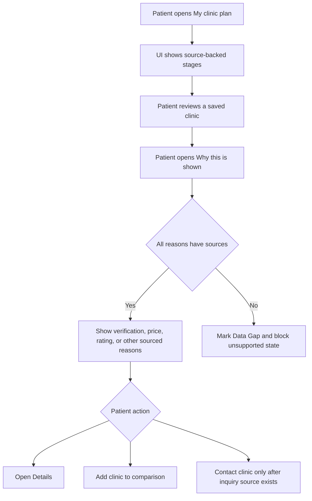
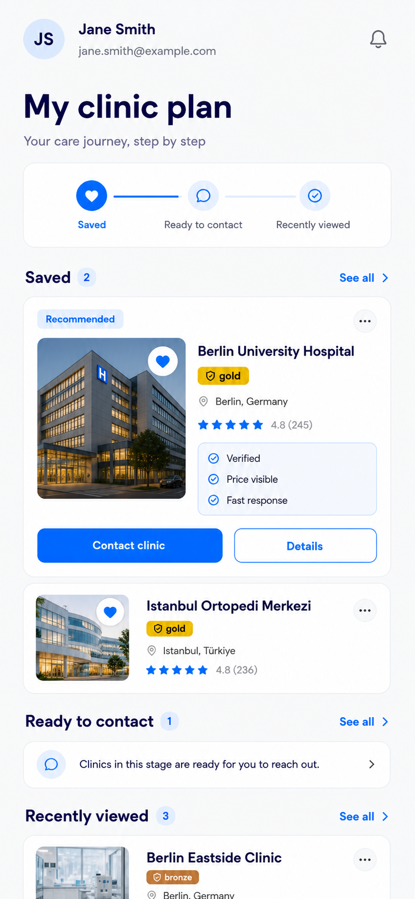
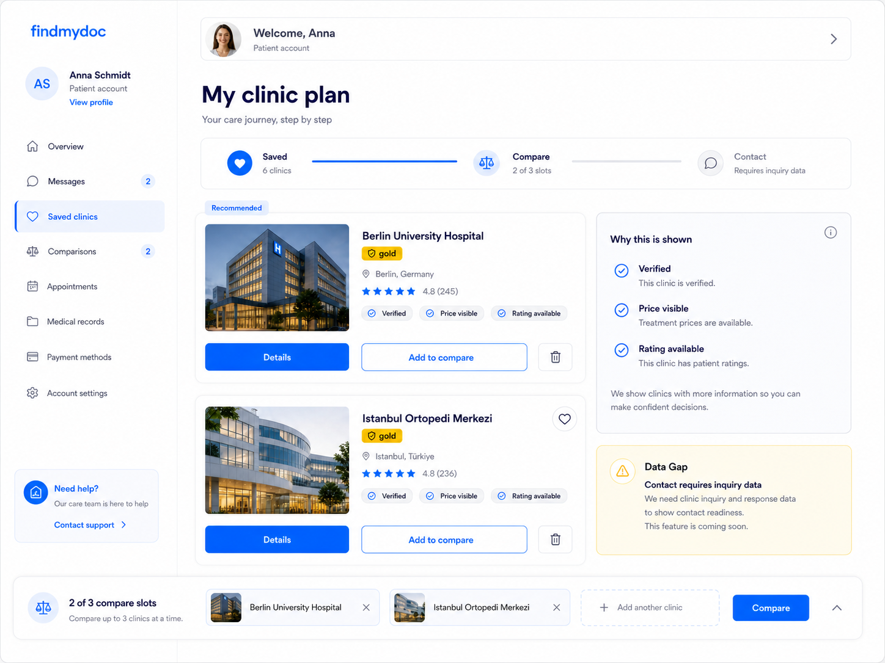
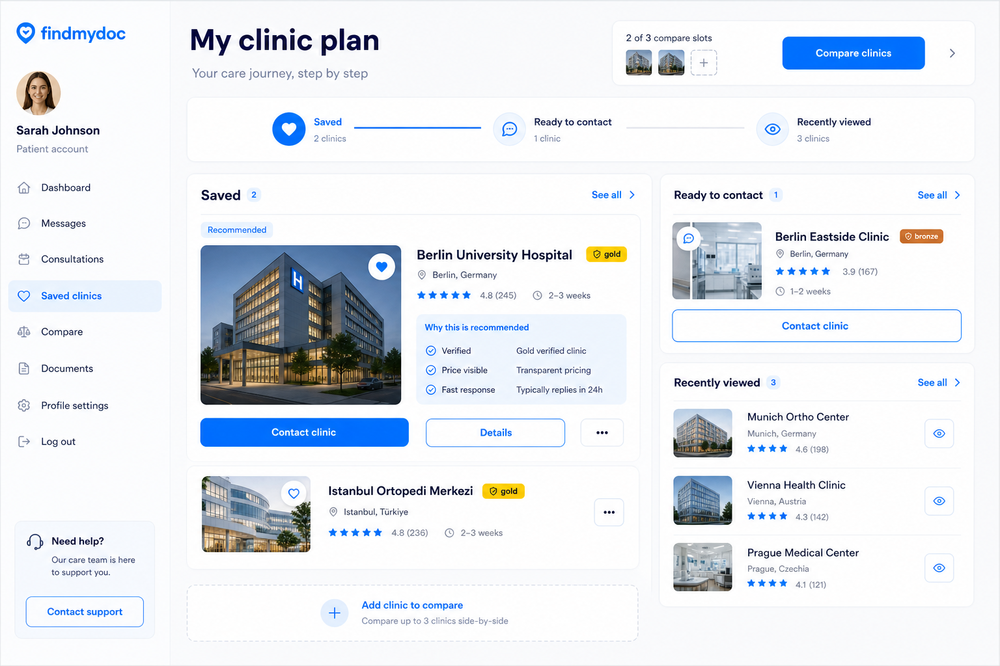

# Clinic Plan

## Executive Summary

Clinic Plan turns favorites into a guided patient journey. It is the most ambitious scenario because it connects saved clinics to staged next actions, but it must be strict about data sources: contact readiness, recommendations, notifications, fast response, and recently viewed states are not implementable until source-backed.

- Scenario: patient reviews saved clinics as a care-planning sequence.
- Patient problem: saved clinics do not currently explain what the patient should do next.
- Patient decision: whether to inspect details, add a clinic to compare, or contact a clinic when the source data supports that action.
- Trust/transparency outcome: the patient sees why a clinic is shown and which next actions are unavailable because data is missing.

## Current State

- Inspected routes/components/collections: `/patient/favorites`, `FavoriteClinicsList`, `FavoriteClinicButton`, `findPatientFavoriteClinicListItems`, `favoriteclinics`, `clinics`, `clinictreatments`, `reviews`.
- Current UX behavior: saved clinics are shown as a basic list with details and remove actions.
- Current data: `favoriteclinics` does not store journey stages, compare slots, viewed timestamps, recommendation reasons, or inquiry status.
- Current limitations: no patient journey engine, no contact workflow, no notification source, no recently viewed source, no source-backed recommendation model.
- Reference screenshots: `mobile.png`, `tablet.png`, and `desktop.png` are generated planning mockups. The README controls implementation scope and blocks unsupported states.

## User Journey

1. Patient opens `My clinic plan` from their profile.
2. UI shows source-backed journey stages and explicitly marks contact readiness as unavailable when inquiry data is missing.
3. Patient reviews a saved clinic and opens `Why this is shown`.
4. UI explains source-backed reasons such as verification, visible price, and available rating.
5. Patient opens details or adds the clinic to comparison.
6. `Contact clinic`, `Fast response`, and contact stages stay hidden or disabled until inquiry data exists.
7. Patient ends with a transparent plan rather than a black-box recommendation.

## Mermaid Flow

## Functional Requirements

### Must

- Explain why a clinic is shown using source-backed reasons.
- Mark missing contact/inquiry capability as a Data Gap.
- Keep `Details` available as the safest next step.
- Allow `Add to compare` only if compare slots are implemented and max three is enforced.
- Show journey stages only when their counts map to real state.
- Keep recommendation language explainable and non-ranking.

### Should

- Use Clinic Plan after Decision Shortlist or Compare Board foundations exist.
- Prefer computed reasons from existing clinic facts before adding persisted recommendation reasons.
- Use tablet and desktop space to show a reason panel alongside saved clinic cards.
- Keep unavailable contact functionality transparent without making it a primary CTA.

### Must Not

- Show patient-plan `Contact clinic` as an active action without patient-owned inquiry rules.
- Show `Fast response` without measured response timestamps.
- Show `Recently viewed` without event or timestamp data.
- Show notification controls without a notification source.
- Use `Recommended` as a black-box ranking.
- Render decorative progress visuals that do not map to real counts.

### Out of Scope

- Full inquiry workflow.
- Notification center.
- Black-box recommendation scoring.
- Recently viewed implementation without source data.
- Medical advice or clinical suitability claims.

## Visual Mockups

| Mockup | File | Purpose | Functions shown | Notes |
| --- | --- | --- | --- | --- |
| Mobile | `mobile.png` | Shows the original guided journey concept on a narrow screen. | Account header, journey stages, recommended card, reasons, contact/details actions, section summaries. | Contains unsupported `Contact clinic`, `Fast response`, and recently viewed states; those are blocked until data exists. |
| Tablet | `tablet.png` | Shows the source-backed version preferred for planning. | Account shell, saved/compare journey, reason panel, data-gap notice, compare tray. | Best reference for transparent Data Gap behavior. |
| Desktop | `desktop.png` | Shows broad account-context journey planning. | Sidebar, journey strip, recommended panel, reason summary, compare controls. | Must be reconciled with data gaps before implementation. |

## Visible UI Contract

Anything not documented in this table is out of implementation scope.

| UI element | Patient value | Trust/transparency purpose | Data source | Component ownership | Allowed behavior |
| --- | --- | --- | --- | --- | --- |
| Patient account shell/header | Confirms private patient context. | Shows patient-owned journey state. | Auth session and `patients`. | New `PatientAccountShell`. | Render only on authenticated patient routes. |
| Account navigation | Helps orient plan within profile. | Prevents plan from feeling like standalone marketing. | Existing or planned routes. | `PatientAccountShell`. | Render only real destinations. |
| Notification bell | Could show clinic updates. | Must reflect real account notifications. | Data Gap: future notifications/inquiry updates. | Future notification component. | Do not implement until source exists. |
| Support card | Gives fallback help. | Builds trust through human support path. | Existing support route or configured support contact. | Optional `PatientSupportCard`. | Do not render without destination. |
| `My clinic plan` title/subtitle | Frames guided decision support. | Makes page purpose explicit. | Static route copy. | Route-level copy. | Use only for this journey scenario. |
| Journey progress strip | Shows stages and counts. | Makes status understandable. | `favoriteclinics.decisionStage`; future inquiry/view data. | `ClinicJourneyProgress`. | Show only stages backed by sources. |
| `Saved` stage | Shows clinics still being considered. | Keeps saved count explicit. | `favoriteclinics`. | `ClinicJourneyProgress`, `ClinicPlanSection`. | Supported after favorite read model update. |
| `Compare` stage/tray | Shows active comparison. | Keeps max-three compare model visible. | `favoriteclinics.compareSlot`. | Reuse `CompareTray`. | Requires compare-slot implementation. |
| `Contact` / ready-to-contact stage | Shows contact readiness. | Must be based on real criteria. | `patientClinicInquiries` intake exists; readiness rules remain missing. | Future `ReadyToContactPanel`. | Hide or disable until patient-owned status rules exist. |
| `Recently viewed` section | Shows browsing context. | Context only, not recommendation. | Data Gap: `patientClinicInteractions` or `favoriteclinics.lastViewedAt`. | Future `RecentlyViewedClinicsPanel`. | Do not render until source exists. |
| `Recommended` label | Highlights a clinic. | Must be explainable, not ranking. | Computed source-backed reasons or future persisted reasons. | `RecommendationBadge`. | Render only when at least one visible reason exists; consider label `Suggested by available facts`. |
| `Why this is shown` panel | Explains reason basis. | Core transparency feature. | Structured reasons with `sourceCollection`, `sourceField`, `computedAt`. | `RecommendationReasons`. | Show only source-backed reasons and Data Gaps separately. |
| `Verified` reason | Shows platform verification. | Source-backed trust signal. | `clinics.verification`. | Reuse `VerificationBadge` plus reason row. | Supported. |
| `Price visible` reason | Shows pricing transparency. | Confirms cost basis can be inspected. | `clinictreatments.price` for selected treatment context. | `TrustSignalList` / reason mapper. | Supported only when treatment scope is known. |
| `Rating available` reason | Shows patient feedback exists. | Distinguishes available aggregate evidence from missing reviews. | `clinics.averageRating` plus approved review count. | `RecommendationReasons`. | Show count with rating. |
| `Fast response` reason | Shows responsiveness. | Must be measured, not guessed. | Data Gap: inquiry response timestamps. | Future reason mapper. | Do not implement until source exists. |
| Clinic media/name/location/rating | Shows provider facts. | Grounds actions in real clinic data. | `clinics`, `reviews`. | Reuse `Media`, `RatingSummary`, location pattern. | Supported for base cards. |
| `Details` button | Opens deeper evidence. | Safe verification path. | `/clinics/[slug]`. | Reuse `Button`. | Always available when slug exists. |
| `Add to compare` button | Moves clinic into compare flow. | Supports evidence-based comparison. | `favoriteclinics.compareSlot`. | Compare action control. | Requires max-three validation. |
| `Contact clinic` button | Starts inquiry. | Trust-critical action requiring persisted state. | Clinic profile requests persist in `patientClinicInquiries`; patient-plan action remains future. | Future inquiry action. | Reuse or extend the existing inquiry API only after patient ownership is defined. |
| Data Gap notice | Explains unavailable functionality. | Builds trust by not pretending source data exists. | Missing source facts. | New `DataGapNotice`. | Use for blocked contact, response, or view-history states. |
| Overflow/menu button | Holds secondary actions. | Keeps management actions quiet. | Favorite and compare state. | `ClinicPlanMenu`. | Include only documented actions. |

## Data Model Plan

| Collection/source | Needed fields | Relationship | Permissions | Provenance/freshness | Status |
| --- | --- | --- | --- | --- | --- |
| `favoriteclinics` | Add `decisionStage`, `compareSlot`, `compareAddedAt`; optional `lastViewedAt` only if no event collection exists. | Patient-to-clinic saved state. | Patient can manage own records. | Existing timestamps plus stage/compare timestamps. | Required extension. |
| `clinics` | Name, slug, thumbnail, address, verification, average rating. | Referenced by favorite. | Public approved facts. | Existing clinic lifecycle. | Supported. |
| `clinictreatments` | Price availability and treatment scope. | Clinic treatment facts. | Public price facts only. | Clinic treatment updates. | Needed for price-visible reason. |
| `reviews` | Approved review count and aggregate. | Clinic aggregate. | Public aggregate only. | Review approval lifecycle. | Needs read-model inclusion. |
| `patientClinicInquiries` | Current: clinic, contact fields, selected doctor/treatment, status, consent evidence, and source path. Future: optional patient/favorite links and response timestamps. | Clinic profile contact request. | Platform-owned intake today; patient/clinic scoped access remains future. | Submitted timestamps today; response lifecycle remains future. | Partial source exists for clinic profile contact UI. |
| `patientClinicInteractions` | `patient`, `clinic`, `interactionType`, `occurredAt`, `sourcePath`. | Patient-to-clinic behavior history. | Patient-owned. | Event timestamps. | Data Gap; required before recently viewed. |
| Recommendation reasons | `reasonKey`, `label`, `sourceCollection`, `sourceField`, `computedAt`; optionally persisted. | Patient/favorite/clinic. | Patient-visible derived facts. | Refresh when source facts change. | Prefer computed v1; persist only if needed. |

Read model requirements:

- `journeyCounts`: saved, compared, contact-ready, contacted, recently viewed where backed.
- `recommendedFavorite`: present only when visible reasons exist.
- `recommendationReasons`: structured, source-backed, and timestamped.
- `dataGaps`: explicit unavailable features and missing sources.
- `compareState`: selected count, max `3`, and selected clinics.

## Component Plan

| Feature | Reuse/change/new | Candidate component or module | Notes |
| --- | --- | --- | --- |
| Base clinic cards | Change | `FavoriteClinicsList`, shared clinic primitives | Add journey variants. |
| Favorite behavior | Reuse/change | `FavoriteClinicButton` | Keep remove quiet. |
| Account shell | New | `PatientAccountShell` | Shared with other patient scenarios. |
| Journey strip | New | `ClinicJourneyProgress` | Must map to real counts. |
| Plan sections | New | `ClinicPlanSection`, `ClinicPlanRecommendedCard` | Separate source-backed and blocked states. |
| Reasons panel | New | `RecommendationReasons` | Must include source fields and Data Gaps. |
| Data gap notice | New | `DataGapNotice` | Required for unavailable contact/recently viewed. |
| Compare tray/action | Reuse/change | `CompareTray`, compare controls | Depends on compare-slot fields. |
| Inquiry action | New future | `ContactClinicButton` | Extend existing clinic profile inquiry API after patient ownership is defined. |

## Differences From Current Implementation

- Mobile: changes the plain list into a staged journey concept, but unsupported contact/recently viewed states must be removed or disabled before implementation.
- Tablet: adds the clearest source-backed variant with reason panel and explicit Data Gap notice.
- Desktop: adds account navigation, journey strip, side reason panel, and compare tray.
- Data behavior: requires journey state, compare slots, reason derivation, and future inquiry/interaction data.
- Trust behavior: changes from implicit recommendations to explicit reasons and visible Data Gaps.

## Acceptance Criteria

- Mobile: no active contact, fast-response, notification, or recently viewed UI appears without source data.
- Tablet: reason panel and Data Gap notice are visible without blocking core `Details` and `Add to compare` actions.
- Desktop: journey strip maps to real counts and compare tray enforces max three.
- Data source: every recommendation reason names a source collection and field.
- Accessibility: journey stages, reason rows, Data Gap notices, icon buttons, and menus have semantic labels and keyboard paths.
- Review: `plan_design_reviewer` confirms every visible unsupported state is blocked or documented as out of scope.

## Specialist Review Handoff

- `plan_design_reviewer`: required against this single scenario folder before implementation.
- `mobile_ui_reviewer`: required because staged journey UI and compare tray can crowd mobile screens.
- `accessibility_reviewer`: required for progress stages, reason panels, icon buttons, menus, and disabled/explanatory states.
- `security_reviewer`: required for patient inquiry, interaction, recommendation, or compare state collections.
- `seo_reviewer`: not required for the private patient page unless public metadata changes.
- `web_vitals_reviewer`: useful if journey panels, images, or client state increase page weight.

## Assumptions and Data Gaps

### Assumptions

- Clinic Plan is a later-stage concept after shortlist and compare foundations exist.
- Source-backed reasons can be computed from existing clinic facts before introducing persisted reason records.
- `Contact clinic` should remain unavailable until an inquiry lifecycle exists.

### Data Gaps

- `patientClinicInquiries` now covers clinic profile submissions; patient-owned contact, contacted, ready-to-contact, and fast-response states still need ownership and response lifecycle rules.
- `patientClinicInteractions` or `lastViewedAt` is required for recently viewed.
- Notification source is missing.
- Recommendation freshness and reason refresh policy need implementation decisions before persisted reasons are introduced.
