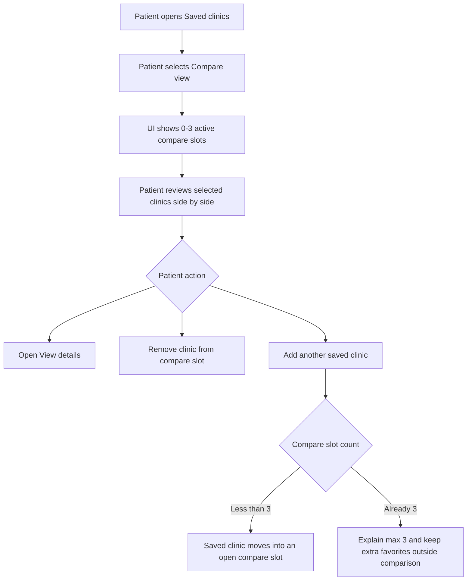
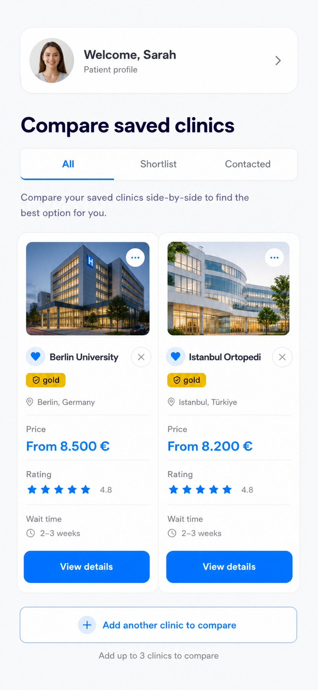
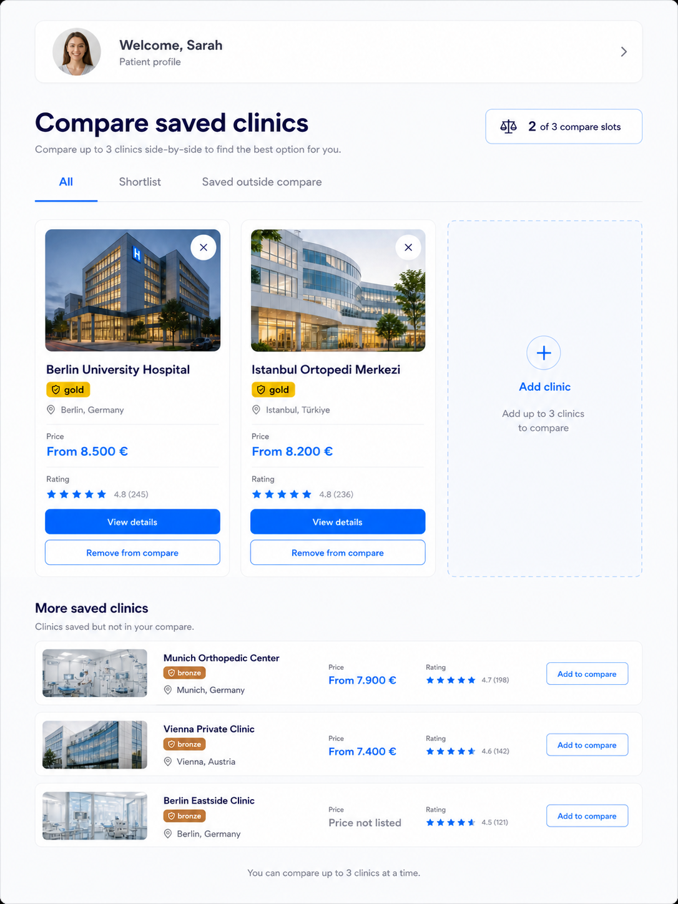
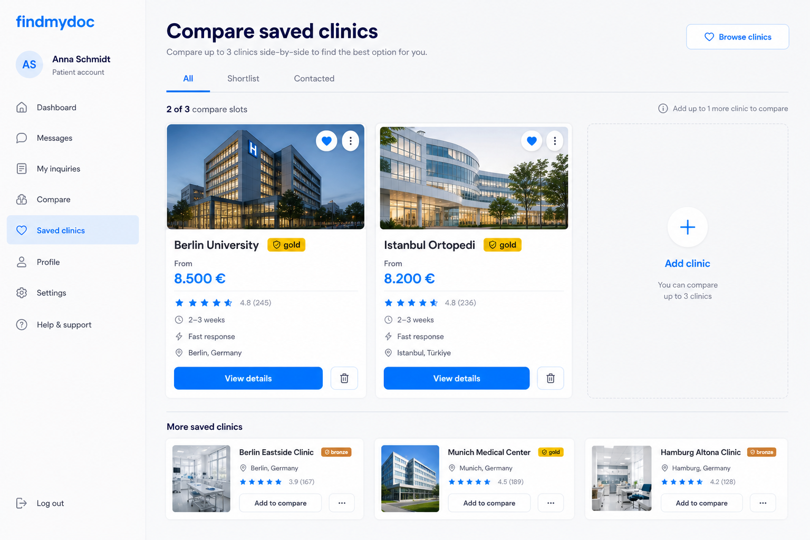

# Compare Board

## Executive Summary

Compare Board turns saved clinics into a transparent comparison workspace. It is strongest when patients need to inspect price, rating, verification, and location side by side, while preserving the rule that favorites can exceed three but active comparison is capped at three.

- Scenario: patient compares up to three saved clinics and keeps additional saved clinics outside comparison.
- Patient problem: current favorites do not explain which clinics are actively being compared.
- Patient decision: which clinic facts are strong enough to open details, keep comparing, or remove from comparison.
- Trust/transparency outcome: the UI shows comparison capacity, missing data, and exact source-backed facts without black-box ranking.

## Current State

- Inspected routes/components/collections: `/patient/favorites`, `FavoriteClinicsList`, `FavoriteClinicButton`, `findPatientFavoriteClinicListItems`, `favoriteclinics`, `clinics`, `clinictreatments`, `reviews`.
- Current UX behavior: saved clinics appear as independent list cards. There is no compare board in the patient account.
- Current data: favorite records do not store compare slots, price is not included in the current favorites read model, and wait-time/contact state is not source-backed.
- Current limitations: no active comparison state, no add-from-saved picker, no missing-data labels, no compare-specific route or shell.
- Reference screenshots: `mobile.png`, `tablet.png`, and `desktop.png` are generated planning mockups. The README controls implementation scope.

## User Journey

1. Patient opens saved clinics and switches to compare view.
2. UI shows how many of three compare slots are filled.
3. Patient reviews selected clinics in a consistent structure.
4. Patient removes a clinic from comparison without deleting it from saved clinics.
5. Patient adds another saved clinic if an empty slot exists.
6. If three slots are already filled, UI explains the cap and keeps extra favorites outside comparison.
7. Patient opens details for deeper evidence before deciding.

## Mermaid Flow

## Functional Requirements

### Must

- Show active compare slots separately from all saved clinics.
- Enforce a maximum of three active comparison clinics.
- Keep additional saved clinics visible outside comparison.
- Provide remove-from-compare behavior that does not delete the favorite.
- Show missing price as `Price not listed` instead of hiding the row silently when the row is part of the comparison.
- Keep `View details` as the primary verification path.
- Use the same fact rows for each compared clinic where possible.

### Should

- Use tablet and desktop density to show selected clinics and more saved clinics in one view.
- Reuse listing comparison pricing and rating utilities when possible.
- Make the max-three rule visible before the patient hits an error.

### Must Not

- Show more than three active compare cards.
- Show wait time, contacted state, or fast response without a source.
- Present the board as a ranking or `best clinic` decision.
- Use spreadsheet density that prevents mobile or tablet reading.
- Hide extra saved clinics just because compare slots are full.

### Out of Scope

- Multiple named comparison boards.
- Black-box scoring.
- Contact workflow.
- Spreadsheet-style tables.
- Sharing comparison boards.

## Visual Mockups

| Mockup | File | Purpose | Functions shown | Notes |
| --- | --- | --- | --- | --- |
| Mobile | `mobile.png` | Shows compact compare behavior for narrow screens. | Profile header, tabs, two compared cards, add another clinic, max-three note. | Early concept includes wait time; implementation must omit wait time until sourced. |
| Tablet | `tablet.png` | Shows the preferred tablet comparison workspace. | Header, tabs, `2 of 3`, two compare cards, empty add slot, more saved clinics, missing price label. | Best reference for explaining saved outside compare. |
| Desktop | `desktop.png` | Shows a broad comparison workspace. | Sidebar, compare cards, empty slot, more saved rail, actions. | Desktop may use denser columns but must keep mobile semantics. |

## Visible UI Contract

Anything not documented in this table is out of implementation scope.

| UI element | Patient value | Trust/transparency purpose | Data source | Component ownership | Allowed behavior |
| --- | --- | --- | --- | --- | --- |
| Patient account shell/header | Confirms private patient context. | Separates account compare state from public listing comparison. | Auth session and `patients`. | New `PatientAccountShell`. | Render only for authenticated patient routes. |
| Account navigation | Helps patients move between account sections. | Makes compare board feel accountable and owned. | Existing or planned patient routes. | `PatientAccountShell`. | Render only real routes. |
| `Browse clinics` button | Lets patients save more clinics. | Clarifies favorites can exceed compare slots. | `/listing-comparison`. | Reuse `Button`. | Link to existing listing route. |
| Page title/subtitle | Names comparison task. | Sets expectation that this is a workspace, not ranking. | Static route copy. | Route-level copy. | Use exact approved copy. |
| Tabs | Let patients filter saved sets. | Filter meaning is explicit and source-backed. | `favoriteclinics.decisionStage`; saved outside compare derived from `compareSlot == null`. | `FavoriteStageTabs`. | Hide unsupported contacted stage. |
| Compare slot summary | Shows `n of 3`. | Makes cap visible and predictable. | Count of `favoriteclinics.compareSlot != null`; max `3`. | `CompareSlotSummary`. | Always show selected count when compare UI is visible. |
| Compare clinic cards | Shows facts side by side. | Uses consistent rows for fair inspection. | Favorites with non-null `compareSlot`; joined clinic facts. | New `ClinicCompareCard`. | Sort by compare slot. |
| Empty add slot | Shows remaining capacity. | Teaches the max-three model. | Derived open slot count. | `CompareEmptySlot`. | Open picker only if fewer than three active slots. |
| Add clinic action | Moves saved clinic into comparison. | Makes membership intentional. | Favorites with `compareSlot == null`. | `CompareSlotPicker`. | Disable with explanation when full. |
| More saved clinics list | Keeps additional favorites visible. | Prevents saved vs compared confusion. | Favorites with null `compareSlot`. | `MoreSavedClinicsRail`. | Show saved clinics even when compare is full. |
| Clinic media | Helps recognize providers. | Uses actual clinic media. | `clinics.thumbnail`, fallback. | Reuse `Media`. | Use stable aspect ratios and alt text. |
| Favorite indicator | Confirms compared clinic is saved. | Explains why clinic is on the board. | Existing favorite record. | Reuse `FavoriteClinicButton` display/quiet state. | Must not delete favorite from compare card unless explicit remove favorite action exists. |
| Remove-from-compare action | Removes active compare membership. | Keeps saved clinic intact. | Clears `compareSlot`, `compareAddedAt`. | `RemoveFromCompareButton`. | Never delete the favorite. |
| Verification badge | Shows verification tier. | Source-backed trust signal. | `clinics.verification`. | Reuse `VerificationBadge`. | Display stored tier only. |
| Price row | Shows cost basis. | Distinguishes known and missing price. | `clinictreatments` scoped to relevant treatment. | Reuse/extend `PriceSummary`. | Show `Price not listed` when absent. |
| Rating row | Shows score and review context. | Avoids context-free rating. | `clinics.averageRating` plus approved review count. | Reuse `RatingSummary`. | Show count when rating is shown. |
| Location row | Shows practical geography. | Helps patient evaluate access. | `clinics.address`. | Location display primitive. | Show real city/country or `Location not listed`. |
| `View details` button | Opens full clinic evidence. | Primary verification path. | `/clinics/[slug]`. | Reuse `Button`. | Link to existing clinic detail route. |
| `Add to compare` button | Adds a saved clinic to an open slot. | Makes comparison membership explicit. | `favoriteclinics.compareSlot`. | `CompareSlotPicker`. | Enforce max three server-side. |
| Wait-time row | Shows availability speed. | Must be measured, not guessed. | Data Gap. | Future `WaitTime`. | Omit until sourced. |

## Data Model Plan

| Collection/source | Needed fields | Relationship | Permissions | Provenance/freshness | Status |
| --- | --- | --- | --- | --- | --- |
| `favoriteclinics` | Add `compareSlot`, `compareAddedAt`; optional `decisionStage`. | Patient-to-clinic saved record. | Patient can update own compare state. | Existing timestamps plus compare timestamp. | Required extension. |
| `clinics` | Name, slug, media, address, verification, average rating. | Referenced by favorite. | Public approved facts. | Existing clinic updates. | Supported. |
| `clinictreatments` | Price values and treatment context. | Clinic treatment facts. | Public price facts only. | Updated by clinic/platform data. | Needed for price rows. |
| `reviews` | Approved review count. | Clinic aggregate. | Public aggregate only. | Review approval lifecycle. | Needs read-model inclusion. |
| `patientClinicInquiries` | Contacted/response data. | Patient-to-clinic inquiry. | Patient-owned state. | Submitted/responded timestamps. | Data Gap; not needed for v1 compare. |

Validation requirements:

- Max three active compare slots per patient.
- Unique `patient + compareSlot` when `compareSlot` is not null.
- Compare actions only operate on favorites owned by the patient.
- Removing from compare must clear compare fields and preserve the favorite.

## Component Plan

| Feature | Reuse/change/new | Candidate component or module | Notes |
| --- | --- | --- | --- |
| Compare page shell | New | `PatientAccountShell` plus compare route/page state | May share with Decision Shortlist. |
| Compare summary | New | `CompareSlotSummary` | Shared across shortlist and compare board. |
| Compare cards | New | `ClinicCompareCard` | Uses shared fact-row components. |
| Empty slot | New | `CompareEmptySlot` | Explains available capacity. |
| More saved list | New | `MoreSavedClinicsRail` | Shows saved clinics outside compare. |
| Price/rating/location rows | Reuse/change | Listing comparison utilities, `PriceSummary`, `RatingSummary` | Add missing-data labels. |
| Favorite behavior | Reuse/change | `FavoriteClinicButton` | Keep separate from compare remove. |
| Compare mutation controls | New | `AddToCompareButton`, `RemoveFromCompareButton` | Must handle optimistic state carefully. |

## Differences From Current Implementation

- Mobile: changes from a simple list to a compare-focused flow with selected cards and add capacity.
- Tablet: introduces a readable two-card plus empty-slot board and a visible list of saved clinics outside compare.
- Desktop: provides broader side-by-side scanning and persistent account context.
- Data behavior: adds compare slots and ordered selected clinics.
- Trust behavior: shows missing price explicitly and blocks unsourced wait/contact labels.

## Acceptance Criteria

- Mobile: compared cards remain readable, add action is visible, and more saved clinics are not lost.
- Tablet: two selected cards, empty slot, and more saved list fit without hover-only controls.
- Desktop: up to three compare columns remain scannable and extra saved clinics remain visible.
- Data source: price, rating, location, and verification rows all map to named sources or explicit missing labels.
- Accessibility: remove-from-compare and add-to-compare have accessible names and do not rely on icon-only state.
- Review: `plan_design_reviewer` confirms no undocumented compare action or unsupported trust signal.

## Specialist Review Handoff

- `plan_design_reviewer`: required against this single scenario folder before implementation.
- `mobile_ui_reviewer`: required because comparison density is high-risk on mobile and tablet.
- `accessibility_reviewer`: required for tabs, add/remove controls, icon buttons, and possible picker/dialog behavior.
- `security_reviewer`: required for patient-owned compare mutations and collection validation.
- `seo_reviewer`: not required for private patient routes unless public metadata changes.
- `web_vitals_reviewer`: useful if dense client state or images increase runtime cost.

## Assumptions and Data Gaps

### Assumptions

- Compare Board can reuse favorite records rather than introducing a separate board collection in v1.
- Treatment context for price comparison is available or explicitly selected before showing price.
- The page is private and requires a patient account.

### Data Gaps

- Wait time has no confirmed source.
- Contacted state requires patient-clinic inquiry data.
- Multi-board history or audit history would require a separate comparison collection, but is out of scope for v1.
