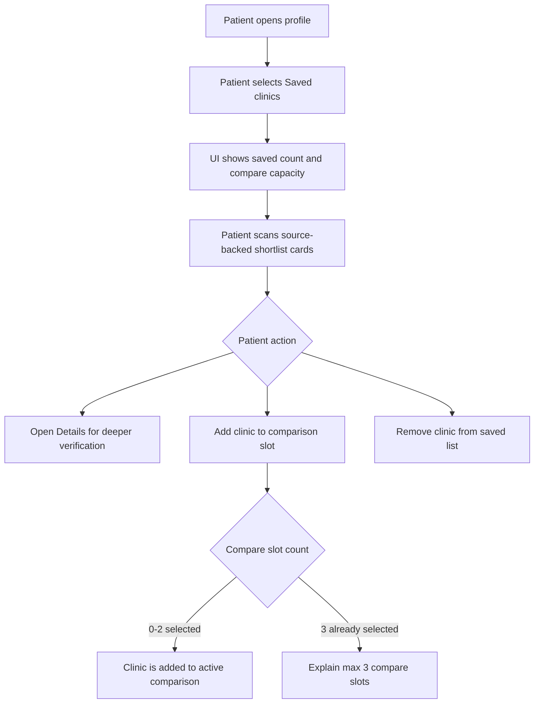
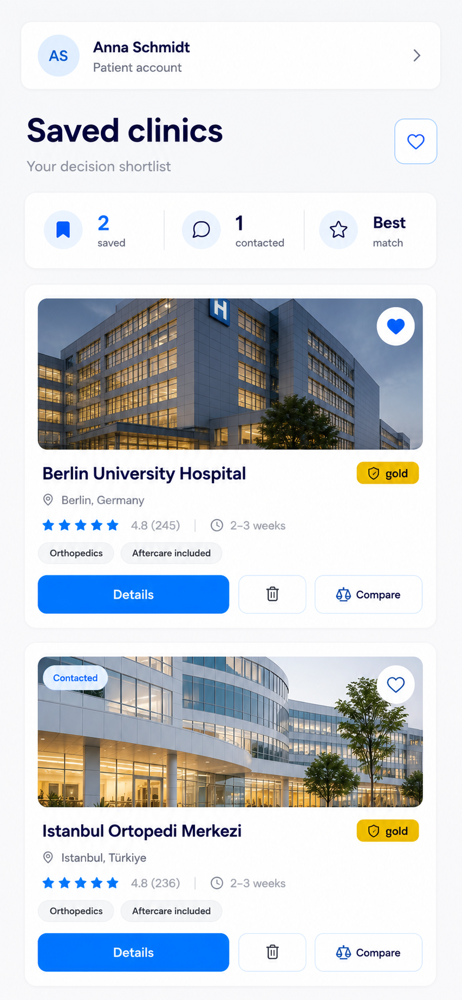
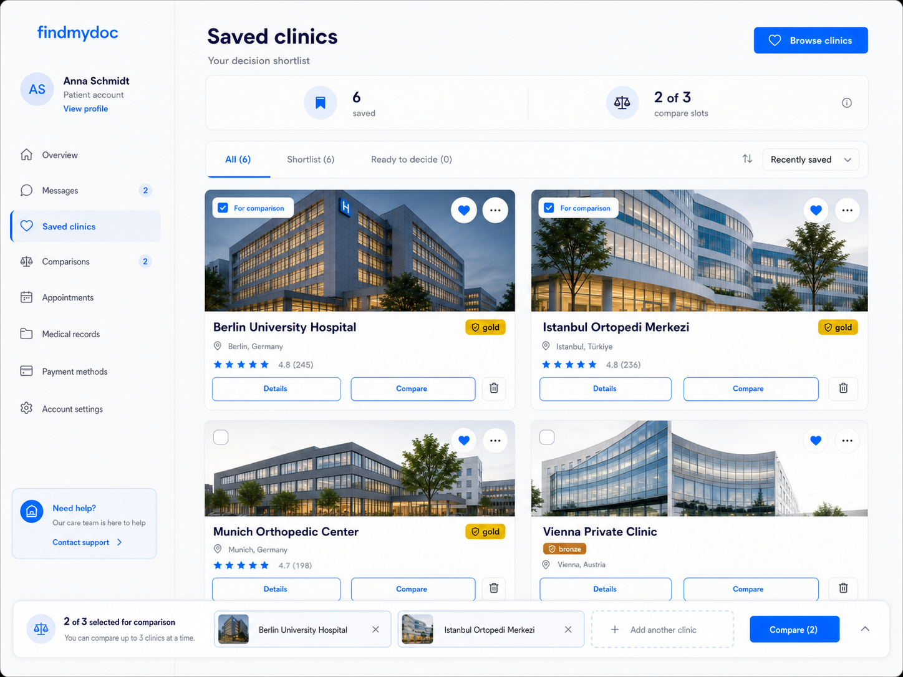
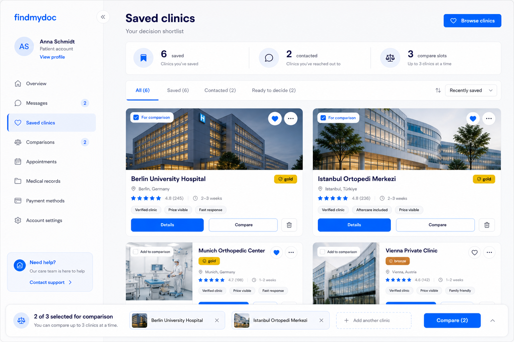

# Decision Shortlist

## Executive Summary

Decision Shortlist reframes saved clinics as a patient-owned decision list. It keeps the current saved-clinic card model but adds transparent summary metrics, source-backed trust signals, and an explicit max-three comparison tray.

- Scenario: patient reviews saved clinics in their profile and selects up to three for comparison.
- Patient problem: saved clinics currently behave like bookmarks, not a guided decision aid.
- Patient decision: which saved clinics should be inspected, compared, or removed.
- Trust/transparency outcome: the patient sees what is saved, what is actively compared, why each clinic is relevant, and which facts are missing.

## Current State

- Inspected routes/components/collections: `/patient/favorites`, `FavoriteClinicsList`, `FavoriteClinicButton`, `findPatientFavoriteClinicListItems`, `favoriteclinics`.
- Current UX behavior: authenticated patients see a heading, saved count, browse link, and a vertical list of cards with image, name, verification, location, rating, details, and remove.
- Current data: `favoriteclinics` only stores `patient` and `clinic`; compare membership, decision stage, contacted state, and source-backed trust-signal arrays do not exist.
- Current limitations: no patient account shell, no compare slots, no stage tabs, no review count in the favorites list, no contact/inquiry source.
- Reference screenshots: `mobile.png`, `tablet.png`, and `desktop.png` in this folder are generated planning mockups. The README is the implementation source of truth.

## User Journey

1. Patient opens their profile and chooses saved clinics.
2. Patient sees the saved total and current comparison capacity before scanning individual cards.
3. Patient filters or scans the shortlist without losing the distinction between all saved clinics and active comparison slots.
4. Patient opens details to verify a clinic, selects a clinic for comparison, or quietly removes it from saved clinics.
5. If the patient tries to compare a fourth clinic, the UI explains the max-three rule and asks them to remove one active comparison first.
6. Patient ends with a clearer shortlist and up to three clinics ready for side-by-side comparison.

## Mermaid Flow

## Functional Requirements

### Must

- Show total saved clinics separately from active comparison slots.
- Allow more than three saved clinics.
- Allow at most three active comparison clinics.
- Distinguish saved state from selected-for-comparison state on every card.
- Keep `Details` as the primary verification action.
- Keep remove/delete behavior quiet and visually secondary.
- Display only source-backed trust signals.
- Show missing or unsupported facts honestly or omit them.

### Should

- Provide stage tabs only for stages backed by data.
- Provide a patient account shell only if the routes behind its links exist.
- Keep a tablet layout that increases scan density without changing the decision model.
- Reuse existing display primitives where possible.

### Must Not

- Show `Best match`, `Fast response`, `Contacted`, or wait-time claims without source data.
- Implement sidebar links, support actions, overflow actions, or icon-only controls that lack documented destinations.
- Delete a favorite when the patient only removes a clinic from comparison.
- Hide comparison-limit errors behind disabled controls without explanation.

### Out of Scope

- Recommendation ranking.
- Contact or inquiry workflow.
- Recently viewed behavior.
- Notification or message center.
- Multi-board comparison.

## Visual Mockups

| Mockup | File | Purpose | Functions shown | Notes |
| --- | --- | --- | --- | --- |
| Mobile | `mobile.png` | Shows a stacked saved-clinic shortlist for one-handed review. | Account context, saved summary, clinic cards, details, remove, compare. | Contains `contacted` and `Best match` labels from the early concept; those are not implementable until sourced and should be removed or replaced. |
| Tablet | `tablet.png` | Shows the mobile hierarchy adapted to a two-column tablet workspace. | Account rail, saved total, compare capacity, tabs, compare checkboxes, cards, compare tray. | Preferred planning reference for a near-term tablet implementation. |
| Desktop | `desktop.png` | Shows the richest shortlist management state. | Sidebar, summary strip, tabs, sort, cards, compare tray, support card. | Some sidebar/support links are contextual only until routes exist. |

## Visible UI Contract

Anything not documented in this table is out of implementation scope.

| UI element | Patient value | Trust/transparency purpose | Data source | Component ownership | Allowed behavior |
| --- | --- | --- | --- | --- | --- |
| Patient account shell | Confirms this is the patient's private area. | Prevents confusion between public search and private saved state. | Auth session and `patients`. | New `PatientAccountShell`. | Render only on authenticated patient routes. |
| Account sidebar/header identity | Gives orientation and ownership. | Shows whose saved clinics are displayed. | `patients` plus auth session. | `PatientAccountShell`. | Show name/avatar only from patient profile or safe fallback initials. |
| Sidebar navigation | Helps move between account areas. | Avoids orphaned profile screens. | Existing or planned routes. | `PatientAccountShell`. | Render only links with real destinations. |
| Support card | Gives a fallback when a patient is unsure. | Builds trust through clear help access. | Existing support route or configured support contact. | Optional `PatientSupportCard`. | Do not render until destination exists. |
| `Browse clinics` button | Lets patients add more saved clinics. | Clarifies that favorites are not capped at three. | `/listing-comparison`. | Reuse `Button` and route link. | Link to existing listing route. |
| Page title and subtitle | Frames the page as a decision shortlist. | Makes the page purpose explicit. | Static route copy. | Route-level copy. | Use `Saved clinics` and source-approved subtitle. |
| Saved count | Shows total saved options. | Separates saved count from active comparison. | Count of `favoriteclinics` for patient. | `FavoriteSummaryMetrics`. | Always count all active saved clinics. |
| Compare capacity | Shows selected slots and max slots. | Makes max-three rule visible before errors. | `favoriteclinics.compareSlot`; fixed max `3`. | `CompareSlotSummary`. | Display `n of 3`; never imply more than 3 active slots. |
| Stage tabs | Lets patients scan by decision state. | Prevents hidden ranking by exposing explicit filters. | `favoriteclinics.decisionStage`. | `FavoriteStageTabs`. | Hide unsupported stages. |
| Sort control | Lets patients control list order. | Makes ordering explicit. | Query state plus supported sort fields. | `FavoriteSortControl`. | Only offer implemented sort modes. |
| Clinic media | Supports provider recognition. | Uses real clinic media instead of decoration. | `clinics.thumbnail`, fallback media. | Reuse `Media`. | Use accessible alt text and stable aspect ratio. |
| Favorite heart | Confirms saved state. | Shows card origin in favorites. | Existing favorite record. | Reuse `FavoriteClinicButton`. | Toggle save/remove only when used as favorite control; display-only variant must not be clickable. |
| Compare checkbox/chip | Shows active comparison membership. | Distinguishes saved from compared. | `favoriteclinics.compareSlot`. | New `CompareToggle`. | Add or remove compare membership without deleting favorite. |
| Clinic overflow menu | Holds secondary actions. | Keeps destructive actions quiet. | Favorite and compare state. | `FavoriteClinicMenu`. | Include only documented actions. |
| Clinic name | Identifies provider. | Anchors all facts to a real clinic. | `clinics.name`, `clinics.slug`. | Reuse listing card text treatment. | Link or pair with `Details`; wrap safely. |
| Verification badge | Shows verification tier. | Source-backed trust signal. | `clinics.verification`. | Reuse `VerificationBadge`. | Do not show as endorsement beyond stored tier. |
| Location | Shows where care happens. | Supports practical decision-making. | `clinics.address.city`, `clinics.address.country`. | Reuse location line pattern. | Show `Location not listed` only when source is empty. |
| Rating and review count | Shows patient feedback with context. | Prevents context-free ratings. | `clinics.averageRating` plus approved review count from `reviews`. | Reuse `RatingSummary`. | Show count whenever rating is shown. |
| Trust chips | Explains why a clinic is relevant. | Makes source-backed reasons visible. | `clinics.verification`, `clinictreatments`, tags, accreditations. | New `TrustSignalList`. | Render only source-backed chips; no `Best match`. |
| `Details` button | Opens clinic profile evidence. | Primary safe verification path. | `/clinics/[slug]`. | Reuse `Button`. | Open existing clinic detail route. |
| `Compare` button | Adds clinic to active comparison. | Supports transparent side-by-side review. | `favoriteclinics.compareSlot`. | New compare action. | Enforce max three server-side and explain failure. |
| Remove icon/button | Removes saved clinic. | Gives patient control without overemphasis. | Existing favorite delete endpoint. | Reuse `FavoriteClinicButton` list variant or quiet remove variant. | Delete favorite only after explicit remove action. |
| Compare tray | Shows active compare set. | Keeps selected clinics and capacity visible. | Favorites where `compareSlot != null`. | New `CompareTray`. | Show selected clinics, remove-from-compare, open slot, and compare CTA. |
| `Add another clinic` slot | Shows remaining capacity. | Teaches max-three rule without error. | Derived from selected count. | `CompareTray`. | Open a saved-clinic picker only when fewer than three selected. |
| Contacted count | Shows follow-up progress. | Must reflect real contact history. | Data Gap: future `patientClinicInquiries`. | Future metric. | Do not implement until inquiry source exists. |
| Wait time | Shows access speed. | Must be measured or sourced. | Data Gap. | Reuse `WaitTime` only when sourced. | Omit until source exists. |

## Data Model Plan

| Collection/source | Needed fields | Relationship | Permissions | Provenance/freshness | Status |
| --- | --- | --- | --- | --- | --- |
| `favoriteclinics` | Existing `patient`, `clinic`; add `decisionStage`, `compareSlot`, `compareAddedAt`. | Belongs to one patient and one clinic. | Patient can manage own records; platform can manage. | Existing timestamps plus compare timestamp. | Extend existing collection. |
| `clinics` | Existing name, slug, thumbnail, address, verification, average rating, tags, accreditations. | Referenced by `favoriteclinics.clinic`. | Public approved clinic facts only. | Existing clinic lifecycle. | Supported today for base cards. |
| `reviews` | Approved review count for displayed rating context. | Reviews attach to clinics. | Public aggregate only. | Must count approved reviews. | Needs read-model inclusion. |
| `clinictreatments` | Price availability and treatment-scoped price facts. | Clinic-treatment relationship. | Public price facts only. | Freshness follows clinic treatment updates. | Use only for source-backed trust chips. |
| `patientClinicInquiries` | Status counts for contacted or ready-to-contact states. | Patient, clinic, optional favorite. | Patient owns own inquiry state. | Submitted/responded timestamps. | Data Gap; future only. |

Validation requirements:

- Keep unique `patient + clinic`.
- Enforce max three non-null `compareSlot` records per patient.
- Enforce one favorite per compare slot per patient.
- Compare actions must operate only on an existing favorite owned by the patient.

## Component Plan

| Feature | Reuse/change/new | Candidate component or module | Notes |
| --- | --- | --- | --- |
| Saved card media/name/location/rating | Change | `FavoriteClinicsList`, listing primitives | Keep current card data but add review count and layout variants. |
| Favorite remove | Reuse/change | `FavoriteClinicButton` | Add quiet account-list state if current list variant is too prominent. |
| Verification badge | Reuse | `VerificationBadge` | Keep tier semantics. |
| Account shell | New | `PatientAccountShell` | Only if more patient routes use the shell. |
| Summary metrics | New | `FavoriteSummaryMetrics`, `CompareSlotSummary` | Must use source-backed counts. |
| Stage tabs | New | `FavoriteStageTabs` | Hide unsupported stages. |
| Trust chips | New | `TrustSignalList` | Source-backed reasons only. |
| Compare controls | New | `CompareToggle`, `CompareTray` | Distinct from favorite save/remove. |
| Sort | New/change | `FavoriteSortControl` | Keep sort state visible. |

## Differences From Current Implementation

- Mobile: adds profile context, summary metrics, card-level compare action, and trust chips; removes the current plain list feeling.
- Tablet: adds a two-column saved-clinic workspace and a persistent compare tray while keeping touch-safe controls.
- Desktop: adds a patient account shell, filters, sort, denser card grid, and compare tray.
- Data behavior: introduces compare membership and decision stage instead of storing only saved relationships.
- Trust behavior: blocks unsourced `Best match`, contacted, fast response, and wait-time labels.

## Acceptance Criteria

- Mobile: cards stack cleanly, actions remain touch-sized, and saved vs compare state is visible on each card.
- Tablet: two-column cards and compare tray fit without hiding core actions or requiring hover-only controls.
- Desktop: sidebar, tabs, cards, sort, and compare tray remain scannable without overlapping.
- Data source: every metric, badge, chip, and status is backed by the named collection or omitted.
- Accessibility: icon-only buttons have accessible names; tabs and menus are keyboard reachable; compare limit errors are announced.
- Review: `plan_design_reviewer` finds no undocumented visible UI element in this folder.

## Specialist Review Handoff

- `plan_design_reviewer`: required against this single scenario folder before implementation.
- `mobile_ui_reviewer`: required because the design changes responsive card layout and sticky/inline compare controls.
- `accessibility_reviewer`: required because the plan uses tabs, icon buttons, menu buttons, and compare toggles.
- `security_reviewer`: required when adding compare fields, validations, or patient-owned update APIs.
- `seo_reviewer`: not required for the private patient page unless public route metadata changes.
- `web_vitals_reviewer`: useful if large clinic images, sticky trays, or client-heavy filters affect runtime performance.

## Assumptions and Data Gaps

### Assumptions

- The patient is authenticated before accessing `/patient/favorites`.
- Clinic details remain the safe primary verification action.
- Compare state can be stored on `favoriteclinics` for the first implementation.

### Data Gaps

- `Contacted` and related counts require `patientClinicInquiries`.
- Wait-time display requires a confirmed source.
- `Best match` requires an explainable ranking model and should not ship in this scenario.
