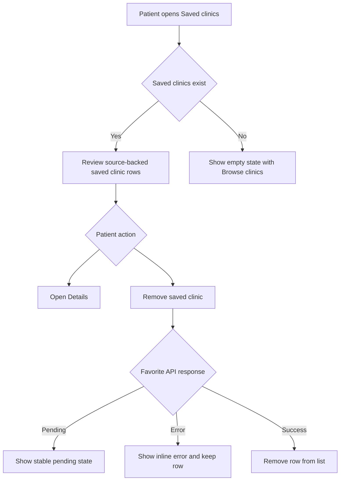

# Saved Clinic Review List

## Executive Summary

- Scenario: polish the existing patient saved-clinics page into a clearer account review list.
- Patient problem: saved clinics currently work, but the account presentation is plain and does not feel as intentional as the public listing and clinic detail surfaces.
- Patient decision: inspect a saved clinic in detail, remove it from saved clinics, or browse clinics to save more options.
- Trust/transparency outcome: the patient sees only source-backed clinic facts from the current favorites read model and understands save/remove state without compare, recommendation, contact, or ranking claims.

## Current State

- Inspected routes/components/collections: `/patient/favorites`, `/listing-comparison`, clinic detail route, `FavoriteClinicsList`, `FavoriteClinicButton`, `findPatientFavoriteClinicListItems`, `FavoriteClinics`, `clinics`, and the patient favorites roadmap.
- Current UX behavior: authenticated patients see `Saved clinics`, a saved count, a `Browse clinics` link, and a vertical list of saved cards with image, clinic name, verification badge, location, optional average rating, `Details`, and `Remove`.
- Current implementation facts: `favoriteclinics` stores the saved relationship with `patient`, `clinic`, timestamps, a stable ID, and a unique `patient + clinic` index. The current favorites list item exposes `favoriteId`, `clinicId`, `name`, `href`, `location`, `media`, `verification`, and optional `ratingValue`.
- Current header behavior: the frontend layout always reuses the global `Header`; `PublicAccountMenu` resolves authenticated patients to an account avatar trigger and guests to a `Sign in` trigger. Because `/patient/favorites` redirects unauthenticated users before rendering, this scenario must show the patient account trigger and must not show guest `Sign in` chrome.
- Current navigation behavior: header navigation is CMS-managed site chrome. The saved-clinics page may reuse existing global nav, but this issue must not introduce new navigation destinations, compare controls, or compare-specific page copy.
- Current limitations: the current favorites list does not expose approved review count, compare slots, contacted state, wait time, recommendation reasons, inquiry state, or recently viewed data. Those states stay out of scope for this scenario.
- Visual grounding: the design uses fresh Playwright screenshots captured after running the demo seed against the local test database. The seed command completed with `demo counts posts=6 clinics=10 doctors=10 reviews=18`.
- Branding screenshots used before image generation:
  - `output/playwright/design-planner/saved-clinic-review-list/listing-mobile-375.png`
  - `output/playwright/design-planner/saved-clinic-review-list/listing-tablet-768.png`
  - `output/playwright/design-planner/saved-clinic-review-list/listing-desktop-1280.png`
  - `output/playwright/design-planner/saved-clinic-review-list/clinic-detail-desktop-1280.png`
- Logo reference: `public/fmd-logo-1-dark.png` was inspected before mockup generation; implementation must use the existing `Logo` component or `public/fmd-logo-1-dark.svg`.
- Reference issue: GitHub issue `#1070`, "Feature: polish favorites UI presentation".

## User Journey

1. Patient opens `Saved clinics` from their account menu.
2. The page confirms this is a patient account surface and shows how many clinics are saved.
3. The patient scans saved clinic rows with real clinic media, name, verification, location, and optional average rating.
4. The patient opens `Details` for deeper evidence or removes a clinic from saved clinics.
5. If removal is pending or fails, the row keeps its layout stable and announces the inline state without hiding the primary `Details` path.
6. If no clinics are saved, the empty state explains the saved-clinic purpose and offers `Browse clinics`.

## Mermaid Flow

## Functional Requirements

### Must

- Preserve the existing Favorites API behavior and `favoriteclinics` data model.
- Show saved count separately from individual saved clinic rows.
- Keep `Details` as the primary action on each saved clinic row.
- Keep `Remove` visually secondary and quieter than `Details`.
- Show only current source-backed facts: clinic media, name, verification variant, location, and optional average rating.
- Keep pending and error states inline without shifting the card enough to cause layout instability.
- Keep empty state action focused on browsing clinics.
- Use authenticated patient account chrome on `/patient/favorites`; do not show guest `Sign in` in this private route state.
- Use compare-neutral saved-clinic copy. The browse destination may remain `/listing-comparison`, but the saved page should describe saving from provider pages or browsing clinics, not a comparison workflow.
- Avoid duplicate browse CTAs in the empty state. When no items exist, the empty-state panel owns the `Browse clinics` CTA; when saved rows exist, the route header can keep the route-level `Browse clinics` action.
- Preserve current findmydoc branding from the seeded screenshots: global header, Logo component, button treatment, card radius, spacing, and subdued borders.
- Preserve the current `VerificationBadge` component styling exactly. Mockup badge shapes, colors, and icon treatment are directional only and must not override the production badge design.

### Should

- Use the current listing-card visual language as the baseline for saved rows.
- Use the current clinic-detail hero hierarchy as guidance for favorite actions remaining secondary to clinical decision CTAs.
- Keep mobile cards stacked and touch-safe before widening to tablet and desktop rows.
- Include Storybook or Playwright visual evidence for saved, empty, pending, and error states during implementation.

### Must Not

- Add compare slots, compare tray, compare picker, or compare-specific server behavior.
- Show `Best match`, `Recommended`, `Contacted`, `Fast response`, wait time, inquiry status, recently viewed, messages, appointments, or support actions.
- Show guest `Sign in` chrome on the authenticated `/patient/favorites` page state.
- Use compare-specific page copy or compare-specific saved-list controls.
- Render two visible `Browse clinics` CTAs in the same empty state.
- Show review counts unless the favorites read model is explicitly extended in a separate approved issue.
- Render sidebar account links unless real destinations are implemented and documented.
- Make the heart/favorite indicator destructive unless it is explicitly the documented remove control.

### Out of Scope

- Data-model changes to `favoriteclinics`.
- Patient-clinic inquiry or contact workflow.
- Comparison workspace or max-three compare logic.
- Recommendation ranking or reason engine.
- Patient account dashboard shell beyond the existing route/header context.
- Public route metadata or SEO changes.

## Visual Mockups

| Mockup | File | Purpose | Functions shown | Notes |
| --- | --- | --- | --- | --- |
| Mobile | `mobile.png` | Shows the primary narrow-screen saved-clinic review path with saved data. | Current global header, authenticated patient account trigger, patient account header, saved count, route-level browse action, stacked saved cards, display-only saved indicator, `Details`, `Remove`, and pending text. | Generated text and media are planning examples. Implementation must use exact route data and the existing Logo component. |
| Tablet | `tablet.png` | Shows a touch-safe tablet row layout with saved data and a lightweight summary panel. | Global header, authenticated patient account trigger, saved count, route-level browse action, three saved rows, verification, location, average rating, `Details`, `Remove`, inline error, decorative patient-account icon, decorative summary icon, and saved-list summary. | No account sidebar or compare controls are in scope. |
| Desktop | `desktop.png` | Shows a broad account-list layout with saved data while keeping scan density close to current listing cards. | Global header, authenticated patient account trigger, page header, saved rows, primary/secondary actions, inline error, decorative patient-account icon, decorative summary icon, and saved-list summary panel. | The list state must not render an empty-state panel or guest `Sign in`. |
| Mobile empty | `mobile-empty.png` | Shows the no-data path on the narrowest account screen. | Current global header, authenticated patient account trigger, patient account header, zero saved count, empty-state heart illustration, and empty-state panel with a single `Browse clinics` CTA. | Render only when the authenticated patient has no saved clinics. |
| Tablet empty | `tablet-empty.png` | Shows the no-data path on tablet without saved rows. | Tablet header/navigation, authenticated patient account trigger, zero saved count, decorative patient-account icon, empty-state heart illustration, and centered empty-state panel with a single `Browse clinics` CTA. | Render only when the authenticated patient has no saved clinics. |
| Desktop empty | `desktop-empty.png` | Shows the no-data path on desktop without saved rows or summary metrics. | Desktop header/navigation, authenticated patient account trigger, zero saved count, decorative patient-account icon, empty-state heart illustration, and wide empty-state panel with a single `Browse clinics` CTA. | Render only when the authenticated patient has no saved clinics. |

## State Coverage

| State | Mobile evidence | Tablet evidence | Desktop evidence | Notes |
| --- | --- | --- | --- | --- |
| Populated | `mobile.png` | `tablet.png` | `desktop.png` | Shows saved clinic rows. Must render only when `items.length > 0`. |
| Empty | `mobile-empty.png` | `tablet-empty.png` | `desktop-empty.png` | Shows `No saved clinics yet`. Must render only when `items.length === 0`. |
| Pending | `mobile.png` | Text-only contract | Text-only contract | Pending remove copy is visually represented on mobile; tablet/desktop can reuse the same inline row treatment without layout shift. |
| Error | Text-only contract | `tablet.png` | `desktop.png` | Inline error copy is visually represented on wider list rows; mobile must use the same row-local pattern if removal fails. |
| Unauthenticated | Text-only contract | Text-only contract | Text-only contract | Preserve the existing private route redirect behavior; no mockup needed for this visual plan. |

## Visible UI Contract

Anything not documented in this table is out of implementation scope.

| UI element | Patient value | Trust/transparency purpose | Data source | Component ownership | Allowed behavior |
| --- | --- | --- | --- | --- | --- |
| Global header | Keeps the account route visually connected to the existing site. | Prevents the saved page from feeling detached from public clinic discovery. | Existing frontend layout and globals. | Existing `Header` template. | Reuse existing header behavior; do not add new nav destinations for this scenario. |
| findmydoc logo | Confirms brand and route context. | Uses the real brand asset rather than a generated approximation. | `public/fmd-logo-1-dark.png` for mockup reference; `public/fmd-logo-1-dark.svg` or existing `Logo` component for implementation. | Existing `Logo` component. | Render through the existing implementation source only. |
| Header navigation | Preserves existing site orientation without making the saved page a discovery workflow. | Distinguishes reused site chrome from issue-owned page features. | Existing CMS-managed `header` global normalized by `normalizeHeaderNavItems`. | Existing `HeaderNav`. | Reuse only current global nav items; labels shown in mockups are chrome examples, not new requirements. Do not add compare-specific saved-list controls. |
| Mobile menu trigger | Keeps global nav reachable on narrow screens. | Makes the header behavior explicit so it is not mistaken for a saved-list control. | Existing `HeaderNav` mobile state. | Existing `HeaderNav`. | Toggle existing global mobile navigation only; no saved-list actions inside this scenario unless already present globally. |
| Patient account trigger | Shows the route is authenticated patient-owned state. | Avoids showing guest `Sign in` on a private patient page. | `resolvePublicAccountMenuState` from request auth context. | Existing `PublicAccountMenu`. | Show authenticated patient account/avatar trigger on `/patient/favorites`; guest users redirect before seeing this page. |
| Patient account decorative icon | Provides a light visual cue for the account label on wider layouts. | Reinforces patient-owned context without adding a new account function. | Static icon from the existing icon system, for example `lucide-react` `CircleUserRound`. | `/patient/favorites` route composition or local header component. | Optional and decorative; render with `aria-hidden="true"` and do not make it focusable or clickable. |
| Patient account label | Frames the page as private patient-owned state. | Distinguishes saved clinics from public listing results. | Static route copy plus authenticated patient route. | `/patient/favorites` route composition. | Show as small contextual copy; do not imply a full account dashboard shell. |
| `Saved clinics` title | Names the current patient task. | Keeps page purpose direct and non-promotional. | Static route metadata and page copy. | `/patient/favorites` route composition with `Heading`. | Use as the route `h1`. |
| Saved count | Shows how many clinics are saved. | Makes saved state auditable and avoids implying compare capacity. | Count of `favoriteclinics` for the authenticated patient. | `/patient/favorites`, `FavoriteClinicsList`. | Count all loaded saved clinics; do not cap at three. |
| Route-level `Browse clinics` button | Gives the patient a clear way to add more saved clinics when saved rows exist. | Clarifies this page is review and management, not discovery itself. | Existing `/listing-comparison` route. | Existing `Button` and Next `Link`. | Link to `/listing-comparison`; render in populated state and hide when the empty-state panel already owns the browse CTA. |
| Saved clinic row/card | Lets the patient scan saved providers. | Groups source-backed facts under one clinic identity. | `favoriteclinics` joined to `clinics`. | `FavoriteClinicsList` or extracted saved-row component. | Render one row per favorite item; keep row stable during pending/error states. |
| Clinic media | Helps recognize a provider. | Uses actual clinic media or a clear fallback. | `clinics.thumbnail` via `resolveMediaDescriptorFromLoadedRelation`; fallback placeholder. | Existing `Media` component. | Use stable aspect ratio and accessible alt text. |
| Display-only saved indicator | Confirms the clinic is currently saved. | Separates saved-state confirmation from destructive removal. | Existing favorite record ID. | Saved-row presentation inside `FavoriteClinicsList` or extracted saved-row component. | If shown, render as non-interactive status only; do not reuse the destructive `FavoriteClinicButton` icon toggle for this indicator. |
| Clinic name | Identifies the provider. | Anchors all facts and actions to a real clinic. | `clinics.name`, `clinics.slug`. | `FavoriteClinicsList`, `Heading`. | Wrap safely; link only when paired with a documented `Details` path. |
| Verification badge | Shows stored platform verification tier. | Keeps trust signal source-backed. | `clinics.verification`. | Existing `VerificationBadge`. | Reuse the existing component and styling unchanged; show stored tier only; do not turn it into an endorsement claim. |
| Location row | Shows where care happens. | Supports practical decision-making. | `clinics.address.city`, `clinics.address.country`; fallback `Location not listed`. | Existing location display pattern. | Show real location or fallback; do not infer region. |
| Average rating row | Shows an available rating signal. | Avoids hiding a source-backed aggregate when present. | `clinics.averageRating`. | `FavoriteClinicsList`. | Format as `4.8 average rating`; do not show review count in this scenario. |
| `Details` button | Opens full clinic evidence. | Keeps deeper verification as the primary next step. | `/clinics/[slug]`. | Existing `Button` and Next `Link`. | Primary action on saved rows when slug exists. |
| `Remove` button | Lets the patient manage saved clinics. | Gives control without competing with `Details`. | Existing favorite ID and DELETE behavior through `FavoriteClinicButton`. | `FavoriteClinicButton` list variant or quiet row variant. | Delete the favorite only after explicit remove action; keep it visually secondary. |
| Pending state | Confirms the remove request is in progress. | Avoids duplicate action and reduces uncertainty. | `FavoriteClinicButton` local pending state. | `FavoriteClinicButton`. | Disable repeated action and announce `Removing...` through an accessible live region. |
| Error state | Tells the patient the save/remove update failed. | Keeps failed state honest without removing the row. | API error message or fallback error copy from `FavoriteClinicButton`. | `FavoriteClinicButton`. | Show inline error and keep row visible with retry path. |
| Empty state panel | Helps the patient recover when no clinics are saved. | Explains why the page is empty without inventing recommendations. | Empty `favoriteclinics` result for patient. | `FavoriteClinicsList`. | Show `No saved clinics yet`, compare-neutral explanatory copy, and `Browse clinics` only when `items.length === 0`; never render alongside saved clinic rows. |
| Empty-state heart illustration | Visually anchors the no-data state to saved clinics. | Communicates empty saved-state without creating an actionable favorite control. | Static icon from the existing icon system, for example `lucide-react` `Heart`. | `FavoriteClinicsList` empty-state composition. | Decorative only; render with `aria-hidden="true"` inside a non-interactive container. Do not expose it as a button or status separate from the empty-state copy. |
| Empty-state helper line | Explains how saved clinics appear without adding a new workflow. | Keeps the empty state instructional and source-neutral. | Static copy plus existing saved-clinic behavior. | `FavoriteClinicsList`. | Optional on tablet/desktop; copy must stay neutral, for example `Saved clinics appear here after you use the heart on a clinic.` |
| Empty-state `Browse clinics` button | Gives the patient one recovery path when no clinics are saved. | Avoids duplicate CTAs and keeps the no-data state honest. | Existing `/listing-comparison` route. | Existing `Button` and Next `Link`. | The only visible browse CTA in the empty state; link to `/listing-comparison` with neutral label. |
| Saved summary decorative icon | Provides a small visual anchor for the desktop/tablet summary panel. | Reinforces that the panel summarizes saved state, not ranking or comparison. | Static icon from the existing icon system, for example `lucide-react` `Bookmark`. | Optional route-level panel. | Decorative only; render with `aria-hidden="true"` and do not use it as an action or separate status. |
| Saved list summary panel | Gives tablet/desktop orientation without adding new functions. | Restates the current saved count and source of the list. | Count of `favoriteclinics` for patient. | Optional route-level panel. | Static/account summary only; no metrics beyond saved count. Decorative summary icon must not imply bookmarks, ranking, or compare capacity beyond the saved count. |

## Data Model Plan

| Collection/source | Needed fields | Relationship | Permissions | Provenance/freshness | Status |
| --- | --- | --- | --- | --- | --- |
| `favoriteclinics` | Existing `id`, `stableId`, `patient`, `clinic`, timestamps. | Patient-to-clinic saved relationship. | Patient can manage own records; platform can manage by existing access rules. | Existing timestamps and unique `patient + clinic` index. | Supported; no schema change. |
| `clinics` | Existing `name`, `slug`, `thumbnail`, `address`, `averageRating`, `verification`. | Referenced by `favoriteclinics.clinic`. | Public approved clinic facts only. | Existing clinic lifecycle. | Supported by current read model. |
| Media fallback | Placeholder path and derived alt text. | Used when clinic thumbnail is unavailable. | Public asset and clinic name. | Existing placeholder behavior. | Supported. |
| Reviews | Approved review count. | Reviews attach to clinics. | Public aggregate only if exposed intentionally. | Review approval lifecycle. | Out of scope; do not show review count for #1070. |
| Compare state | `compareSlot`, `compareAddedAt`, compare max. | Would attach to favorites in other scenarios. | Patient-owned state. | Data Gap for this issue. | Out of scope for #1070. |
| Inquiry/contact state | Inquiry status and response timestamps. | Patient-to-clinic workflow. | Patient-owned sensitive state. | Data Gap. | Out of scope for #1070. |

## Component Plan

| Feature | Reuse/change/new | Candidate component or module | Notes |
| --- | --- | --- | --- |
| Patient favorites route header | Change | `src/app/(frontend)/patient/favorites/page.tsx` | Preserve current route and metadata while improving hierarchy and count treatment. |
| Authenticated account chrome | Reuse | `src/app/(frontend)/layout.tsx`, `PublicAccountMenu`, `Header`, `HeaderNav` | Reuse patient account trigger on the private route; no guest `Sign in` state in saved-page screenshots. |
| Route-level browse action | Change | `src/app/(frontend)/patient/favorites/page.tsx` | Show for populated saved lists; avoid duplicating the empty-state CTA. |
| Decorative account and state icons | New/change | `/patient/favorites`, `FavoriteClinicsList`, optional saved summary panel | Use existing icon library; decorative icons must be `aria-hidden` and non-focusable. |
| Saved clinic list rows | Change | `src/features/favorites/FavoriteClinicsList.client.tsx` | Refine row/card layout, empty state, pending/error placement, and action hierarchy. |
| Display-only saved indicator | New/change | `FavoriteClinicsList` local row presentation or extracted saved row | Non-interactive status only; do not wire the indicator to delete behavior. |
| Favorite remove/save behavior | Reuse/change | `src/features/favorites/FavoriteClinicButton.tsx` | Keep API behavior; use list variant for explicit `Remove` only and adjust styling only if needed. |
| Clinic media | Reuse | `Media` | Keep stable aspect ratios and current image sizing discipline. |
| Verification | Reuse | `VerificationBadge` | Use stored variant only. |
| Buttons | Reuse | `Button` atom | Use existing primary/secondary variants. |
| Optional saved summary panel | New route-level composition | `/patient/favorites` route or local component | Purely presentational count/context panel; no new data source. |
| Storybook states | New/change | `src/stories/**` for favorites list or button states | Add deterministic saved, empty, pending, and error visual states before implementation handoff. |

## Differences From Current Implementation

- Mobile: changes the current plain saved list into a branded account page with the existing global header, authenticated patient trigger, clearer count, stacked cards, stronger `Details` hierarchy, quieter `Remove`, and separate populated, pending, and empty-state evidence.
- Tablet: changes the vertical list into wider saved rows with a small saved-list summary panel while avoiding sidebar routes and compare controls.
- Desktop: keeps the current listing-card visual language but uses a dedicated account-list layout with refined row spacing, stable media, and separate populated and empty-state evidence.
- Empty state: removes the dark mobile hero treatment, keeps one `Browse clinics` CTA inside the empty panel, and uses compare-neutral explanatory copy.
- Listing-card save affordance: the mockups preserve the heart as a display-only saved-state indicator but keep destructive removal in the explicit `Remove` action on the account page.
- Clinic-detail save placement: this scenario does not redesign clinic detail, but implementation should keep the existing hero save action secondary to treatment/contact/detail flows named in issue `#1070`.

## Acceptance Criteria

- Mobile/responsive: at `320px`, `375px`, `640px`, `768px`, `1024px`, and `1280px`, saved cards and saved media render without horizontal overflow, clipped text, crowded touch targets, or ambiguous CTA order.
- Tablet: saved rows and optional summary panel fit without hover-only controls; `Details` and `Remove` remain reachable by touch.
- Desktop: header, saved count, saved rows, and empty/error states remain scannable without sidebar-only navigation or compare controls.
- Auth chrome: `/patient/favorites` visual checks show the authenticated patient account trigger and never show a guest `Sign in` trigger.
- Empty state: no saved rows, no route-level duplicate browse CTA, no compare-specific copy, and one clear `Browse clinics` CTA.
- Data source: every displayed clinic fact maps to `favoriteclinics` or the joined `clinics` fields listed in the Data Model Plan; review count, wait time, contact state, and recommendations are omitted.
- Accessibility: `Details`, `Remove`, favorite indicators, pending text, error text, and empty-state action have accessible names, visible focus, and live-region behavior where state changes; decorative icons are `aria-hidden` and non-focusable.
- State coverage: saved and empty states are documented visually for mobile, tablet, and desktop; pending and error states are documented through the visible contract and must be covered by Storybook or Playwright screenshots during implementation.
- Review: implementation review must confirm the plan remains scoped to issue `#1070` and introduces no undocumented visible UI element.

## Specialist Review Handoff

- `mobile_ui_reviewer`: required after implementation because saved card layout, touch targets, and empty/error states change across mobile and tablet.
- `accessibility_reviewer`: required after implementation because favorite actions, pending/error live regions, icon affordances, and focus states are involved.
- `security_reviewer`: not required if implementation only changes presentation and preserves existing Favorites API/access behavior; required if access, hooks, routes, or API behavior change.
- `seo_reviewer`: not required because `/patient/favorites` is a private patient route unless public metadata or indexable routes change.
- `web_vitals_reviewer`: useful if image sizing, LCP behavior, or client hydration cost changes materially; otherwise optional for this UI-only polish.

## Assumptions and Data Gaps

### Assumptions

- Issue `#1070` remains a presentation-polish issue and does not authorize favorites schema changes.
- The patient is authenticated before accessing `/patient/favorites`; unauthenticated users keep the existing redirect flow.
- Existing global header and route shell remain available around the patient favorites route.
- Generated clinic images in the mockups are planning examples; implementation uses actual clinic thumbnails or the existing fallback media.

### Data Gaps

- Review count is not in the current favorites list read model, so it must not be displayed in this scenario.
- Compare state is not available in `favoriteclinics`, so compare slots, compare tray, and compare limit messaging stay out of scope.
- Contacted, ready-to-contact, fast response, wait time, recently viewed, messages, appointments, and notifications have no approved source for this issue.
- Patient account dashboard routes beyond `/patient/favorites` are not documented as implemented destinations for this scenario.

<!-- topic: patient-favorites; scenario: saved-clinic-review-list -->
