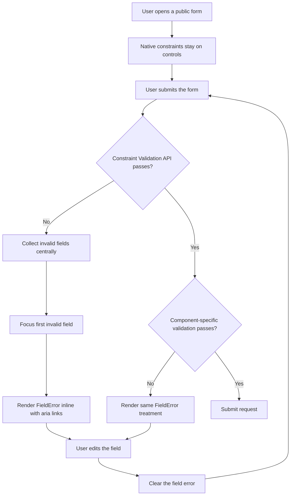

# Public Form Native Inline Errors

## Executive Summary

- Scenario: Replace browser-native validation bubbles in public findmydoc forms with centralized inline validation feedback.
- Patient problem: The browser tooltip UI is visually inconsistent, can obscure nearby fields, and does not match the clinical findmydoc interface.
- Patient decision: Users need to see which field needs attention, why it failed, and how to continue without losing their place in the form.
- Trust/transparency outcome: Native HTML constraints remain on controls, but the visible failure state is controlled, accessible, and consistent across public forms.

## Current State

- Inspected routes/components/collections:
  - `src/components/organisms/Auth/RegistrationForm.tsx`
  - `src/components/organisms/Auth/LoginForm.tsx`
  - `src/app/(frontend)/auth/password/reset/ResetPasswordRequestForm.tsx`
  - `src/app/(frontend)/auth/password/reset/complete/ResetPasswordCompleteForm.tsx`
  - `src/app/(frontend)/auth/invite/complete/InviteCompleteForm.tsx`
  - `src/components/organisms/Contact/ContactRequestForm.client.tsx`
  - `src/components/organisms/ClinicDetail/ClinicAppointmentSection.tsx`
  - `src/components/organisms/Form/index.tsx`
  - `src/blocks/Form/**`
- Current UX behavior:
  - Public forms rely on native `required`, `type`, `minLength`, or form-library validation.
  - Where the browser handles invalid submit directly, the visible error can appear as an unstyled browser tooltip.
  - Existing custom errors vary by component and are not yet one reusable pattern.
- Current limitations:
  - The tooltip placement is browser-controlled and can cover the field layout.
  - Native browser tooltip styling is not themable with findmydoc tokens.
  - Required, format, and custom errors are not consistently linked with `aria-describedby`.
- Reference screenshots:
  - `output/playwright/public-form-validation/current-patient-login-browser.png`
  - `output/playwright/public-form-validation/current-patient-login-mobile.png`
  - `output/playwright/public-form-validation/current-patient-login-desktop.png`
  - `output/playwright/public-form-validation/current-patient-register-mobile.png`
  - `output/playwright/public-form-validation/login-invalid-320.png`
  - `output/playwright/public-form-validation/login-invalid-375.png`
  - `output/playwright/public-form-validation/login-invalid-640.png`
  - `output/playwright/public-form-validation/login-invalid-768.png`
  - `output/playwright/public-form-validation/login-invalid-1024.png`
  - `output/playwright/public-form-validation/login-invalid-1280.png`
  - `output/playwright/public-form-validation/contact-invalid-375-short-clean.png`
- Storybook grounding:
  - Attempted local Storybook at `http://localhost:6006/`.
  - Blocker: Storybook preview failed while rendering the login story with `Cannot read properties of undefined (reading 'customEqualityTesters')`, consistent with the local Storybook 10.4.1 and `@storybook/test` 8.6.15 runtime mismatch.
- Local runtime grounding:
  - Next.js dev server was run on `http://localhost:3001` because port `3000` was occupied.
- Seed/fixture status:
  - No data seed was required; the target public auth/contact form states are static or story-driven.
- Existing data ownership:
  - Clinic registration is now owned by `ClinicRegistrationFunnel`; it uses inline validation and medical-specialty focus categories instead of the retired city-selection form.
  - CMS public forms are already owned by the Payload form-builder adapter in `src/components/organisms/Form/index.tsx` and `src/blocks/Form/**`; this scenario changes only the visible validation state and browser-bubble suppression.

## User Journey

1. Patient entry point: A patient or clinic representative opens a public login, registration, contact, appointment, invite, reset-password, or CMS-rendered form.
2. Decision moment: The user submits with an empty or malformed required field.
3. Trust-building moment: The invalid control receives focus, shows an inline error row, and keeps the field label and control visible.
4. Uncertainty or failure state: Server/API errors remain global when they are not field-specific; password confirmation, city selection, and backend field errors use the same inline visual treatment.
5. Final outcome: The user fixes the field, the error clears on input, and the form submits without any browser-native tooltip bubble.

## Mermaid Flow

## Functional Requirements

### Must

- Suppress browser-native tooltip bubbles on public UI forms with `noValidate`.
- Keep native constraints on inputs: `required`, `type="email"`, `minLength`, `pattern`, and similar attributes.
- Use the HTML Constraint Validation API through a shared helper before submit handlers run.
- Render inline field errors through a shared `Field` + `FieldError` pattern.
- Add `data-invalid` to field wrappers and `aria-invalid` plus `aria-describedby` to controls.
- Focus the first invalid field after an invalid submit.
- Clear a field error when the user changes that field.
- Preserve existing server/API error behavior and redirect behavior.
- Follow the error-source priority contract:
  - Native constraint errors are collected first and block submission.
  - Component-specific field errors run only after native constraints pass.
  - Server/API field errors can replace or set field errors after submission.
  - Global alerts remain only for flow-level or non-field-specific failures.
  - Each field renders one visible error message at a time.

### Should

- Use concise, stable messages for common native validity states.
- Reuse the same visual treatment for custom field errors such as password confirmation and city selection.
- Keep the error row compact enough for dense mobile forms.
- Provide Storybook reference stories for invalid-submit, error, correction, and submit flows.

### Must Not

- Use `reportValidity()` for public UI forms because it reopens the browser tooltip bubble.
- Remove native constraints from controls.
- Move business validation out of server/API hooks into UI-only logic.
- Change Payload Admin validation behavior.

### Out of Scope

- Payload Admin form validation.
- New backend validation rules.
- New submit endpoints.
- Redesigning full form layouts beyond the validation state.

## Visual Mockups

| Mockup | File | Purpose | Functions shown | Notes |
| --- | --- | --- | --- | --- |
| Variant comparison | `variant-comparison.png` | Temporary design decision artifact | A minimal inline, B soft pill, C grouped field treatment | Variant A was selected as the implementation baseline, with a subtle icon treatment from B. |
| Mobile | `mobile.png` | Primary mobile treatment | Required error, email format error, focused field, submit button | Shows the chosen compact inline row under each invalid field. |
| Tablet | `tablet.png` | Two-column adaptation | Registration form with invalid first/last name and email | Keeps error rows inside each grid cell without changing column rhythm. |
| Desktop | `desktop.png` | Wide public form density | Login/contact examples with global and field-level errors | Demonstrates inline errors while preserving global API/status alerts. |

The generated mockups are design-direction artifacts, not route screenshots. `desktop.png` is a comparison board showing how the same treatment behaves in multiple public form contexts; it is not a new combined login/registration page. Any dismiss icon, password visibility icon, required marker style, or optional marker generated by imagegen is out of implementation scope unless listed in the Visible UI Contract below.

## Visible UI Contract

Anything not documented in this table is out of implementation scope.

| UI element | Patient value | Trust/transparency purpose | Data source | Component ownership | Allowed behavior |
| --- | --- | --- | --- | --- | --- |
| Field wrapper | Groups label, control, and error as one scannable unit | Makes invalid state visually local to the exact field | Component state from validation helper or form library | `src/components/atoms/field.tsx` | Sets `data-invalid`; no layout shift beyond the error row height. |
| Field label | Identifies the field that needs correction | Keeps the label visible when the error appears | Existing component copy | Existing form components | Must remain linked to the control through `htmlFor`. |
| Input/select/textarea invalid styling | Shows which control failed | Creates a consistent token-based invalid border/focus ring | Native/control error state | `src/components/atoms/input.tsx`, `textarea.tsx`, `select.tsx`, `combobox.tsx`, `checkbox.tsx` | Uses semantic destructive token; no custom browser tooltip. |
| FieldError row | Explains the failure inline | Gives the user specific correction guidance | `ValidityState`, custom form validation, or server field errors | `src/components/atoms/field.tsx` | Renders `role="alert"`, icon `aria-hidden`, and message text. |
| Global alert | Shows non-field-specific API or flow errors | Separates backend/session problems from field mistakes | Existing API responses or route state | Existing auth/contact form components | Must not replace field-specific errors when a field is known. |
| Submit button | Continues the primary flow | Prevents accidental submit during async work | Existing component state | Existing form components | Disabled only for existing loading/success states. |
| Success message | Confirms completion | Shows that the corrected form submitted | Existing component state | Existing form components | Unchanged except field errors are cleared on success. |
| Textarea invalid state | Shows larger text-entry failures without covering user text | Keeps message/contact failures local to the textarea field | Native constraints or `react-hook-form` errors | `src/components/atoms/textarea.tsx`, contact and CMS form fields | Error row appears below the textarea; textarea may grow only by existing sizing rules. |
| Checkbox invalid state | Shows required boolean failures near the checkbox label | Keeps consent/required option failures tied to the interactive control | `react-hook-form` field errors in CMS block fields | `src/components/atoms/checkbox.tsx`, `src/blocks/Form/Checkbox/index.tsx` | Error row appears below the checkbox row; the checkbox exposes `aria-invalid` and `aria-describedby`. |
| CMS form field errors | Align public Payload form-builder fields with public auth/contact forms | Removes visual inconsistency between CMS forms and authored public forms | Existing `react-hook-form` errors from the public form adapter | `src/components/organisms/Form/index.tsx`, `src/blocks/Form/**` | Public form block uses `noValidate`; block fields render `FieldError` and native-looking invalid styling. |
| Required marker | Communicates required status when existing form copy includes it | Supports quick scanning without relying only on the error after submit | Existing field config or form component props | Existing form components and CMS field adapters | Existing markers remain; this scenario does not redesign required/optional marker copy. |

### Error Message Contract

| Source | Priority | Visible placement | Message ownership | Notes |
| --- | --- | --- | --- | --- |
| Native `valueMissing` | 1 | FieldError under the control | Shared `PublicFormValidation` default, overridable per field | Default: `This field is required.` |
| Native `typeMismatch` | 1 | FieldError under the control | Shared helper, overridable per field | Default: `Enter a valid email address.` |
| Native `tooShort` / `tooLong` | 1 | FieldError under the control | Shared helper, overridable per field | Uses `minLength` / `maxLength` when available. |
| Native `patternMismatch`, range, step, bad input | 1 | FieldError under the control | Shared helper, overridable per field | Generic by default; specific fields can override. |
| Component-specific custom errors | 2 | Same FieldError under the known field | Owning form component | Password confirmation and clinic city selection use this path. |
| Server/API field errors | 3 | Same FieldError under the known field | Existing API response or submit handler | Used only when the backend identifies a specific field. |
| Server/API global errors | 4 | Existing global `Alert` | Existing submit handler | Used for auth/session/network or unknown field failures. |

Only the highest-priority current failure for a field is rendered. Editing a field clears that field's current error; a later submit can recreate it if the value is still invalid.

## Data Model Plan

| Collection/source | Needed fields | Relationship | Permissions | Provenance/freshness | Status |
| --- | --- | --- | --- | --- | --- |
| HTML form controls | `name`, `required`, `type`, `minLength`, `pattern`, `disabled`, `validity` | Directly read from the submitted form element | Client-only form state | Browser Constraint Validation API at submit time | Available |
| Auth/contact API responses | Existing error message and optional field details | Form submit handlers already consume these responses | Existing endpoint permissions | Response freshness at request time | Available |
| Payload form-builder fields | Existing field config and `react-hook-form` errors | CMS adapter renders public form fields | Existing public form rendering | Payload form config at render time | Available |

## Component Plan

| Feature | Reuse/change/new | Candidate component or module | Notes |
| --- | --- | --- | --- |
| Shared field wrapper/error | New local shadcn-equivalent atom | `src/components/atoms/field.tsx` | Mirrors shadcn `Field`/`FieldError` semantics used by the current atoms folder. |
| Native validation collector | New reusable molecule logic | `src/components/molecules/PublicFormValidation/logic.ts` | Converts `ValidityState` to stable messages and first-invalid focus target. |
| Public validation hook | New reusable hook | `src/components/molecules/PublicFormValidation/usePublicFormValidation.ts` | Shared by client-rendered public forms. |
| Atom invalid styling | Change | `input.tsx`, `textarea.tsx`, `select.tsx`, `combobox.tsx`, `checkbox.tsx` | Adds token-based invalid border/focus treatment. |
| Auth forms | Change | Registration, login, reset, invite forms | Add `noValidate`, inline native errors, custom field errors. |
| Contact and appointment forms | Change | Public contact form, clinic appointment section | Add same validation behavior and visual treatment. |
| CMS public form block | Change | `src/components/organisms/Form/index.tsx`, `src/blocks/Form/**` | Suppress browser bubbles and align public form-builder errors. |
| Storybook references | Change | `src/stories/**` form stories | Add invalid-submit/error/fix/submit interaction stories. |
| Future AI/developer rule | Change | `src/components/AGENTS.md`, `src/app/(frontend)/AGENTS.md` | Prevents reintroducing browser validation bubbles. |

## Differences From Current Implementation

- Mobile:
  - Browser tooltip bubbles are replaced by inline `FieldError` rows under the failing field.
  - The first invalid field receives focus, and the surrounding field gets token-based invalid styling.
  - Error text stays below the control, preserving nearby labels and fields.
- Tablet:
  - Grid fields keep errors inside their own grid cell.
  - The field group height can grow for an error row without covering sibling fields.
- Desktop:
  - Dense login, contact, registration, and CMS forms preserve their current layout.
  - Global alerts remain for backend or flow-level failures, while known field failures render inline.

## Acceptance Criteria

- Mobile:
  - Verified at 320, 375, and 640 px for invalid-submit, error display, correction, and submit.
  - No horizontal overflow, clipped labels, or covered fields after errors appear.
  - Verify at least one short-height state (`320x568` or `375x667`) for invalid-submit visibility.
  - Verify at least one virtual-keyboard-adjacent focus path as partial Chromium evidence: first invalid field receives focus and remains scroll-reachable after submit.
  - Runtime evidence captured: login invalid-submit at 320/375/640; contact invalid-submit at 375 short height with the submit button visible; clinic city combobox open/search/select at 375 short height without horizontal overflow.
- Tablet:
  - Verified at 768 and 1024 px with grid fields and long error rows.
- Desktop:
  - Verified at 1280 px for login, registration, contact, appointment, and CMS-style form examples.
- Data source:
  - Native constraints remain on the relevant controls.
  - Form-specific validation still uses existing submit handlers and APIs.
- Accessibility:
  - Invalid controls expose `aria-invalid`.
  - Error rows are linked with `aria-describedby`.
  - Error rows use `role="alert"` for submit-triggered feedback.
  - First invalid control receives focus.
  - Controls with custom UI, such as combobox and checkbox, keep a label or labelled-by relationship and link to the same error row when invalid.
- Review:
  - Run `plan_design_reviewer` on this folder before implementation review.
  - Run mobile UI and accessibility reviewers after implementation.
  - Run security reviewer because auth form components are touched, even though server/API trust boundaries are unchanged.

## Specialist Review Handoff

- `plan_design_reviewer`: required against this single scenario folder.
- `mobile_ui_reviewer`: required after implementation because public form layout and mobile error states changed.
- `accessibility_reviewer`: required after implementation because validation, focus, ARIA, and alert behavior changed.
- `security_reviewer`: required after implementation because auth form components changed; expected scope is regression review only, not new server trust boundaries.
- `seo_reviewer`: not required; no metadata, indexation, routing, or structured data changes.
- `web_vitals_reviewer`: not required unless implementation adds heavy assets or new route-level media; the chosen treatment is text/icon-only.
- `storybook_reviewer`: required if story files or Storybook test coverage change.

## Assumptions and Data Gaps

### Assumptions

- “Native” means using HTML constraints and the Constraint Validation API, not showing the browser-controlled validation tooltip.
- Public UI scope includes auth/login/registration, invite/password forms, contact, clinic appointment, and the public CMS form block.
- Payload Admin remains unchanged.
- English validation copy is acceptable for current public UI consistency because existing public form copy is English.

### Data Gaps

- Storybook runtime needs dependency alignment before Storybook screenshots can be used as primary visual evidence.
- There is no current product localization source for field-validation messages beyond existing per-form label props.
- Imagegen-generated affordances such as password visibility toggles and alert dismiss buttons are design artifacts only; implementation must not add them from this scenario without a separate contract.

<!-- topic: public-form-validation; scenario: native-inline-errors -->
