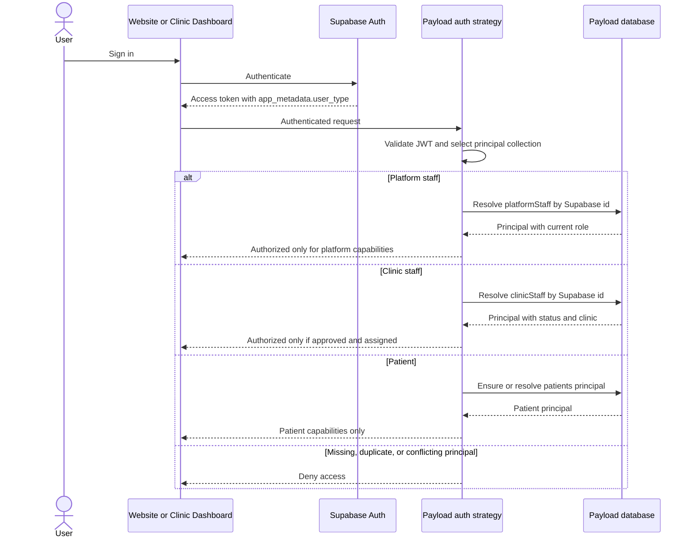

# Supabase Authentication Flow

```mermaid
sequenceDiagram
    actor User
    participant Browser as Website or Clinic Dashboard
    participant Supabase as Supabase Auth
    participant Payload as Payload auth strategy
    participant DB as Payload database

    User->>Browser: Sign in
    Browser->>Supabase: Authenticate
    Supabase-->>Browser: Access token with app_metadata.user_type
    Browser->>Payload: Authenticated request
    Payload->>Payload: Validate JWT and select principal collection
    alt Platform staff
        Payload->>DB: Resolve platformStaff by Supabase id
        DB-->>Payload: Principal with current role
        Payload-->>Browser: Authorized only for platform capabilities
    else Clinic staff
        Payload->>DB: Resolve clinicStaff by Supabase id
        DB-->>Payload: Principal with status and clinic
        Payload-->>Browser: Authorized only if approved and assigned
    else Patient
        Payload->>DB: Ensure or resolve patients principal
        DB-->>Payload: Patient principal
        Payload-->>Browser: Patient capabilities only
    else Missing, duplicate, or conflicting principal
        Payload-->>Browser: Deny access
    end
```

## Website Admin Boundary

The website admin login only handles platform staff and redirects only an existing, eligible `platformStaff` principal to Payload Admin. Clinic staff do not receive Payload Admin access and later authenticate in the separate Clinic Dashboard. Patients do not receive Payload Admin access.

## Authorization Facts

The Supabase claim chooses a collection only. Payload reads the current platform role, clinic relation, and clinic approval status from the resolved principal for every request. This prevents a stale or user-controlled claim from granting platform or clinic authority.

## Provisioning

Staff principals are provisioned before login through trusted workflows. Patient principals retain ensure-on-auth. A missing staff principal is denied; no website login creates a staff account.
