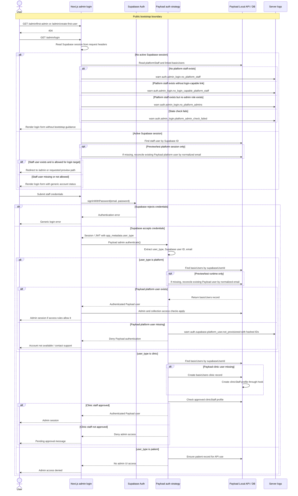

# Supabase Authentication Flow

This diagram shows the current order for staff login, platform-user provisioning boundaries, and account setup in the healthcare platform.

```mermaid
sequenceDiagram
    actor User as User
    participant Login as Next.js admin login
    participant Supabase as Supabase Auth
    participant Strategy as Payload auth strategy
    participant Payload as Payload Local API / DB
    participant Logs as Server logs

    Note over User,Logs: Public bootstrap boundary

    User->>Login: GET /admin/first-admin or /admin/create-first-user
    Login-->>User: 404

    User->>Login: GET /admin/login
    Login->>Login: Read Supabase session from request headers

    alt No active Supabase session
        Login->>Payload: Read platformStaff and linked basicUsers
        alt No platform staff exists
            Login->>Logs: warn auth.admin_login.no_platform_staff
        else Platform staff exists without login-capable link
            Login->>Logs: warn auth.admin_login.no_login_capable_platform_staff
        else Platform staff exists but no admin role exists
            Login->>Logs: warn auth.admin_login.no_platform_admins
        else State check fails
            Login->>Logs: warn auth.admin_login.platform_admin_check_failed
        end
        Login-->>User: Render login form without bootstrap guidance
    else Active Supabase session
        Login->>Payload: Find staff user by Supabase ID
        opt Preview/test platform session only
            Login->>Payload: If missing, reconcile existing Payload platform user by normalized email
        end
        alt Staff user exists and is allowed for login target
            Login-->>User: Redirect to /admin or requested preview path
        else Staff user missing or not allowed
            Login-->>User: Render login form with generic account status
        end
    end

    User->>Login: Submit staff credentials
    Login->>Supabase: signInWithPassword(email, password)

    alt Supabase rejects credentials
        Supabase-->>Login: Authentication error
        Login-->>User: Generic login error
    else Supabase accepts credentials
        Supabase-->>Login: Session / JWT with app_metadata.user_type
        Login->>Strategy: Payload admin authenticate()
        Strategy->>Strategy: Extract user_type, Supabase user ID, email

        alt user_type is platform
            Strategy->>Payload: Find basicUsers by supabaseUserId
            opt Preview/test runtime only
                Strategy->>Payload: If missing, reconcile existing Payload user by normalized email
            end
            alt Payload platform user exists
                Payload-->>Strategy: Return basicUsers record
                Strategy-->>Login: Authenticated Payload user
                Login->>Payload: Admin and collection access checks apply
                Login-->>User: Admin session if access rules allow it
            else Payload platform user missing
                Strategy->>Logs: warn auth.supabase.platform_user.not_provisioned with hashed IDs
                Strategy-->>Login: Deny Payload authentication
                Login-->>User: Account not available / contact support
            end

        else user_type is clinic
            Strategy->>Payload: Find basicUsers by supabaseUserId
            alt Payload clinic user missing
                Strategy->>Payload: Create basicUsers clinic record
                Payload->>Payload: Create clinicStaff profile through hook
            end
            Strategy->>Payload: Check approved clinicStaff profile
            alt Clinic staff approved
                Strategy-->>Login: Authenticated Payload user
                Login-->>User: Admin session
            else Clinic staff not approved
                Strategy-->>Login: Deny admin access
                Login-->>User: Pending approval message
            end

        else user_type is patient
            Strategy->>Payload: Ensure patient record for API use
            Strategy-->>Login: No admin UI access
            Login-->>User: Admin access denied
        end
    end
```

## Business Logic Concepts

### User Types & Collections

The system supports three distinct user roles with different data storage patterns:

- **Platform Staff** → Stored in `basicUsers` with `platformStaff` profile
- **Clinic Staff** → Stored in `basicUsers` with `clinicStaff` profile
- **Patients** → Stored directly in `patients` collection (no separate profile)

### Profile Management Strategy

**Platform Staff**:
- Supabase Auth user, Payload `basicUsers`, and Payload `platformStaff` profile are provisioned outside the public website runtime.
- Public login never creates missing platform records.
- Preview/test runtime may reconcile a valid Supabase platform session to an existing Payload platform user by normalized email.

**Clinic Staff**:
- Main user record stores authentication data
- Separate profile record stores role-specific information
- Records are created in two phases: user first, profile shortly after (non-transactional)

**Patient Users**:
- Single record contains both authentication and profile data
- Simpler data model for end-user management

### Approval Workflow

**Clinic Staff Access Control**:
- New clinic users can authenticate but cannot access admin features
- Platform administrators must manually approve clinic staff
- Approved status controls admin interface access only
- API access remains available regardless of approval status

**Platform Staff**:
- Public runtime login requires an existing Payload platform user.
- Platform staff login-state checks distinguish whether a platform admin role exists, without exposing public bootstrap guidance.

**Patients**:
- Patient authentication is for API use, not Payload admin UI access.

### Consistency & Recovery

**Email Reconciliation**:
- Platform email reconciliation is limited to preview/test runtime and only links a valid Supabase platform session to an existing Payload platform user.
- Other automatic user creation paths must not be used to bootstrap platform staff.

**Creation Semantics**:
- Platform staff creation is not part of public runtime authentication.
- Clinic user and profile creation are not wrapped in a single transaction; a temporary gap can exist if profile creation fails.
- Concurrent create conflicts are handled by re-querying and reusing the already-created record where public runtime creation is still allowed.

## Authentication Flow Stages

### Stage 1: Token Processing
- Extract JWT token from authorization headers
- Validate token signature against Supabase secrets
- Parse user metadata from token claims

### Stage 2: User Type Resolution
- Identify user type from Supabase metadata
- Map user type to appropriate PayloadCMS collections
- Apply user-type-specific configuration rules

### Stage 3: User Management
- Search for existing user by Supabase identifier
- For platform users, do not create missing Payload records during public runtime login
- In preview/test runtime, reconcile platform users by normalized email only when an existing Payload platform user is found
- For clinic users, create a missing user/profile record when allowed by the auth flow
- For patients, ensure a patient record for API use
- Recover from concurrent create conflicts by re-lookup where public runtime creation is still allowed

### Stage 4: Access Authorization
- Validate user permissions based on type and approval status
- Apply collection-level and field-level access controls
- Return authenticated user or deny access

### Stage 5: Session Establishment
- Provide authenticated user context to PayloadCMS
- Enable API access based on user permissions
- Log authentication events for monitoring

## Error Handling Philosophy

### Graceful Degradation
- Authentication failures result in access denial, not system errors
- Users receive appropriate feedback without exposing system internals
- Failed operations are logged for administrator review
- Admin login page remains read-only for provisioning to avoid retry/redirect loops on failures

### Creation Integrity
- User persistence precedes profile creation (non-atomic). Failures in profile creation are logged; recovery may require manual or future automated repair.

### Security Boundaries
- Invalid tokens are rejected without revealing validation details
- User enumeration attacks are prevented through consistent response timing
- Error messages provide minimal information to unauthorized users

## Monitoring & Operations

### Business Metrics
- **User Onboarding**: Track new user creation by type
- **Approval Workflow**: Monitor clinic staff approval rates and timing
- **Authentication Success**: Measure login success rates by user type
- **Profile Consistency**: Track profile creation and recovery events

### Operational Considerations
- **Performance**: Authentication operations optimized for healthcare platform scale
- **Reliability**: Idempotent lookups and conflict recovery improve consistency under concurrency
- **Security**: Comprehensive logging enables security monitoring and audit trails
- **Scalability**: Stateless design supports horizontal scaling requirements

---

*This authentication flow is designed specifically for healthcare platform requirements, balancing security, usability, and operational efficiency.*
