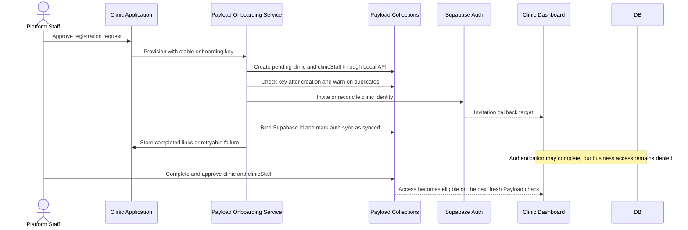
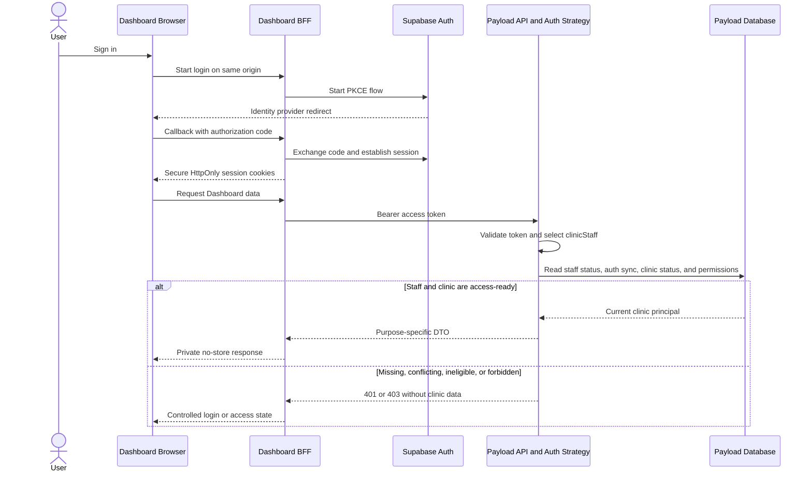
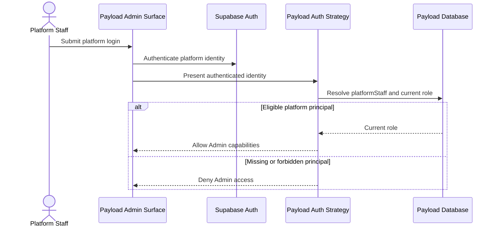
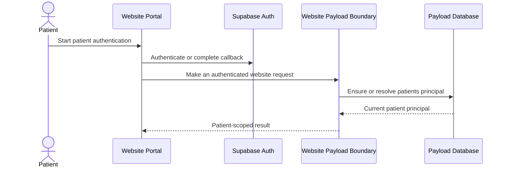

# Supabase Authentication Flows by Application Surface

## Clinic Onboarding and Access Activation

```mermaid
sequenceDiagram
    actor Platform as Platform Staff
    participant Application as Clinic Application
    participant Payload as Payload Onboarding Service
    participant Collections as Payload Collections
    participant Supabase as Supabase Auth
    participant Dashboard as Clinic Dashboard

    Platform->>Application: Approve registration request
    Application->>Payload: Provision with stable onboarding key
    Payload->>Collections: Create pending clinic and clinicStaff through Local API
    Payload->>Collections: Check key after creation and warn on duplicates
    Payload->>Supabase: Invite or reconcile clinic identity
    Supabase-->>Dashboard: Invitation callback target
    Payload->>Collections: Bind Supabase id and mark auth sync as synced
    Payload->>Application: Store completed links or retryable failure
    Note over Dashboard,DB: Authentication may complete, but business access remains denied
    Platform->>Collections: Complete and approve clinic and clinicStaff
    Collections-->>Dashboard: Access becomes eligible on the next fresh Payload check
```

`clinicApplications` is the current trigger and audit record, not a permanent relationship on the clinic. A future CRM
can replace the trigger by sending the same stable onboarding command. Partial and repeated records retain that key;
Payload emits a structured warning when one execution source resolves to multiple clinics or staff principals.

## Clinic Dashboard

```mermaid
sequenceDiagram
    actor User
    participant Browser as Dashboard Browser
    participant BFF as Dashboard BFF
    participant Supabase as Supabase Auth
    participant Payload as Payload API and Auth Strategy
    participant DB as Payload Database

    User->>Browser: Sign in
    Browser->>BFF: Start login on same origin
    BFF->>Supabase: Start PKCE flow
    Supabase-->>Browser: Identity provider redirect
    Browser->>BFF: Callback with authorization code
    BFF->>Supabase: Exchange code and establish session
    BFF-->>Browser: Secure HttpOnly session cookies
    Browser->>BFF: Request Dashboard data
    BFF->>Payload: Bearer access token
    Payload->>Payload: Validate token and select clinicStaff
    Payload->>DB: Read staff status, auth sync, clinic status, and permissions
    alt Staff and clinic are access-ready
        DB-->>Payload: Current clinic principal
        Payload-->>BFF: Purpose-specific DTO
        BFF-->>Browser: Private no-store response
    else Missing, conflicting, ineligible, or forbidden
        Payload-->>BFF: 401 or 403 without clinic data
        BFF-->>Browser: Controlled login or access state
    end
```

The Dashboard browser calls only the Dashboard origin for application data. Tokens remain in host-bound `HttpOnly`
cookies and server code. Payload receives server-to-server requests from the BFF, so Dashboard origins are not Payload
CORS origins.

## Payload Admin

```mermaid
sequenceDiagram
    actor Staff as Platform Staff
    participant Admin as Payload Admin Surface
    participant Supabase as Supabase Auth
    participant Payload as Payload Auth Strategy
    participant DB as Payload Database

    Staff->>Admin: Submit platform login
    Admin->>Supabase: Authenticate platform identity
    Admin->>Payload: Present authenticated identity
    Payload->>DB: Resolve platformStaff and current role
    alt Eligible platform principal
        DB-->>Payload: Current role
        Payload-->>Admin: Allow Admin capabilities
    else Missing or forbidden principal
        Payload-->>Admin: Deny Admin access
    end
```

Only `platformStaff` can enter Payload Admin. Clinic staff and patients are explicitly denied.

## Patient Portal

```mermaid
sequenceDiagram
    actor Patient
    participant Portal as Website Portal
    participant Supabase as Supabase Auth
    participant Payload as Website Payload Boundary
    participant DB as Payload Database

    Patient->>Portal: Start patient authentication
    Portal->>Supabase: Authenticate or complete callback
    Portal->>Payload: Make an authenticated website request
    Payload->>DB: Ensure or resolve patients principal
    DB-->>Payload: Current patient principal
    Payload-->>Portal: Patient-scoped result
```

The Dashboard decision does not change the patient portal session or ensure-on-auth behavior.

## Shared Authorization Facts

The Supabase claim chooses a principal collection only. Payload reads the current platform role, staff lifecycle and
auth synchronization state, clinic relation, and clinic approval/deletion state from the resolved principal for every
request. Staff principals are provisioned before login; patients retain ensure-on-auth. Missing, duplicate,
conflicting, or unsynchronized principals fail closed.
