# Supabase Authentication Flow

This diagram shows the business process for user authentication and account setup in the healthcare platform.

```mermaid
sequenceDiagram
    participant User as 👤 User
    participant Frontend as 🌐 Next.js Frontend
    participant Supabase as 🔐 Supabase Auth
    participant Strategy as 🎯 Auth Strategy
    participant PayloadDB as 🗄️ PayloadCMS DB

    Note over User, PayloadDB: User Login Process
    
    User->>Frontend: 1. Enters email/password
    Frontend->>Supabase: 2. Sign in with credentials
    
    alt Login Success
        Supabase-->>Frontend: 3. Returns JWT token + user data
        Frontend->>Strategy: 4. Calls authenticate()
        
        Note over Strategy: Extract & Validate User Data
        Strategy->>Supabase: 5. Get user session & decode JWT
        Supabase-->>Strategy: 6. User metadata (email, user_type, names)
        
        Note over Strategy: Determine User Type & Collection
        Strategy->>Strategy: 7. Check user_type (clinic/platform/patient)
        Strategy->>Strategy: 8. Map to collection (basicUsers/patients)
        
        Note over Strategy, PayloadDB: Find or Create User
        Strategy->>PayloadDB: 9. Search for existing user by supabaseUserId
        
        alt User Exists
            PayloadDB-->>Strategy: 10a. Return existing user
            
            Note over Strategy, PayloadDB: Check Profile Exists (for staff)
            alt Staff User (clinic/platform)
                Strategy->>PayloadDB: 11a. Check for profile (clinicStaff/platformStaff)
                
                alt Profile Missing
                    PayloadDB-->>Strategy: 12a. No profile found
                    Strategy->>PayloadDB: 13a. Create missing profile
                    PayloadDB-->>Strategy: 14a. Profile created
                    Note right of Strategy: Ensures existing users<br/>get their profiles
                else Profile Exists
                    PayloadDB-->>Strategy: 12b. Profile found
                end
            end
            
        else User Doesn't Exist
            Note over Strategy, PayloadDB: Atomic Creation (Transaction)
            Strategy->>PayloadDB: 10b. Begin transaction
            Strategy->>PayloadDB: 11b. Create user record
            PayloadDB-->>Strategy: 12b. User created (ID: X)
            
            alt Staff User Needs Profile
                Strategy->>PayloadDB: 13b. Create profile record
                PayloadDB-->>Strategy: 14b. Profile created
            end
            
            Strategy->>PayloadDB: 15b. Commit transaction
            PayloadDB-->>Strategy: 16b. Both records saved
            Note right of Strategy: Atomic: Either both<br/>created or neither
        end
        
        Note over Strategy: Additional Checks for Clinic Users
        alt Clinic User
            Strategy->>PayloadDB: 17. Check if clinic staff is approved
            PayloadDB-->>Strategy: 18. Return approval status
            
            alt Not Approved
                Strategy-->>Frontend: 19a. Deny access (null user)
            else Approved
                Strategy-->>Frontend: 19b. Allow access
            end
        else Platform/Patient User
            Strategy-->>Frontend: 19c. Allow access
        end
        
        Frontend-->>User: 20. Redirect to dashboard/admin
        
    else Login Failed
        Supabase-->>Frontend: 3b. Authentication error
        Frontend-->>User: 4b. Show error message
    end

    Note over User, PayloadDB: Key Features
    Note right of Strategy: ✅ Atomic transactions<br/>✅ Missing profile detection<br/>✅ Detailed error logging<br/>✅ User type validation
```

## Business Logic Concepts

### User Types & Collections

The system supports three distinct user roles with different data storage patterns:

- **Platform Staff** → Stored in `basicUsers` with `platformStaff` profile
- **Clinic Staff** → Stored in `basicUsers` with `clinicStaff` profile  
- **Patients** → Stored directly in `patients` collection (no separate profile)

### Profile Management Strategy

**Staff Users (Clinic & Platform)**:
- Main user record stores authentication data
- Separate profile record stores role-specific information
- Both records are created together or not at all (atomic operations)

**Patient Users**:
- Single record contains both authentication and profile data
- Simpler data model for end-user management

### Approval Workflow

**Clinic Staff Access Control**:
- New clinic users can authenticate but cannot access admin features
- Platform administrators must manually approve clinic staff
- Approved status controls admin interface access only
- API access remains available regardless of approval status

**Platform Staff & Patients**:
- Immediate access upon successful authentication
- No additional approval workflow required

### Profile Recovery Mechanism

**Missing Profile Detection**:
- System checks for profile existence during each login
- Missing profiles are automatically created for staff users
- Ensures data consistency even after system migrations or errors

**Transaction Safety**:
- All user creation operations use database transactions
- Partial failures result in complete rollback
- Prevents orphaned user records or missing profiles

## Authentication Flow Stages

### Stage 1: Token Processing
- Extract JWT token from authorization headers
- Validate token signature against Supabase secrets
- Parse user metadata from token claims

### Stage 2: User Type Resolution
- Identify user type from Supabase metadata
- Map user type to appropriate PayloadCMS collections
- Apply user-type-specific configuration rules

### Stage 3: User Management
- Search for existing user by Supabase identifier
- Create new user if not found (with profile if applicable)
- Ensure profile consistency for all staff users

### Stage 4: Access Authorization
- Validate user permissions based on type and approval status
- Apply collection-level and field-level access controls
- Return authenticated user or deny access

### Stage 5: Session Establishment
- Provide authenticated user context to PayloadCMS
- Enable API access based on user permissions
- Log authentication events for monitoring

## Error Handling Philosophy

### Graceful Degradation
- Authentication failures result in access denial, not system errors
- Users receive appropriate feedback without exposing system internals
- Failed operations are logged for administrator review

### Transaction Integrity
- Database operations use transactions to maintain consistency
- Partial failures trigger complete rollback to prevent data corruption
- Atomic operations ensure system reliability under load

### Security Boundaries
- Invalid tokens are rejected without revealing validation details
- User enumeration attacks are prevented through consistent response timing
- Error messages provide minimal information to unauthorized users

## Monitoring & Operations

### Business Metrics
- **User Onboarding**: Track new user creation by type
- **Approval Workflow**: Monitor clinic staff approval rates and timing
- **Authentication Success**: Measure login success rates by user type
- **Profile Consistency**: Track profile creation and recovery events

### Operational Considerations
- **Performance**: Authentication operations optimized for healthcare platform scale
- **Reliability**: Transaction-based operations ensure data consistency
- **Security**: Comprehensive logging enables security monitoring and audit trails
- **Scalability**: Stateless design supports horizontal scaling requirements

---

*This authentication flow is designed specifically for healthcare platform requirements, balancing security, usability, and operational efficiency.*
