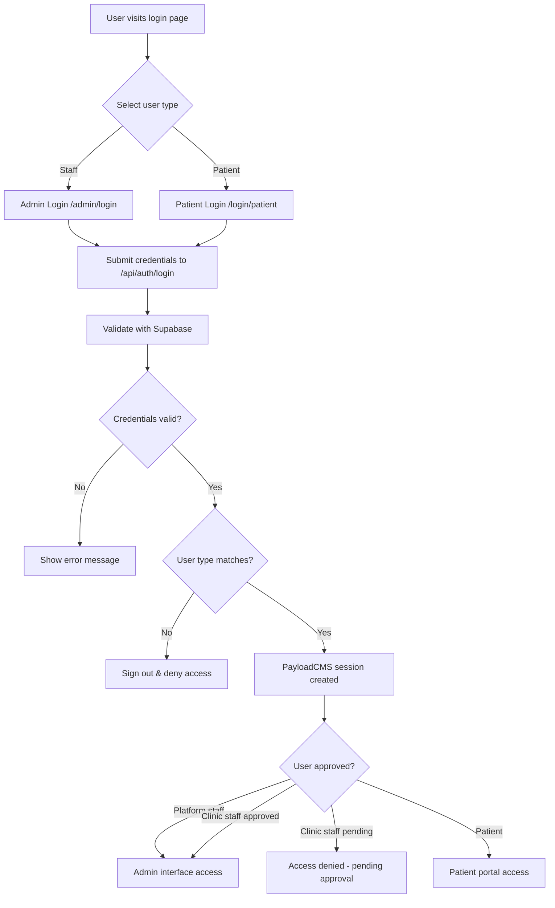

# Authentication System

## Architecture

Server-side authentication combining Supabase auth with PayloadCMS user management. The system validates credentials with Supabase, then manages sessions and user provisioning through PayloadCMS.

## User Types & Collections

```typescript
// User type mapping
type UserType = 'clinic' | 'platform' | 'patient'

// Collections
basicUsers: 'clinic' | 'platform' staff → Admin UI access
patients: Patient collection → Patient portal access
```

### Access Control
- **Admin UI**: Available to `basicUsers` collection (clinic + platform staff)
- **Patient Portal**: Available to `patients` collection  
- **Approval System**: Clinic users require approval before accessing admin interface

## Authentication Flow



## Auth Flow Implementation

```typescript
// 1. Login API - /api/auth/login
export async function POST(request: Request) {
  const { email, password, userType } = await request.json()
  
  // Validate with Supabase
  const { data, error } = await supabase.auth.signInWithPassword({
    email, password
  })
  
  // Check user type authorization
  if (data.user.user_metadata.type !== userType) {
    await supabase.auth.signOut()
    return Response.json({ error: 'Access denied' }, { status: 403 })
  }
  
  return Response.json({ success: true, redirectUrl: getRedirectUrl(userType) })
}

// 2. PayloadCMS Auth Strategy
export const supabaseStrategy = async (req) => {
  const token = extractBearerToken(req.headers.authorization)
  const { data, error } = await supabase.auth.getUser(token)
  
  if (error) return null
  
  // Find or create user in PayloadCMS
  return await findOrCreateUser(data.user, req.payload)
}
```

## Login Forms

The system uses a universal `BaseLoginForm` component that adapts to different user types:

```typescript
// Universal login component
export function BaseLoginForm({ userTypes }: { userTypes: UserType[] }) {
  const handleSubmit = async (credentials) => {
    const response = await fetch('/api/auth/login', {
      method: 'POST',
      body: JSON.stringify({ ...credentials, userType: selectedType })
    })
    
    if (response.ok) {
      router.push(redirectUrl)
    }
  }
}

// Usage examples
<BaseLoginForm userTypes={['clinic', 'platform']} /> // Admin login
<BaseLoginForm userTypes={['patient']} />            // Patient login
```

### Login Pages
- **Admin Login** (`/admin/login`): Accepts clinic and platform staff
- **Patient Login** (`/login/patient`): Accepts patients only
- **Validation**: Server-side only, no client-side pre-validation

## Access Control

Collection access is controlled through PayloadCMS access functions that check user types and permissions:

```typescript
// Collection access patterns
export const Clinics: CollectionConfig = {
  slug: 'clinics',
  access: {
    create: isPlatformStaff,
    read: () => true, // Public read
    update: ({ req: { user } }) => {
      return user?.type === 'platform' || 
             (user?.type === 'clinic' && { id: { equals: user.clinic } })
    }
  }
}

// Auth strategy integration
export default buildConfig({
  auth: {
    strategies: [
      {
        name: 'supabase',
        authenticate: supabaseStrategy
      }
    ]
  }
})
```

### User Type Separation
- Server validates user type against endpoint requirements
- Unauthorized access attempts result in automatic sign-out  
- Each login endpoint restricted to specific user types

## Security Rules

- **Server-side validation**: All auth logic on server
- **User type separation**: Each login endpoint restricted to specific types  
- **Automatic sign-out**: On unauthorized access attempts
- **No client tokens**: PayloadCMS manages sessions
- **Approval workflow**: Clinic users need approval before admin access

## File Structure

```
src/
├── app/api/auth/login/route.ts        # Auth API
├── components/Auth/BaseLoginForm.tsx   # Universal form
├── auth/strategies/supabaseStrategy.ts # PayloadCMS integration
└── app/(frontend)/
    ├── admin/login/page.tsx           # Staff login
    └── login/patient/page.tsx         # Patient login
```
