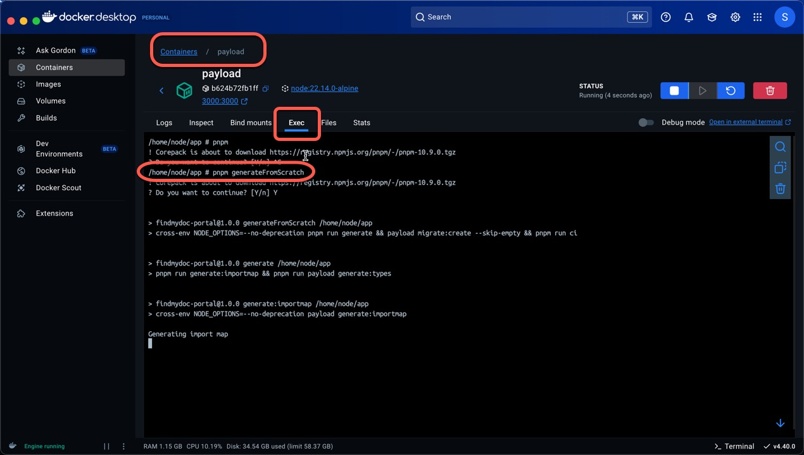

# Development Setup

## Connect to Vercel

1. **Vercel CLI**: Install the Vercel CLI globally using `pnpm i -g vercel`.
2. **Login**: Run `vercel login` and follow the prompts to authenticate.
   a. login with GitHub
   b. use the centralized Vercel account for the project

3. **Link Project**: `vercel link --project findmydoc-portal --yes`
4. **Pull for Preview**: `vercel pull --environment preview --yes`

## Local Development

### Migrations

When running locally against Postgres, you can use either the automatic push adapter or explicit migrations:

- **Automatic push** (fast, non-production):

  The Postgres adapter default for development has `push: true`, so you can add or remove fields without generating migrations.

- **Explicit migrations** (recommended for CI/CD):

  1. Create a new migration: `pnpm payload migrate:create`
  2. Check status: `pnpm payload migrate:status`
  3. Apply pending migrations: `pnpm payload migrate`

### Seed

Use the **Developer Dashboard** to manage seed data after logging in at [http://localhost:3000/admin](http://localhost:3000/admin):

1. Navigate to the start page (**Developer Dashboard**).
2. Click **Seed Baseline** to upsert required reference data (safe, idempotent; can run anytime).
3. (Local / non‑production only) Click **Seed Demo (Reset)** to clear demo collections and repopulate sample content.
4. Use **Refresh Status** to view the last run summary (created/updated counts, any partial failures, and reset counts).

Notes:
* Baseline seeding never deletes data; repeated runs should show 0 created if nothing changed.
* Demo reset is destructive to demo collections only and is disabled in production.
* Only platform role users see / can use the demo seeding action.
* Full policy, error handling tiers, and collection ordering: see the [Seeding System](./seeding.md) documentation.

### MCP (AI tools)

To use findmydoc's Model Context Protocol (MCP) server with developer tools (VS Code, Claude, etc.), you’ll need an MCP API key (platform staff only) and a client configuration.

See: [MCP integration](./integrations/mcp.md)

### Payload API routes (avoid shadowing)

Payload’s REST API is served by the catch‑all route under [src/app/(payload)/api/[...slug]/route.ts](../src/app/(payload)/api/[...slug]/route.ts). Avoid adding per‑collection Next.js routes under `/api/<collection>` (for example `/api/basicUsers`), because those **shadow** the catch‑all route and can cause admin UI relationship lookups to 404.

If you need custom Next.js API endpoints, use non‑conflicting paths (e.g. `/api/auth/**`, `/api/forms/**`). Only shadow Payload’s routes with a clear, documented rationale and verify the admin UI still resolves relationship fields correctly.

### First Admin User

On first setup, create your initial admin user:

1. Visit [http://localhost:3000/admin/first-admin](http://localhost:3000/admin/first-admin)
2. Fill in your admin credentials
3. The page automatically redirects to login once an admin exists

> **Note:** This page is only accessible when no admin users exist in Supabase.

### Docker

Use Docker Compose to standardize your dev environment:

1. Copy environment variables: `cp .env.example .env`
2. Start services: `docker compose up`.

### Interactive Sessions

For interactive access (e.g., confirming schema changes):

- Payload shell:`docker compose run --rm --service-ports payload`
- Postgres shell:`docker compose run --rm postgres`

Alternativley use docker dektop or exec to access the containers and the shell inside the containers.
- **Postgres**: `docker exec -it <container_id> psql -U postgres`
- **Payload**: `docker exec -it <container_id> sh`

