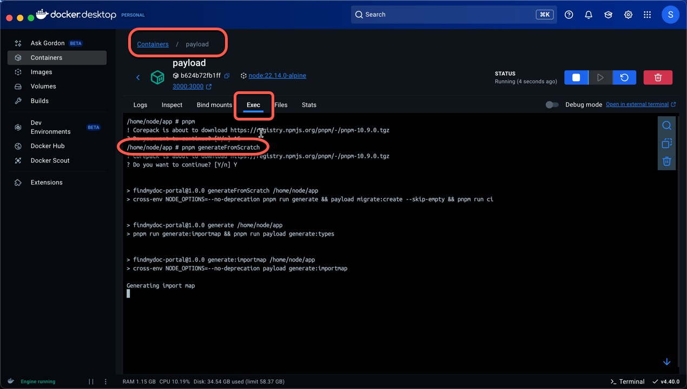

# Development Setup

## Prerequisites

- Node.js 24.x (repository standard)
- pnpm 10.x
- Docker Desktop

## Connect to Vercel

1. **Vercel CLI**: Install the Vercel CLI globally using `pnpm i -g vercel`.
2. **Login**: Run `vercel login` and follow the prompts to authenticate.
   a. login with GitHub
   b. use the centralized Vercel account for the project

3. **Link Project**: `vercel link --project findmydoc-portal --yes`
4. **Pull for Preview**: `vercel pull --environment preview --yes`

## Local Development

### Environment Mode Matrix

The repository supports `local`, `hybrid`, and `cloud` operation with the same codebase.

| Mode | Database | Storage | Key Env Signals |
| --- | --- | --- | --- |
| `local` | Local Postgres (Docker) | Local filesystem uploads | `DATABASE_URI` points to local DB, `USE_S3_IN_DEV` unset/`false` |
| `hybrid` | Remote Postgres (often Supabase) | Local or S3-compatible | `DATABASE_URI` points to remote DB, optional `USE_S3_IN_DEV=true` with S3 env |
| `cloud` | Managed Postgres (often Supabase) | S3-compatible | Production env with managed DB and complete S3 env variables |

If `USE_S3_IN_DEV=true`, the S3 adapter in `src/plugins/index.ts` becomes active in development too.

### Codegen (required after schema/plugin changes)

This repo uses a single command to regenerate all generated Payload artifacts (admin import map + TypeScript types):

- `pnpm generate`

Run this after changing Payload config/plugins, collection schemas, or when your branch pulls in Payload-related dependency updates.

### Run Local Dev with Preview Redirect Blocker

Use the redirect blocker when you want to simulate preview-only access rules locally:

```bash
pnpm dev:redirect-blocker
```

This command sets:
- `DEPLOYMENT_ENV=preview`
- `NEXT_PUBLIC_DEPLOYMENT_ENV=preview`

Result:
- Requests without a platform staff session are redirected to `/admin/login?message=preview-login-required&next=...`.

See also:
- [Features: Preview Redirect Blocker](./features.md#preview-redirect-blocker)
- [Preview Guard Technical Notes](/src/features/previewGuard/README.md)

### Migrations

This repository uses an explicit migration-first workflow in every environment.

- **Default local behavior**:

  Schema push is disabled by default (`PAYLOAD_DB_PUSH=false`).

- **Required developer flow**:

  1. Create a new migration: `pnpm payload migrate:create <name>`
  2. Apply pending migrations locally: `pnpm payload migrate`
  3. Verify migration status: `pnpm payload migrate:status`
  4. Commit the generated files in `src/migrations/**`

- **CI/CD enforcement**:

  - Build fails if Payload can generate a migration but no migration files were committed.
  - Build runs `pnpm payload migrate:status` after applying migrations.
  - Preview and Production deployments run migrations as part of `pnpm run ci` during Vercel builds.

- **Optional local experimentation only**:

  You may temporarily set `PAYLOAD_DB_PUSH=true` on a throwaway local database, but this must not be used for shared or deployed environments.

For the complete release sequence, see [Deployment & Migration Runbook](./deployment-runbook.md).

### Seed

Use the unified CLI runner for local/non-interactive seed execution:

```bash
pnpm seed:run -- --type baseline
pnpm seed:run -- --type demo
pnpm seed:run -- --type demo --reset
```

Notes:
- `--runtime-env` is optional (auto-detected from `VERCEL_ENV`, then `DEPLOYMENT_ENV`, then `NODE_ENV`).
- Baseline is allowed in all runtimes.
- Demo and any reset operation are blocked in production runtime.
- For hosted preview/production runs, use the manual **Seed Data** workflow instead of `/api/seed` POST.

You can still use the **Developer Dashboard** after logging in at [http://localhost:3000/admin](http://localhost:3000/admin):

1. Navigate to the admin start page and locate the **Developer seeding** widget.
2. Click **Seed Baseline** to upsert required reference data (safe, idempotent; can run anytime).
3. (Local / non‑production only) Click **Seed Demo (Reset)** to clear demo collections and repopulate sample content.
4. Use **Refresh Status** to fetch the latest seed summary, then review logs in the widget console.

Notes:
* Baseline seeding never deletes data; repeated runs should show 0 created if nothing changed.
* Demo reset is destructive to demo collections only and is disabled in production.
* Only platform basic users can access seed actions and logs in the widget.
* `/api/seed` POST is allowed in `preview`, `development`, and `test`; it is disabled in production.
* For long-running media-heavy seed runs in hosted preview/prod environments, use the manual **Seed Data** GitHub workflow.
* Full policy, error handling tiers, and collection ordering: see the [Seeding System](./seeding.md) documentation.

### MCP (AI tools)

To use findmydoc's Model Context Protocol (MCP) server with developer tools (VS Code, Claude, etc.), you’ll need an MCP API key (platform staff only) and a client configuration.

See: [MCP integration](./integrations/mcp.md)

### Payload API routes (avoid shadowing)

Payload’s REST API is served by the catch‑all route under [src/app/(payload)/api/[...slug]/route.ts](../src/app/(payload)/api/[...slug]/route.ts). Avoid adding per‑collection Next.js routes under `/api/<collection>` (for example `/api/basicUsers`), because those **shadow** the catch‑all route and can cause admin UI relationship lookups to 404.

If you need custom Next.js API endpoints, use non‑conflicting paths (e.g. `/api/auth/**`, `/api/form-bridge/**`). Only shadow Payload’s routes with a clear, documented rationale and verify the admin UI still resolves relationship fields correctly.


### First Admin User

On first setup, create your initial admin user:

1. Visit [http://localhost:3000/admin/first-admin](http://localhost:3000/admin/first-admin)
2. Fill in your admin credentials
3. The page automatically redirects to login once an admin exists

> **Note:** This page is only accessible when no local platform admin users exist in the CMS (`basicUsers`).

### Docker

Use Docker Compose to standardize your dev environment:

1. Copy environment variables: `cp .env.example .env`
2. Start services: `docker compose up`.

### Interactive Sessions

For interactive access (e.g., confirming schema changes):

- Payload shell:`docker compose run --rm --service-ports payload`
- Postgres shell:`docker compose run --rm postgres`

Alternatively, use Docker Desktop or `docker exec` to access the containers and their shells.
- **Postgres**: `docker exec -it <container_id> psql -U postgres`
- **Payload**: `docker exec -it <container_id> sh`



## Documentation Consistency Check

Run the docs consistency validator before opening a PR:

```bash
pnpm docs:check
```

What it validates:
- broken internal markdown links in `docs/`
- referenced `pnpm` scripts that do not exist in `package.json`
- inline repo path references that no longer exist (placeholder paths are ignored)

CI recommendation:
- add `pnpm docs:check` as a lightweight gate in your docs or PR validation workflow.
