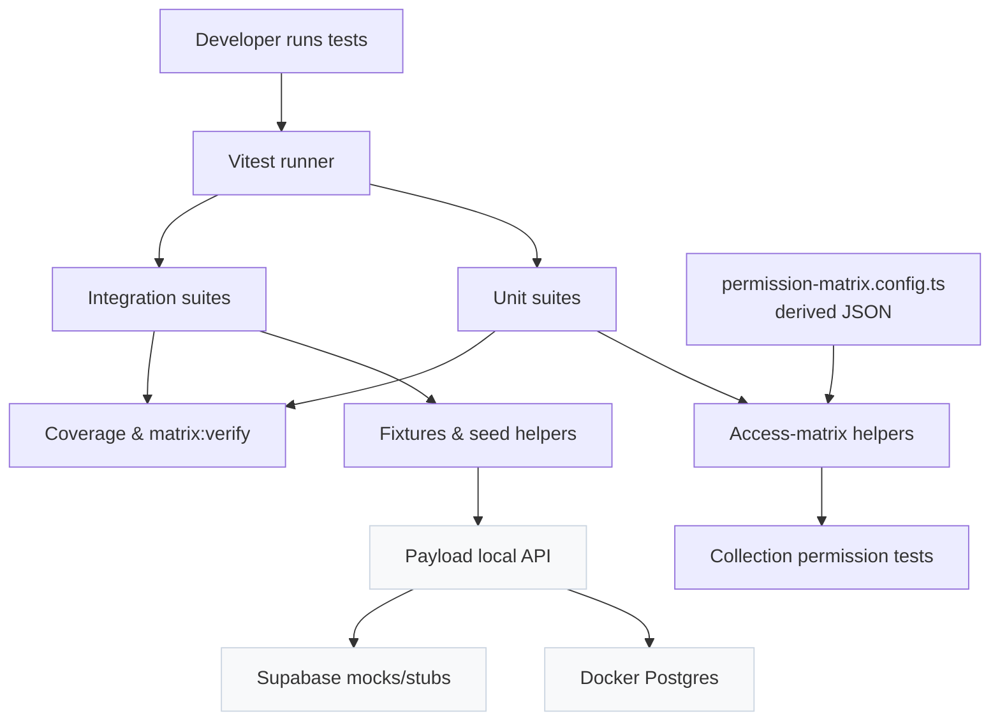

# Testing Strategy

This page explains what we expect from the test suite and how it mirrors the permission matrix driven architecture.

## Guiding Principles

- **Protect access control first.** Every change to `src/access` or collection `access` functions must stay in lockstep with the metadata in `docs/security/permission-matrix.config.ts` and the generated JSON snapshots.
- **Exercise business hooks.** Hooks encapsulate side effects and validation, so unit suites track their behaviour across happy paths and failure paths.
- **Lean on integration for workflows.** Use the fixtures in `tests/fixtures` to cover cross-collection flows that involve Payload and Supabase interactions.
- **Keep tests focused.** Mock Payload internals only at the edges; we do not re-test the platform, Supabase SDKs, or generated types.

## What To Cover

| Priority | Area | Notes |
| --- | --- | --- |
| Must | Access control (unit + permission matrix) | Aim for 100% branch coverage; validate true/false/scoped filters using the shared helpers. |
| Must | Authentication logic | Verify Supabase token handling, provisioning hooks, and error branches. |
| Must | Business hooks | Assert data transformations, validations, and side effects. |
| Should | Field-level rules & utilities | Cover complex field validation or helper utilities that gate behaviour. |
| Avoid | Payload internals, Supabase SDK, generated types, migrations | Treat these as external dependencies. |

## Test Types

- **Unit** (`tests/unit`): Fast, focused suites that mock external calls. This includes access helpers, collection configs (via the permission matrix helpers), hooks, and auth utilities.
- **Integration** (`tests/integration`): Real Payload requests against the Docker-backed Postgres instance using the fixture helpers. Use when a behaviour depends on multiple collections or Supabase interactions.
- **Setup scripts** (`tests/setup`): Global lifecycle orchestration (database, seeds, cleanup). These are executed automatically; you rarely need to touch them.

## When To Add Tests

- You changed a collection `access` rule → update the permission matrix config, regenerate snapshots, and adjust the matching test in `tests/unit/access-matrix`.
- You added a hook or extended an existing one → create or expand the suite under `tests/unit/hooks`.
- You introduced a new workflow that crosses collections or relies on seeds → prefer an integration test with fixtures so behaviour remains realistic.

## Naming & Location

- Place tests inside the matching domain folder under `tests/` instead of co-locating with source files.
- Use descriptive filenames (`clinics.permission.test.ts`, `patientProvisioning.hook.test.ts`) to make intent obvious when scanning `pnpm tests --watch` output.
- Shared helpers live in `tests/unit/helpers`; if you need a new mock, add it there instead of duplicating code.

## Cross-References

- [Access Control](./access-control.md) explains how metadata drives the permission matrix suites.
- [Patterns & Utilities](./patterns.md) lists the reusable mocks, fixtures, and cleanup helpers.
- [Setup](./setup.md) details the environment and commands.

## Architecture Overview

Below is a compact diagram showing how our test suites interact with Payload, the permission matrix, fixtures, and infrastructure. It focuses on the software architecture (what talks to what) rather than on the documentation flow.

