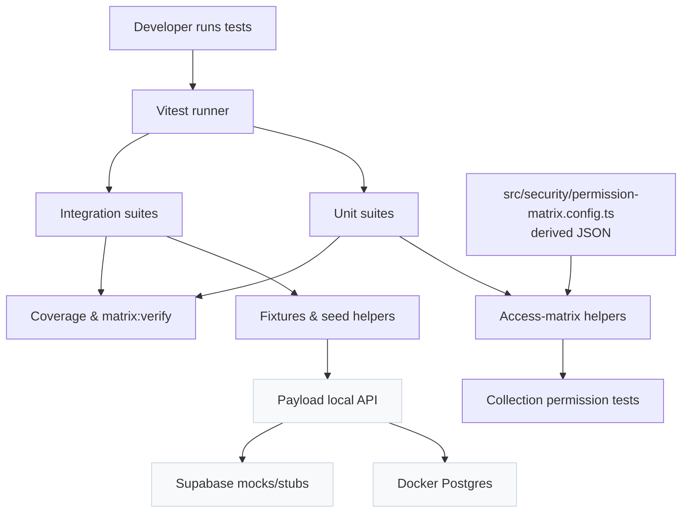

# Testing Strategy

This page explains what we expect from the test suite and how it mirrors the permission matrix driven architecture.

## Guiding Principles

- **Protect access control first.** Every change to `src/access` or collection `access` functions must stay in lockstep with the metadata in `src/security/permission-matrix.config.ts` and the generated JSON snapshots.
- **Exercise business hooks.** Hooks encapsulate side effects and validation, so unit suites track their behaviour across happy paths and failure paths.
- **Lean on integration for workflows.** Use the fixtures in `tests/fixtures` to cover cross-collection flows that involve Payload and Supabase interactions.
- **Keep tests focused.** Mock Payload internals only at the edges; we do not re-test the platform, Supabase SDKs, or generated types.
- **Partial Mocking (Stubbing) over Full Implementation.** When mocking complex objects (like Payload's `user` or `req`), prefer stubbing only the properties required for the specific test case. We do not aim to preserve the full implementation behavior of external dependencies in unit tests. This reduces coupling and brittleness.

## What To Cover

| Priority | Area | Notes |
| --- | --- | --- |
| Must | Access control (unit + permission matrix) | Aim for 100% branch coverage; validate true/false/scoped filters using the shared helpers. |
| Must | Authentication logic | Verify Supabase token handling, provisioning hooks, and error branches. |
| Must | Business hooks | Assert data transformations, validations, and side effects. |
| Should | Field-level rules & utilities | Cover complex field validation or helper utilities that gate behaviour. |
| Avoid | Payload internals, Supabase SDK, generated types, migrations | Treat these as external dependencies. |

## Test Types

- **Unit** (`tests/unit`): Fast, focused suites that mock external calls. This includes access helpers, collection configs (via the permission matrix helpers), hooks, and auth utilities.
- **Integration** (`tests/integration`): Real Payload requests against the Docker-backed Postgres instance using the fixture helpers. Use when a behaviour depends on multiple collections or Supabase interactions.
- **Setup scripts** (`tests/setup`): Global lifecycle orchestration (database, seeds, cleanup). These are executed automatically; you rarely need to touch them.
- **E2E** (`tests/e2e`): Keep this intentionally small and deterministic. Use it for true user journeys (admin login, dashboard smoke, key CRUD path), not for collection-internal contract depth.

## Collection Contract Model (Integration-first)

We use a two-tier model for collection coverage:

- **Baseline contract (all collections):** at least one integration path that proves owner-role CRUD behavior plus one denied write path.
- **Deep contract (critical domains):** additional integration scenarios for relationship integrity, duplicate guards, and hook-driven side effects.
- A suite can intentionally be referenced by both tiers in the registry when one file contains both baseline and deep assertions for the same slug.

Registry and gate:

- Contract registry: `tests/integration/contracts/collectionContractRegistry.ts`
- Hard sync gate: `tests/integration/contracts/collectionContractCoverage.test.ts`

The gate fails when:

- a slug exists in `src/collections/**` but not in the registry
- a registry entry points to a missing integration test file
- a slug in a deep-domain group has no deep test references

## Core Integration Scope (Issue #297)

For core medical-network collections (`clinics`, `doctors`, `medical-specialties`, `accreditation`, `treatments`, `clinictreatments`, `doctortreatments`, `doctorspecialties`, `countries`, `cities`, `reviews`), integration tests should explicitly cover:

- At least one allowed CRUD path for the role that owns the operation.
- At least one denied permission path (clinic/patient/anonymous where relevant).
- Relationship integrity checks for joins and referenced IDs.
- Derived field or hook behavior where implemented (for example `doctors.fullName`, review/treatment/clinic average ratings, treatment average prices).

## When To Add Tests

- You changed a collection `access` rule → update the permission matrix config, regenerate snapshots, and adjust the matching test in `tests/unit/access-matrix`.
- You added a hook or extended an existing one → create or expand the suite under `tests/unit/hooks`.
- You introduced a new workflow that crosses collections or relies on seeds → prefer an integration test with fixtures so behaviour remains realistic.
- You added a new collection slug → add baseline integration coverage and register it in `collectionContractRegistry` in the same PR.

## Naming & Location

- Place tests inside the matching domain folder under `tests/` instead of co-locating with source files.
- Use descriptive filenames (`clinics.permission.test.ts`, `patientProvisioning.hook.test.ts`) to make intent obvious when scanning `pnpm tests --watch` output.
- Shared helpers live in `tests/unit/helpers`; if you need a new mock, add it there instead of duplicating code.

## Cross-References

- [Access Control](./access-control.md) explains how metadata drives the permission matrix suites.
- [Patterns & Utilities](./patterns.md) lists the reusable mocks, fixtures, and cleanup helpers.
- [Setup](./setup.md) details the environment and commands.

## Follow-up

Collection contract coverage and DB reset performance are intentionally separated.

- Current status: deterministic contract coverage and the hard sync gate are active.
- The next phase should optimize DB reset runtime (faster run-reset or snapshot/template approach) without coupling that refactor to collection test semantics.
- Track the reset optimization scope in `docs/testing/follow-ups/db-reset-acceleration.md`.

## Architecture Overview

Below is a compact diagram showing how our test suites interact with Payload, the permission matrix, fixtures, and infrastructure. It focuses on the software architecture (what talks to what) rather than on the documentation flow.

```mermaid
flowchart TB
	Dev[Developer runs tests] --> Vitest[Vitest runner]
	Vitest --> Unit[Unit suites]
	Vitest --> Integration[Integration suites]

	Unit --> MatrixHelpers[Access-matrix helpers]
	MatrixConfig[src/security/permission-matrix.config.ts\nderived JSON] --> MatrixHelpers
	MatrixHelpers --> AccessTests[Collection permission tests]

	Integration --> Fixtures[Fixtures & seed helpers]
	Fixtures --> Payload[Payload local API]
	Payload --> Postgres[Docker Postgres]
	Payload --> Supabase[Supabase mocks/stubs]

	Unit --> Reports[Coverage & matrix:verify]
	Integration --> Reports

	classDef infra fill:#f8f9fa,stroke:#cbd5e1
	class Payload,Postgres,Supabase infra
```
