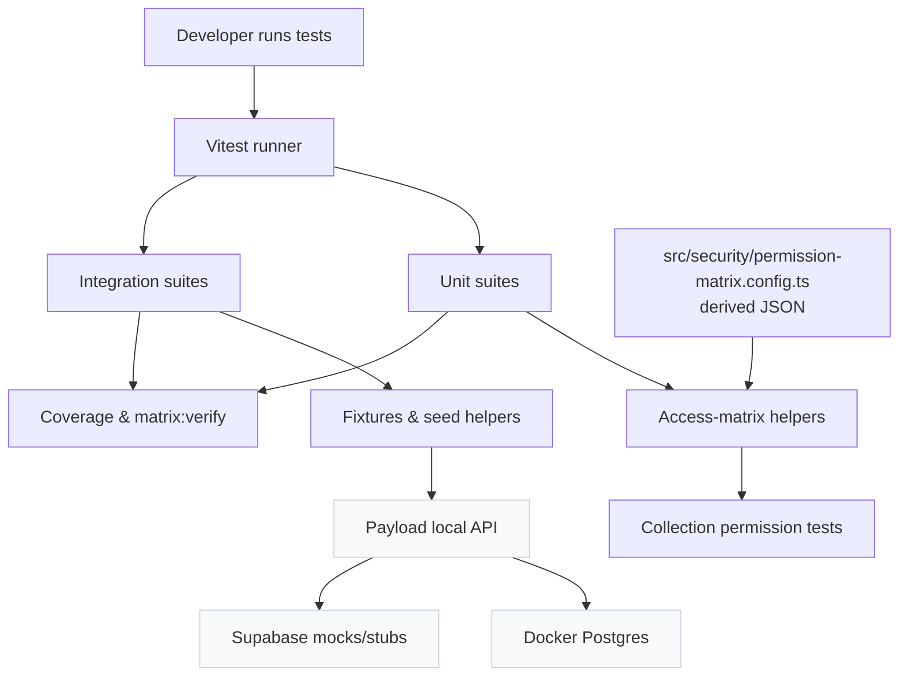

# Testing Strategy

This page explains what we expect from the test suite and how it mirrors the permission matrix driven architecture.

## Guiding Principles

- **Protect access control first.** Every change to `src/access` or collection `access` functions must stay in lockstep with the metadata in `src/security/permission-matrix.config.ts` and the generated JSON snapshots.
- **Exercise business hooks.** Hooks encapsulate side effects and validation, so unit suites track their behaviour across happy paths and failure paths.
- **Lean on integration for workflows.** Use the fixtures in `tests/fixtures` to cover cross-collection flows that involve Payload and Supabase interactions.
- **Keep tests focused.** Mock Payload internals only at the edges; we do not re-test the platform, Supabase SDKs, or generated types.
- **Partial Mocking (Stubbing) over Full Implementation.** When mocking complex objects (like Payload's `user` or `req`), prefer stubbing only the properties required for the specific test case. We do not aim to preserve the full implementation behavior of external dependencies in unit tests. This reduces coupling and brittleness.

## What To Cover

| Priority | Area | Notes |
| --- | --- | --- |
| Must | Access control (unit + permission matrix) | Aim for 100% branch coverage; validate true/false/scoped filters using the shared helpers. |
| Must | Authentication logic | Verify Supabase token handling, provisioning hooks, and error branches. |
| Must | Business hooks | Assert data transformations, validations, and side effects. |
| Should | Field-level rules & utilities | Cover complex field validation or helper utilities that gate behaviour. |
| Avoid | Payload internals, Supabase SDK, generated types, migrations | Treat these as external dependencies. |

## Test Types

- **Unit** (`tests/unit`): Fast, focused suites that mock external calls. This includes access helpers, collection configs (via the permission matrix helpers), hooks, and auth utilities.
- **Integration** (`tests/integration`): Real Payload requests against the Docker-backed Postgres instance using the fixture helpers. Use when a behaviour depends on multiple collections or Supabase interactions.
- **Setup scripts** (`tests/setup`): Global lifecycle orchestration (database, seeds, cleanup). These are executed automatically; you rarely need to touch them.
- **E2E** (`tests/e2e`): Keep this intentionally small and deterministic. Use it for true user journeys (admin login, dashboard smoke, key CRUD path), not for collection-internal contract depth.

## Collection Contract Model (Integration-first)

We use a two-tier model for collection coverage:

- **Baseline contract (all collections):** at least one integration path that proves owner-role CRUD behavior plus one denied write path.
- **Deep contract (critical domains):** additional integration scenarios for relationship integrity, duplicate guards, and hook-driven side effects.
- A suite can intentionally be referenced by both tiers in the registry when one file contains both baseline and deep assertions for the same slug.

Registry and gate:

- Contract registry: `tests/integration/contracts/collectionContractRegistry.ts`
- Hard sync gate: `tests/integration/contracts/collectionContractCoverage.test.ts`

The gate fails when:

- a slug exists in `src/collections/**` but not in the registry
- a registry entry points to a missing integration test file
- a slug in a deep-domain group has no deep test references

## Core Integration Scope (Issue #297)

For core medical-network collections (`clinics`, `doctors`, `medical-specialties`, `accreditation`, `treatments`, `clinictreatments`, `doctortreatments`, `doctorspecialties`, `countries`, `cities`, `reviews`), integration tests should explicitly cover:

- At least one allowed CRUD path for the role that owns the operation.
- At least one denied permission path (clinic/patient/anonymous where relevant).
- Relationship integrity checks for joins and referenced IDs.
- Derived field or hook behavior where implemented (for example `doctors.fullName`, review/treatment/clinic average ratings, treatment average prices).

## When To Add Tests

- You changed a collection `access` rule → update the permission matrix config, regenerate snapshots, and adjust the matching test in `tests/unit/access-matrix`.
- You added a hook or extended an existing one → create or expand the suite under `tests/unit/hooks`.
- You introduced a new workflow that crosses collections or relies on seeds → prefer an integration test with fixtures so behaviour remains realistic.
- You added a new collection slug → add baseline integration coverage and register it in `collectionContractRegistry` in the same PR.

## Naming & Location

- Place tests inside the matching domain folder under `tests/` instead of co-locating with source files.
- Use descriptive filenames (`clinics.permission.test.ts`, `patientProvisioning.hook.test.ts`) to make intent obvious when scanning `pnpm tests --watch` output.
- Shared helpers live in `tests/unit/helpers`; if you need a new mock, add it there instead of duplicating code.

## CI results and full integration

PR Validation uses native job results and complete path-filter outputs. A documentation omission is permitted only after successful classification. The workflow summary records the reason. Failed classification, invalid outputs, failed or cancelled prerequisites, unexpected skips, missing expected coverage reports, artifact transfer failures and coverage merge failures remain errors.

PR Validation and Preview use `.github/filters/validation.yml` with the pinned native `dorny/paths-filter` action and `predicate-quantifier: every`. The application build and new Preview deployment are omitted only when all changed paths belong to these classes, including mixtures:

| Class | Permitted paths |
| --- | --- |
| Test cases | `tests/**/*.test.ts`, `tests/**/*.test.tsx`, `tests/e2e/**/*.spec.ts`, `tests/e2e/**/*.spec.tsx` |
| Repository metadata | `.secrets.baseline`, `.github/ISSUE_TEMPLATE/*.yml`, `.github/ISSUE_TEMPLATE/*.yaml` |
| Documentation | Markdown under `docs/**`; root `README.md` |

Test setup, fixture, helper, support and mock directories still require builds. Test-like filenames containing setup, fixture, helper or support also require builds. Runtime code, styles, product files, public assets, dependencies, lockfiles, shared configuration, executable tooling, workflow configuration and unknown paths require builds. Deletions count, and the native action expands renames into old and new paths. Empty evidence forces conservative work. Missing or inconsistent native counts and PR discovery beyond the API's 3000-file limit fail classification. A failed classification cannot authorize an omission. Workflow summaries state approved omissions, and manual execution always requests full build and integration.

The build policy applies to PRs and triggered Main runs. Other checks retain their existing routing. Preview classification runs for every PR and Main push so workflow changes and unknown Markdown paths cannot bypass the shared policy through trigger exclusions. Vercel deployment still requires the existing trusted-source condition. These routing checks do not prove complete native discovery or measured savings; acceptance requires normal workflow evidence.

PR integration selection requires complete native `modified` status, JSON file-list and count evidence for existing `tests/integration/**/*.test.ts` cases only. The selected count must equal both the native changed-path count and the PR changed-file count. Added, deleted, renamed or mixed paths run full integration. Shared setup, fixtures, helpers, mocks, source files, dependencies, relevant configuration and unknown paths also run full integration. Known unit, tooling, data-integrity and E2E case-only changes, repository metadata and named documentation retain the explicit integration omission. Shared support paths override that omission.

The runner passes candidate file arguments only to the suite stage. Before DB preparation, native `vitest list --project integration --filesOnly --json` must discover exactly those files plus `tests/integration/contracts/collectionContractCoverage.test.ts`. Vitest uses substring filters, so extra files, missing files, invalid discovery, a missing contract or an empty request fall back to the ordinary unfiltered full suite. The workflow summary and `scope.json` record the actual mode and selected identities. No registry parser or separate change classifier participates.

Selected PR coverage uses native seed/suite blob replay with global integration thresholds disabled for that partial merge only. `coverage-integration-partial` contains explicitly incomplete coverage and `scope.json`. Combined Coverage labels partial integration evidence and makes no full-suite compliance assertion. Full integration keeps `coverage-integration`, the native merged coverage report and unchanged thresholds. Test failures, missing expected reports, failed artifact transfer and merge failures remain errors in either mode.

Main full integration follows validation relevance independently of the application build. Integration-test changes therefore run the full suite even when the build is omitted. Main Markdown changes inside full-suite inputs are no longer suppressed by a generic Markdown trigger ignore. Named documentation-only omissions remain available, and `workflow_dispatch` runs the full build and integration suite. The serial database-copy runner preserves full Payload configuration, seed preparation, isolation, assertions and strict cleanup. Main and manual full-suite coverage retain the 50% thresholds for statements, branches, functions and lines.

`Integration Tests` and `Combined Coverage` remain optional merge checks. Combined Coverage reports the available sources and explicitly identifies permitted absences; it cannot establish a missing suite's coverage or erase a failed test result. Integration failure is visible but does not guarantee a merge block under the existing ruleset. The seven required checks remain `lint pr title`, `Static Checks`, `Unit Tests`, `Storybook Tests`, `Build`, `Dependency Review` and `db-quality-gate`. DB Quality retains its separate schema and migration responsibility.

### Normal-CI evidence and acceptance

The frozen reference is [Main d9a92ee](https://github.com/findmydoc-platform/website/commit/d9a92ee015e17ec7cca5af144c9effab679c5533). Its successful [PR Validation run](https://github.com/findmydoc-platform/website/actions/runs/37775132580), [Preview run](https://github.com/findmydoc-platform/website/actions/runs/37775132581) and [DB Quality run](https://github.com/findmydoc-platform/website/actions/runs/37775132576) are Main baseline controls. The current integration inventory has 104 suite files and 1019 cases, plus one seed file and case. Native full report replay therefore contains 105 files and 1020 cases.

The normal PR references below use comment-only representative changes on the frozen baseline. Values are seconds. Complete validation ends at the last expected result across the observed normal PR workflows, including required checks, expected Integration, coverage completion and dynamic security scans. Preview is included if it finishes later. Runner sums count each executed native Actions job once, including setup, installation, reporting and cleanup; they are not billing estimates.

| Reference class / representative | PR Validation / Preview runs | Complete validation | Required-check feedback | First-job start delay | All PR runner time | Preview runner time | PR + Preview runner time |
| --- | --- | ---: | ---: | ---: | ---: | ---: | ---: |
| Unit test / 1 | [37929541607](https://github.com/findmydoc-platform/website/actions/runs/37929541607) / [37929541580](https://github.com/findmydoc-platform/website/actions/runs/37929541580) | 486 | 486 | 4 | 1227 | 195 | 1422 |
| Unit test / 2 | [37930641261](https://github.com/findmydoc-platform/website/actions/runs/37930641261) / [37930641177](https://github.com/findmydoc-platform/website/actions/runs/37930641177) | 519 | 519 | 4 | 1193 | 221 | 1414 |
| Repository metadata / 1 | [37929676739](https://github.com/findmydoc-platform/website/actions/runs/37929676739) / [37929676742](https://github.com/findmydoc-platform/website/actions/runs/37929676742) | 510 | 510 | 5 | 1207 | 170 | 1377 |
| Repository metadata / 2 | [37930822237](https://github.com/findmydoc-platform/website/actions/runs/37930822237) / [37930822025](https://github.com/findmydoc-platform/website/actions/runs/37930822025) | 539 | 539 | 3 | 1317 | 188 | 1505 |
| Existing integration test / 1 | [37929828434](https://github.com/findmydoc-platform/website/actions/runs/37929828434) / [37929828390](https://github.com/findmydoc-platform/website/actions/runs/37929828390) | 915 | 432 | 4 | 1892 | 224 | 2116 |
| Existing integration test / 2 | [37931738409](https://github.com/findmydoc-platform/website/actions/runs/37931738409) / [37931738405](https://github.com/findmydoc-platform/website/actions/runs/37931738405) | 1273 | 418 | 3 | 2253 | 225 | 2478 |

All observed PR runner totals include 12 workflows, including the dynamic CodeQL and code-quality Actions runs absent from a feature-branch-only listing. The additional hosted CodeQL check is not another Actions job. Native workflow queue time is zero in these references because `created_at` equals `run_started_at`. First-job start delay includes scheduling overhead and cannot establish queue-only time. Dependency waits remain inside complete validation. Parallel workflow elapsed times are never added.

The unit references span 486 to 519 complete seconds and 1414 to 1422 PR-plus-Preview runner seconds. Metadata spans 510 to 539 complete seconds and 1377 to 1505 runner seconds. Integration spans 915 to 1273 complete seconds and 2116 to 2478 runner seconds. Its second Integration job takes 1121 seconds against 773 seconds in the first reference. The slower run remains in the evidence; all six references succeed on attempt 1 without reruns. These individual values and their spread are reference evidence only. All three classes natively report `deployable=true` on the baseline; unit and metadata omit Integration under the existing routing. Main routing suggests full integration already runs for these baseline changes, but unrelated Main controls cannot establish their actual class-matched cost.

The [manual foundation control at 15056b6](https://github.com/findmydoc-platform/website/actions/runs/37931058896) passes the full 104-file suite and seed preparation, native coverage replay and expected artifacts. It reports 77.31% statements, 71.35% branches, 75% functions and 80.88% lines against unchanged 50% thresholds. This control predates the final selected-run implementation. It proves neither normal PR selection nor a comparable saving pair.

Acceptance remains incomplete under [spec #2075](https://github.com/findmydoc-platform/website/issues/2075#issuecomment-6080061658) and the [approved measurement resolution](https://github.com/findmydoc-platform/management/issues/412#issuecomment-6079291929). Each adopted class needs two complete comparable before-and-after pairs, repeated shorter complete validation and lower net recurring runner consumption. Candidate comparisons must retain the representative change, application inputs, dependencies, runtime versions, coverage requirements, runner class and event scope. Associated Main consumption must be measured separately and included in the net comparison. No such Main comparison or accepted candidate pair is available yet.

Normal PR workflows target `main`. A PR carrying the workflow implementation cannot qualify as a pure test or metadata sample. Candidate evidence therefore needs an approved activation sequence before normal pure-class PR comparisons can run. Main merge, a deployment, issue closure or changing Integration's required status is not implied by a green implementation run. Keep failed, cancelled and slower attempts visible, separate investigation costs from recurring work, and repair or revert exceptions that fail correctness or net-benefit acceptance. Preserve the serial database-copy baseline and existing safeguards.

The named temporary report at docs/research/ci-optimization-poc.md is absent. It has not been recreated, and unrelated diagnosis assets remain intact. Test, architecture and security reviews are recommended before adoption and require explicit owner confirmation. Integration remains optional; its later required status is a separate owner decision based on the completed evidence.

## Cross-References

- [Access Control](./access-control.md) explains how metadata drives the permission matrix suites.
- [Patterns & Utilities](./patterns.md) lists the reusable mocks, fixtures, and cleanup helpers.
- [Setup](./setup.md) details the environment and commands.

Deterministic contract coverage and the hard sync gate are part of the default test model.

DB reset uses template-clone restores through the shared harness, with `empty` templates for integration and `baseline` templates for Playwright E2E.

Template rebuilds are driven per template kind. Integration only depends on the `empty` template fingerprint, while Playwright E2E depends on both `empty` and `baseline`.

## Architecture Overview

Below is a compact diagram showing how our test suites interact with Payload, the permission matrix, fixtures, and infrastructure. It focuses on the software architecture (what talks to what) rather than on the documentation flow.

```mermaid
flowchart TB
	Dev[Developer runs tests] --> Vitest[Vitest runner]
	Vitest --> Unit[Unit suites]
	Vitest --> Integration[Integration suites]

	Unit --> MatrixHelpers[Access-matrix helpers]
	MatrixConfig[src/security/permission-matrix.config.ts\nderived JSON] --> MatrixHelpers
	MatrixHelpers --> AccessTests[Collection permission tests]

	Integration --> Fixtures[Fixtures & seed helpers]
	Fixtures --> Payload[Payload local API]
	Payload --> Postgres[Docker Postgres]
	Payload --> Supabase[Supabase mocks/stubs]

	Unit --> Reports[Coverage & matrix:verify]
	Integration --> Reports

	classDef infra fill:#f8f9fa,stroke:#cbd5e1
	class Payload,Postgres,Supabase infra
```
