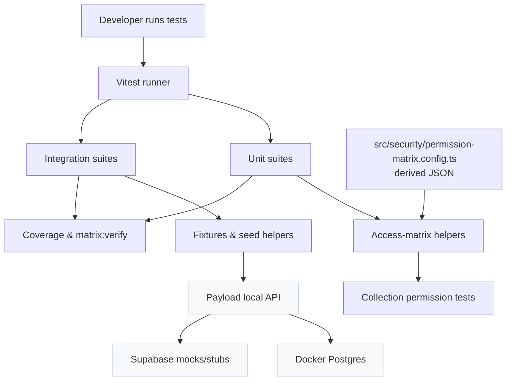

# Testing Strategy

This page explains what we expect from the test suite and how it mirrors the permission matrix driven architecture.

## Guiding Principles

- **Protect access control first.** Every change to `src/access` or collection `access` functions must stay in lockstep with the metadata in `src/security/permission-matrix.config.ts` and the generated JSON snapshots.
- **Exercise business hooks.** Hooks encapsulate side effects and validation, so unit suites track their behaviour across happy paths and failure paths.
- **Lean on integration for workflows.** Use the fixtures in `tests/fixtures` to cover cross-collection flows that involve Payload and Supabase interactions.
- **Keep tests focused.** Mock Payload internals only at the edges; we do not re-test the platform, Supabase SDKs, or generated types.
- **Partial Mocking (Stubbing) over Full Implementation.** When mocking complex objects (like Payload's `user` or `req`), prefer stubbing only the properties required for the specific test case. We do not aim to preserve the full implementation behavior of external dependencies in unit tests. This reduces coupling and brittleness.

## What To Cover

| Priority | Area | Notes |
| --- | --- | --- |
| Must | Access control (unit + permission matrix) | Aim for 100% branch coverage; validate true/false/scoped filters using the shared helpers. |
| Must | Authentication logic | Verify Supabase token handling, provisioning hooks, and error branches. |
| Must | Business hooks | Assert data transformations, validations, and side effects. |
| Should | Field-level rules & utilities | Cover complex field validation or helper utilities that gate behaviour. |
| Avoid | Payload internals, Supabase SDK, generated types, migrations | Treat these as external dependencies. |

## Test Types

- **Unit** (`tests/unit`): Fast, focused suites that mock external calls. This includes access helpers, collection configs (via the permission matrix helpers), hooks, and auth utilities.
- **Integration** (`tests/integration`): Real Payload requests against the Docker-backed Postgres instance using the fixture helpers. Use when a behaviour depends on multiple collections or Supabase interactions.
- **Setup scripts** (`tests/setup`): Global lifecycle orchestration (database, seeds, cleanup). These are executed automatically; you rarely need to touch them.
- **E2E** (`tests/e2e`): Keep this intentionally small and deterministic. Use it for true user journeys (admin login, dashboard smoke, key CRUD path), not for collection-internal contract depth.

## Collection Contract Model (Integration-first)

We use a two-tier model for collection coverage:

- **Baseline contract (all collections):** at least one integration path that proves owner-role CRUD behavior plus one denied write path.
- **Deep contract (critical domains):** additional integration scenarios for relationship integrity, duplicate guards, and hook-driven side effects.
- A suite can intentionally be referenced by both tiers in the registry when one file contains both baseline and deep assertions for the same slug.

Registry and gate:

- Contract registry: `tests/integration/contracts/collectionContractRegistry.ts`
- Hard sync gate: `tests/integration/contracts/collectionContractCoverage.test.ts`

The gate fails when:

- a slug exists in `src/collections/**` but not in the registry
- a registry entry points to a missing integration test file
- a slug in a deep-domain group has no deep test references

## Core Integration Scope (Issue #297)

For core medical-network collections (`clinics`, `doctors`, `medical-specialties`, `accreditation`, `treatments`, `clinictreatments`, `doctortreatments`, `doctorspecialties`, `countries`, `cities`, `reviews`), integration tests should explicitly cover:

- At least one allowed CRUD path for the role that owns the operation.
- At least one denied permission path (clinic/patient/anonymous where relevant).
- Relationship integrity checks for joins and referenced IDs.
- Derived field or hook behavior where implemented (for example `doctors.fullName`, review/treatment/clinic average ratings, treatment average prices).

## When To Add Tests

- You changed a collection `access` rule → update the permission matrix config, regenerate snapshots, and adjust the matching test in `tests/unit/access-matrix`.
- You added a hook or extended an existing one → create or expand the suite under `tests/unit/hooks`.
- You introduced a new workflow that crosses collections or relies on seeds → prefer an integration test with fixtures so behaviour remains realistic.
- You added a new collection slug → add baseline integration coverage and register it in `collectionContractRegistry` in the same PR.

## Naming & Location

- Place tests inside the matching domain folder under `tests/` instead of co-locating with source files.
- Use descriptive filenames (`clinics.permission.test.ts`, `patientProvisioning.hook.test.ts`) to make intent obvious when scanning `pnpm tests --watch` output.
- Shared helpers live in `tests/unit/helpers`; if you need a new mock, add it there instead of duplicating code.

## CI results and full integration

PR Validation uses native job results and complete path-filter outputs. A documentation omission is permitted only after successful classification. The workflow summary records the reason. Failed classification, invalid outputs, failed or cancelled prerequisites, unexpected skips, missing expected coverage reports, artifact transfer failures and coverage merge failures remain errors.

PR Validation and Preview use `.github/filters/validation.yml` with the pinned native `dorny/paths-filter` action and `predicate-quantifier: every`. The application build and new Preview deployment are omitted only when all changed paths belong to these classes, including mixtures:

| Class | Permitted paths |
| --- | --- |
| Test cases | `tests/**/*.test.ts`, `tests/**/*.test.tsx`, `tests/e2e/**/*.spec.ts`, `tests/e2e/**/*.spec.tsx` |
| Repository metadata | `.secrets.baseline`, `.github/ISSUE_TEMPLATE/*.yml`, `.github/ISSUE_TEMPLATE/*.yaml` |
| Documentation | Markdown under `docs/**`; root `README.md` |

Test setup, fixture, helper, support and mock directories still require builds. Test-like filenames containing setup, fixture, helper or support also require builds. Runtime code, styles, product files, public assets, dependencies, lockfiles, shared configuration, executable tooling, workflow configuration and unknown paths require builds. Deletions count, and the native action expands renames into old and new paths. Empty evidence forces conservative work. Missing or inconsistent native counts and PR discovery beyond the API's 3000-file limit fail classification. A failed classification cannot authorize an omission. Workflow summaries state approved omissions, and manual execution always requests full build and integration.

The build policy applies to PRs and triggered Main runs. Other checks retain their existing routing. Preview classification runs for every PR and Main push so workflow changes and unknown Markdown paths cannot bypass the shared policy through trigger exclusions. Vercel deployment still requires the existing trusted-source condition. These routing checks do not prove complete native discovery or measured savings; acceptance requires normal workflow evidence.

PR integration selection requires complete native `modified` status, JSON file-list and count evidence for existing `tests/integration/**/*.test.ts` cases only. The selected count must equal both the native changed-path count and the PR changed-file count. Added, deleted, renamed or mixed paths run full integration. Shared setup, fixtures, helpers, mocks, source files, dependencies, relevant configuration and unknown paths also run full integration. Known unit, tooling, data-integrity and E2E case-only changes, repository metadata and named documentation retain the explicit integration omission. Shared support paths override that omission.

The runner passes candidate file arguments only to the suite stage. Before DB preparation, native `vitest list --project integration --filesOnly --json` must discover exactly those files plus `tests/integration/contracts/collectionContractCoverage.test.ts`. Vitest uses substring filters, so extra files, missing files, invalid discovery, a missing contract or an empty request fall back to the ordinary unfiltered full suite. The workflow summary and `scope.json` record the actual mode and selected identities. No registry parser or separate change classifier participates.

Selected PR coverage uses native seed/suite blob replay with global integration thresholds disabled for that partial merge only. `coverage-integration-partial` contains explicitly incomplete coverage and `scope.json`. Combined Coverage labels partial integration evidence and makes no full-suite compliance assertion. Full integration keeps `coverage-integration`, the native merged coverage report and unchanged thresholds. Test failures, missing expected reports, failed artifact transfer and merge failures remain errors in either mode.

Main full integration follows validation relevance independently of the application build. Integration-test changes therefore run the full suite even when the build is omitted. Main Markdown changes inside full-suite inputs are no longer suppressed by a generic Markdown trigger ignore. Named documentation-only omissions remain available, and `workflow_dispatch` runs the full build and integration suite. The serial database-copy runner preserves full Payload configuration, seed preparation, isolation and assertions. Teardown strictly stops managed test services and preserves matching database templates plus S3Mock state. A teardown failure fails the execution; successful cleanup does not delete preserved state. Main and manual full-suite coverage retain the 50% thresholds for statements, branches, functions and lines.

`Integration Tests` and `Combined Coverage` remain optional merge checks. Combined Coverage reports the available sources and explicitly identifies permitted absences; it cannot establish a missing suite's coverage or erase a failed test result. Integration failure is visible but does not guarantee a merge block under the existing ruleset. The seven required checks remain `lint pr title`, `Static Checks`, `Unit Tests`, `Storybook Tests`, `Build`, `Dependency Review` and `db-quality-gate`. DB Quality retains its separate schema and migration responsibility.

### Normal-CI evidence and acceptance

The original investigation reference is [Main d9a92ee](https://github.com/findmydoc-platform/website/commit/d9a92ee015e17ec7cca5af144c9effab679c5533). Its successful [PR Validation run](https://github.com/findmydoc-platform/website/actions/runs/37775132580), [Preview run](https://github.com/findmydoc-platform/website/actions/runs/37775132581) and [DB Quality run](https://github.com/findmydoc-platform/website/actions/runs/37775132576) are Main baseline controls. The current integration inventory has 104 suite files and 1019 cases, plus one seed file and case. Native full report replay therefore contains 105 files and 1020 cases.

The six original normal PR observations below use comment-only representative changes on the frozen baseline. They remain investigation evidence. Sharp changed from 0.35.4 to 0.35.5 in Main f00362b8, so these observations do not form acceptance pairs against the current dependency candidate. Values are seconds. Complete validation ends at the last expected result across the observed normal PR workflows, including required checks, expected Integration, coverage completion and dynamic security scans. Preview is included if it finishes later. Runner sums count each executed native Actions job once, including setup, installation, reporting and cleanup; they are not billing estimates.

| Reference class / representative | PR Validation / Preview runs | Complete validation | Required-check feedback | First-job start delay | All PR runner time | Preview runner time | PR + Preview runner time |
| --- | --- | ---: | ---: | ---: | ---: | ---: | ---: |
| Unit test / 1 | [37929541607](https://github.com/findmydoc-platform/website/actions/runs/37929541607) / [37929541580](https://github.com/findmydoc-platform/website/actions/runs/37929541580) | 486 | 486 | 4 | 1227 | 195 | 1422 |
| Unit test / 2 | [37930641261](https://github.com/findmydoc-platform/website/actions/runs/37930641261) / [37930641177](https://github.com/findmydoc-platform/website/actions/runs/37930641177) | 519 | 519 | 4 | 1193 | 221 | 1414 |
| Repository metadata / 1 | [37929676739](https://github.com/findmydoc-platform/website/actions/runs/37929676739) / [37929676742](https://github.com/findmydoc-platform/website/actions/runs/37929676742) | 510 | 510 | 5 | 1207 | 170 | 1377 |
| Repository metadata / 2 | [37930822237](https://github.com/findmydoc-platform/website/actions/runs/37930822237) / [37930822025](https://github.com/findmydoc-platform/website/actions/runs/37930822025) | 539 | 539 | 3 | 1317 | 188 | 1505 |
| Existing integration test / 1 | [37929828434](https://github.com/findmydoc-platform/website/actions/runs/37929828434) / [37929828390](https://github.com/findmydoc-platform/website/actions/runs/37929828390) | 915 | 432 | 4 | 1892 | 224 | 2116 |
| Existing integration test / 2 | [37931738409](https://github.com/findmydoc-platform/website/actions/runs/37931738409) / [37931738405](https://github.com/findmydoc-platform/website/actions/runs/37931738405) | 1273 | 418 | 3 | 2253 | 225 | 2478 |

All observed PR runner totals include 12 workflows, including the dynamic CodeQL and code-quality Actions runs absent from a feature-branch-only listing. The additional hosted CodeQL check is not another Actions job. Native workflow queue time is zero in these references because `created_at` equals `run_started_at`. First-job start delay includes scheduling overhead and cannot establish queue-only time. Dependency waits remain inside complete validation. Parallel workflow elapsed times are never added.

The unit references span 486 to 519 complete seconds and 1414 to 1422 PR-plus-Preview runner seconds. Metadata spans 510 to 539 complete seconds and 1377 to 1505 runner seconds. Integration spans 915 to 1273 complete seconds and 2116 to 2478 runner seconds. Its second Integration job takes 1121 seconds against 773 seconds in the first reference. The slower run remains in the evidence; all six references succeed on attempt 1 without reruns. These individual values and their spread are reference evidence only. All three classes natively report `deployable=true` on the baseline; unit and metadata omit Integration under the existing routing. Main routing suggests full integration already runs for these baseline changes, but unrelated Main controls cannot establish their actual class-matched cost.

The [manual foundation control at 15056b6](https://github.com/findmydoc-platform/website/actions/runs/37931058896) passes the full 104-file suite and seed preparation, native coverage replay and expected artifacts. It reports 77.31% statements, 71.35% branches, 75% functions and 80.88% lines against unchanged 50% thresholds. This control predates the final selected-run implementation. It proves neither normal PR selection nor a comparable saving pair.

The renewed reference uses [Main f00362b8](https://github.com/findmydoc-platform/website/commit/f00362b886874bf5d0994f60f2cff99d8086cbbe), including Sharp 0.35.5. Its six normal PR observations reproduce the preserved representative comment changes, two per class, and each has an actual associated Main push. Application inputs, assertions, test identities, fixtures, runtime versions, runner class and full-suite coverage requirements remain comparable. The complete native observations and individual attempts are preserved; synthetic skipped jobs consume zero runner time.

| Reference class / representative | PR and base/head | PR Validation / Preview runs | Complete validation | Required-check feedback | First-job start delay | All PR runner time excluding Preview | Preview runner time | PR + Preview runner time | Main commit / PR Validation run | All associated Main runner time | PR + Preview + Main runner time |
| --- | --- | --- | ---: | ---: | ---: | ---: | ---: | ---: | --- | ---: | ---: |
| Unit test / 1 | [#2089](https://github.com/findmydoc-platform/website/pull/2089); [f00362b8](https://github.com/findmydoc-platform/website/commit/f00362b886874bf5d0994f60f2cff99d8086cbbe) / [4eef2d96](https://github.com/findmydoc-platform/website/commit/4eef2d967eca8beb9636d2ed2c8c8b5f00da6b5d) | [37947307955](https://github.com/findmydoc-platform/website/actions/runs/37947307955) / [37947307833](https://github.com/findmydoc-platform/website/actions/runs/37947307833) | 523 | 523 | 4 | 1220 | 176 | 1396 | [7b8e286a](https://github.com/findmydoc-platform/website/commit/7b8e286aaa5e72be8f125f79699ecafd3d995dc8) / [37948582655](https://github.com/findmydoc-platform/website/actions/runs/37948582655) | 2415 | 3811 |
| Unit test / 2 | [#2091](https://github.com/findmydoc-platform/website/pull/2091); [7b8e286a](https://github.com/findmydoc-platform/website/commit/7b8e286aaa5e72be8f125f79699ecafd3d995dc8) / [71cde669](https://github.com/findmydoc-platform/website/commit/71cde669c962bd468b35ccbe892c96741043969b) | [37948756361](https://github.com/findmydoc-platform/website/actions/runs/37948756361) / [37948756491](https://github.com/findmydoc-platform/website/actions/runs/37948756491) | 451 | 451 | 4 | 1155 | 227 | 1382 | [baf70024](https://github.com/findmydoc-platform/website/commit/baf700245db08098cdd0fa06e9f6ab6c4b2f9b81) / [37951009379](https://github.com/findmydoc-platform/website/actions/runs/37951009379) | 2390 | 3772 |
| Repository metadata / 1 | [#2096](https://github.com/findmydoc-platform/website/pull/2096); [baf70024](https://github.com/findmydoc-platform/website/commit/baf700245db08098cdd0fa06e9f6ab6c4b2f9b81) / [243d72a8](https://github.com/findmydoc-platform/website/commit/243d72a8c2abe584a9a5f8f2bda9df0e495f0aab) | [37951156882](https://github.com/findmydoc-platform/website/actions/runs/37951156882) / [37951156900](https://github.com/findmydoc-platform/website/actions/runs/37951156900) | 406 | 406 | 11 | 1052 | 229 | 1281 | [5650a922](https://github.com/findmydoc-platform/website/commit/5650a9224b0482cf6288c48106c7941fde8b6f4c) / [37953531474](https://github.com/findmydoc-platform/website/actions/runs/37953531474) | 2490 | 3771 |
| Repository metadata / 2 | [#2097](https://github.com/findmydoc-platform/website/pull/2097); [5650a922](https://github.com/findmydoc-platform/website/commit/5650a9224b0482cf6288c48106c7941fde8b6f4c) / [a7affb09](https://github.com/findmydoc-platform/website/commit/a7affb09bedcad1cccdfc2a34216a23c08fce984) | [37953598670](https://github.com/findmydoc-platform/website/actions/runs/37953598670) / [37953599508](https://github.com/findmydoc-platform/website/actions/runs/37953599508) | 519 | 519 | 3 | 1192 | 221 | 1413 | [b1566a2d](https://github.com/findmydoc-platform/website/commit/b1566a2dbefe06c5979ebdac6934a8a2d6773046) / [37956265346](https://github.com/findmydoc-platform/website/actions/runs/37956265346) | 2625 | 4038 |
| Existing integration test / 1 | [#2098](https://github.com/findmydoc-platform/website/pull/2098); [b1566a2d](https://github.com/findmydoc-platform/website/commit/b1566a2dbefe06c5979ebdac6934a8a2d6773046) / [f661941f](https://github.com/findmydoc-platform/website/commit/f661941f7295cfab6d600c687bdc393282ed1d09) | [37956362093](https://github.com/findmydoc-platform/website/actions/runs/37956362093) / [37956362091](https://github.com/findmydoc-platform/website/actions/runs/37956362091) | 1286 | 478 | 13 | 2286 | 216 | 2502 | [a811d50f](https://github.com/findmydoc-platform/website/commit/a811d50f30de05a4d2cf3ae7fa7829672da10aac) / [37959091021](https://github.com/findmydoc-platform/website/actions/runs/37959091021) | 2519 | 5021 |
| Existing integration test / 2 | [#2099](https://github.com/findmydoc-platform/website/pull/2099); [a811d50f](https://github.com/findmydoc-platform/website/commit/a811d50f30de05a4d2cf3ae7fa7829672da10aac) / [982edc9e](https://github.com/findmydoc-platform/website/commit/982edc9e04d1376b389fbf49cb4d52c4cf497c14) | [37959142248](https://github.com/findmydoc-platform/website/actions/runs/37959142248) / [37959142321](https://github.com/findmydoc-platform/website/actions/runs/37959142321) | 853 | 403 | 4 | 1765 | 225 | 1990 | [0482827d](https://github.com/findmydoc-platform/website/commit/0482827d68dd1078057fb55c85f9fbea91313152) / [37961831471](https://github.com/findmydoc-platform/website/actions/runs/37961831471) | 2473 | 4463 |

All six renewed PR observations and their associated Main runs succeed on attempt 1, without reruns or cancelled attempts. Every observed native Actions job is counted once, including dynamic CodeQL and code-quality workflows; the separately hosted CodeQL check is not counted again. Main totals include its Preview work. Native workflow queue time is zero in these observations because creation and start timestamps match; the first-job delay remains separate.

The baseline native filters report `deployable=true` for all three classes. Unit and metadata PRs omit Integration and combine unit and Storybook coverage; existing integration-case PRs run full integration. All six Main pushes retain the full suite, seed preparation, complete report replay and unchanged thresholds. The 1286-second first integration PR and its faster 853-second second repetition both remain visible. The second integration PR records a coverage-comment publishing warning at GitHub's 65,536-character body limit; successful tests, coverage and artifact transfer do not establish comment delivery.

The old investigation table and renewed BEFORE table are separate observations. Only the renewed dependency-matched references form the before side below.

The six paired normal observations meet the criteria in [spec #2075](https://github.com/findmydoc-platform/website/issues/2075#issuecomment-6080061658) and the [approved measurement resolution](https://github.com/findmydoc-platform/management/issues/412#issuecomment-6079291929) within their preserved comment-only scope. Application sources, dependencies, assertions, fixtures, test identities, runtime versions, runner class and full-suite coverage requirements remain comparable. The delivery-test-only repair described below is disclosed separately. Complete PR validation includes every expected result, coverage completion and dynamic Actions scan; required feedback is an earlier boundary. Values below are observed seconds. Runner consumption counts every actual PR, Preview and associated Main job once, including failed attempts; parallel elapsed windows are never added.

| Class / representative | AFTER PR / Validation / Preview / actual Main Validation | Complete PR BEFORE / AFTER | Required feedback AFTER | First-job delay AFTER | PR + Preview BEFORE / AFTER | Main runner BEFORE / AFTER | Recurring BEFORE / AFTER |
| --- | --- | ---: | ---: | ---: | ---: | ---: | ---: |
| Unit / 1 | [#2111](https://github.com/findmydoc-platform/website/pull/2111) / [37976805502](https://github.com/findmydoc-platform/website/actions/runs/37976805502) / [37976805576](https://github.com/findmydoc-platform/website/actions/runs/37976805576) / [37977562231](https://github.com/findmydoc-platform/website/actions/runs/37977562231) | 523 / 313 | 294 | 3 | 1396 / 1055 | 2415 / 2230 | 3811 / 3285 |
| Unit / 2 | [#2112](https://github.com/findmydoc-platform/website/pull/2112) / [37977754642](https://github.com/findmydoc-platform/website/actions/runs/37977754642) / [37977754894](https://github.com/findmydoc-platform/website/actions/runs/37977754894) / [37980252080](https://github.com/findmydoc-platform/website/actions/runs/37980252080) | 451 / 238 | 222 | 3 | 1382 / 953 | 2390 / 1794 | 3772 / 2747 |
| Metadata / 1 | [#2113](https://github.com/findmydoc-platform/website/pull/2113) / [37980341447](https://github.com/findmydoc-platform/website/actions/runs/37980341447) / [37980341435](https://github.com/findmydoc-platform/website/actions/runs/37980341435) / [37982040012](https://github.com/findmydoc-platform/website/actions/runs/37982040012) | 406 / 336 | 311 | 4 | 1281 / 992 | 2490 / 2232 | 3771 / 3224 |
| Metadata / 2 | [#2114](https://github.com/findmydoc-platform/website/pull/2114) / [37982130327](https://github.com/findmydoc-platform/website/actions/runs/37982130327) / [37982130136](https://github.com/findmydoc-platform/website/actions/runs/37982130136) / [37984576786](https://github.com/findmydoc-platform/website/actions/runs/37984576786) | 519 / 259 | 243 | 4 | 1413 / 921 | 2625 / 2065 | 4038 / 2986 |
| Integration / 1 | [#2115](https://github.com/findmydoc-platform/website/pull/2115) / [37984681155](https://github.com/findmydoc-platform/website/actions/runs/37984681155) / [37984681172](https://github.com/findmydoc-platform/website/actions/runs/37984681172) / [37987055971](https://github.com/findmydoc-platform/website/actions/runs/37987055971) | 1286 / 268 | 247 | 3 | 2502 / 1107 | 2519 / 2046 | 5021 / 3153 |
| Integration / 2 | [#2116](https://github.com/findmydoc-platform/website/pull/2116) / [37987149754](https://github.com/findmydoc-platform/website/actions/runs/37987149754) / [37987149708](https://github.com/findmydoc-platform/website/actions/runs/37987149708) / [37989306911](https://github.com/findmydoc-platform/website/actions/runs/37989306911) | 853 / 512 | 302 | 4 | 1990 / 1333 | 2473 / 2188 | 4463 / 3521 |

Both Unit repetitions complete in 313 and 238 seconds against 523 and 451; both metadata repetitions in 336 and 259 against 406 and 519; both selected Integration repetitions in 268 and 512 against 1286 and 853. Recurring runner consumption is lower in every pair. Class totals are Unit 6032 against 7583, metadata 6210 against 7809 and Integration 6674 against 9484 job-seconds. All six together consume 18,916 against 24,876 job-seconds, a difference of 5960: AFTER PR plus Preview 6361 and Main 12,555; BEFORE PR plus Preview 9964 and Main 14,912. These are individual repeated observations and hand totals, with no averaging, monthly projection or billing claim. Serial database-copy gains are already baseline behavior.

Main elapsed time does not improve uniformly. Unit 1 takes 1307 against 1090 seconds, 217 seconds slower; its Integration job takes 1096 against 937. Metadata 1 takes 1291 against 1275, 16 seconds slower; metadata 2 takes 1236 against 1223, 13 seconds slower. Unit 2 Main completes in 879 against 1060; Integration 1 Main in 1125 against 1263. Unit 2's other Main work increases from 463 to 469 job-seconds, and metadata 1's from 414 to 498. These slower components remain inside the reported totals.

Five associated Main observations succeed on attempt 1. Integration 2's unchanged actual Main [0d817b6e](https://github.com/findmydoc-platform/website/commit/0d817b6e022a9ab99cbb9449986c6fce3599381b) fails on [attempt 1](https://github.com/findmydoc-platform/website/actions/runs/37989306911/attempts/1) and [attempt 2](https://github.com/findmydoc-platform/website/actions/runs/37989306911/attempts/2) because Docker Hub rejects the unauthenticated S3Mock pull at its rate limit. Seed and suite do not start; strict STOP/PRESERVE succeeds, and Combined Coverage fails its prerequisite guard. The user authorizes [attempt 3](https://github.com/findmydoc-platform/website/actions/runs/37989306911/attempts/3), which passes full integration and Combined Coverage. Original Main work 1039, second-attempt work 31 and third-attempt work 1118 sum to 2188 job-seconds; reused successful descriptors are not counted as new executions. Original PR work 1333 plus all-attempt Main work 2188 gives 3521 against BEFORE 4463. Both failures remain part of this recovered pair.

Integration 2's successful Main validation window is 5821 seconds from original start at 20:47:19Z to final coverage completion at 22:24:20Z on 2026-10-09. It contains the 604-second window through attempt 2, the 4089-second user-response gap and the 1128-second third attempt. The all-associated span is 5822 seconds. The user gap is elapsed time, not runner time or workflow queue. Earlier applicable Main feedback remains 302 seconds, original queue zero and first-job delay 3; attempt 3's first-new-job delay is 6 and its fresh queue interval is unavailable. The original PR's 207-second Combined job includes a 181-second Storybook download step and the retained gap between successful download at 20:33:17.994Z and next action at 20:36:12.674Z. Native logs establish no retry warning or cause. Unit coverage-comment size warnings also remain visible; passing reports do not prove comment delivery.

Unit and metadata PRs retain the approved Integration, application-build and Preview-deployment omissions while native Preview classification executes. Both selected Integration PRs run the five original Countries cases plus all three mandatory collection contracts, with seed 1/1 and partial replay 3 files / 9 cases. Their partial artifacts are distinct: 11642264267 and 11642948926. Partial Integration coverage is 21.12/7.94/12.06/23.29 percent; Combined coverage is explicitly incomplete at 65.7/53.66/69.98/68.16. These reports make no full-suite threshold claim. Every successful associated Main runs ordinary unfiltered full mode, seed 1/1, suite 104/1019 and full replay 105/1020, all three contracts and unchanged four 50% thresholds. Unit, Storybook, full Integration and Combined artifacts are retained. Recovered Main retains original Unit 11644746024 and Storybook 11644357336 and new full Integration 11647844376 and Combined 11648118876. Integration coverage is 77.31/71.35/75/80.88; its Combined coverage is 71.42/60.57/76.8/73.96, preserving the observed Storybook variation. Every successful selected or full run retains strict STOP/PRESERVE.

### Investigation history

Correctness controls remain separate from recurring comparisons. Runtime, support, added-test, unknown-path and named-documentation controls establish conservative routing or explicit omissions. Original deleted/renamed probes fail Static because a delivery test names a removed file; they never execute the intended contract assertion, and their failed 825 and 944 job-seconds remain recorded. [Repair #2108](https://github.com/findmydoc-platform/website/pull/2108) changes only delivery-test inventory discovery; production runner, configurations, registry, assertions, coverage and lifecycle remain unchanged. Fresh [Main Validation 37973657779](https://github.com/findmydoc-platform/website/actions/runs/37973657779) passes full 105/1020, all three contracts, four artifacts, unchanged thresholds and STOP/PRESERVE. Its complete validation is 1088 seconds, earlier feedback 297 and all-associated Main work 2207 job-seconds; repair PR work is 1010.

New [DELETE #2109](https://github.com/findmydoc-platform/website/pull/2109) and [RENAME #2110](https://github.com/findmydoc-platform/website/pull/2110) execute full fallback with replay 104/1015 and 105/1020 respectively. Each has exactly the expected missing-original-country registry failure; all five renamed Countries cases pass. Full artifacts and coverage 77.31/71.35/75/80.88 against unchanged thresholds are retained, but tests and Combined's prerequisite guard remain failed and no Combined artifact exists. Strict STOP/PRESERVE succeeds. Both PRs close unmerged; their work is 2025 and 2137 job-seconds. They do not replace the original failures. The earlier [manual control 37967499474](https://github.com/findmydoc-platform/website/actions/runs/37967499474), on a tree equal to activated Main before the delivery-test repair, has complete validation 1329 seconds, earlier feedback 465 and work 1885 job-seconds. Its 1156-second Integration job remains recorded. The repair Main figures above belong to a different execution.

The [activation phase](https://github.com/findmydoc-platform/website/issues/2087) restored the representative files for exact comment replay.

Captured investigation consumption is 46,853 job-seconds through the completed correctness phase. This includes original d9 observations, implementation and activation events, manual controls, all original correctness controls, repair PR/Main and renewed negative controls. It excludes the six recurring BEFORE/AFTER pairs and final documentation events, whose native cost is not yet observed. This is a bounded event ledger, not exhaustive account consumption or exact billing. Both failed Integration 2 Main attempts are already included once in its recurring total and are not added again as investigation consumption.

### Current scope and operational risks

Normal PR workflows target `main`; mixed implementation, activation, repair and manual controls cannot substitute for pure representative comparisons. Manual controls use a separate published integration ref after verified tree equality because non-PR concurrency is keyed by ref. The locally prepared Docker Hub authentication correction [#2117](https://github.com/findmydoc-platform/website/issues/2117) remains unpublished with credential setup outstanding; it is not adopted by any measured revision. Recovery makes a duplicate AFTER 2b unnecessary for this acceptance. The external pull-rate risk remains separate operational work.

Complete native evidence supports resolution of implementation tickets #2076 through #2079 only. Parent spec #2075 and the management deliverable remain open and unchanged; their broader workflow is separate. Integration and Combined Coverage remain optional, and the seven required checks are unchanged. Deployment and making Integration required remain separate owner decisions. The named temporary report at docs/research/ci-optimization-poc.md is absent; unrelated diagnosis assets remain intact. Original review reports and failed evidence are preserved. Test, architecture and security specialist reviews require explicit owner confirmation.

## Cross-References

- [Access Control](./access-control.md) explains how metadata drives the permission matrix suites.
- [Patterns & Utilities](./patterns.md) lists the reusable mocks, fixtures, and cleanup helpers.
- [Setup](./setup.md) details the environment and commands.

Deterministic contract coverage and the hard sync gate are part of the default test model.

DB reset uses template-clone restores through the shared harness, with `empty` templates for integration and `baseline` templates for Playwright E2E.

Template rebuilds are driven per template kind. Integration only depends on the `empty` template fingerprint, while Playwright E2E depends on both `empty` and `baseline`.

## Architecture Overview

Below is a compact diagram showing how our test suites interact with Payload, the permission matrix, fixtures, and infrastructure. It focuses on the software architecture (what talks to what) rather than on the documentation flow.

```mermaid
flowchart TB
	Dev[Developer runs tests] --> Vitest[Vitest runner]
	Vitest --> Unit[Unit suites]
	Vitest --> Integration[Integration suites]

	Unit --> MatrixHelpers[Access-matrix helpers]
	MatrixConfig[src/security/permission-matrix.config.ts\nderived JSON] --> MatrixHelpers
	MatrixHelpers --> AccessTests[Collection permission tests]

	Integration --> Fixtures[Fixtures & seed helpers]
	Fixtures --> Payload[Payload local API]
	Payload --> Postgres[Docker Postgres]
	Payload --> Supabase[Supabase mocks/stubs]

	Unit --> Reports[Coverage & matrix:verify]
	Integration --> Reports

	classDef infra fill:#f8f9fa,stroke:#cbd5e1
	class Payload,Postgres,Supabase infra
```
