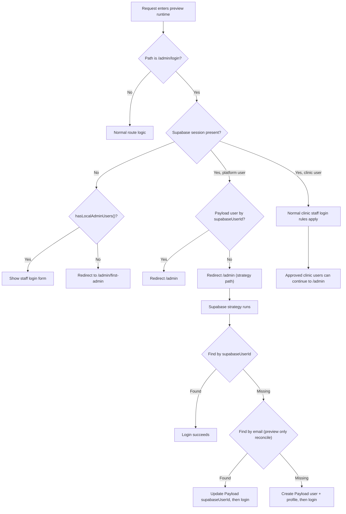
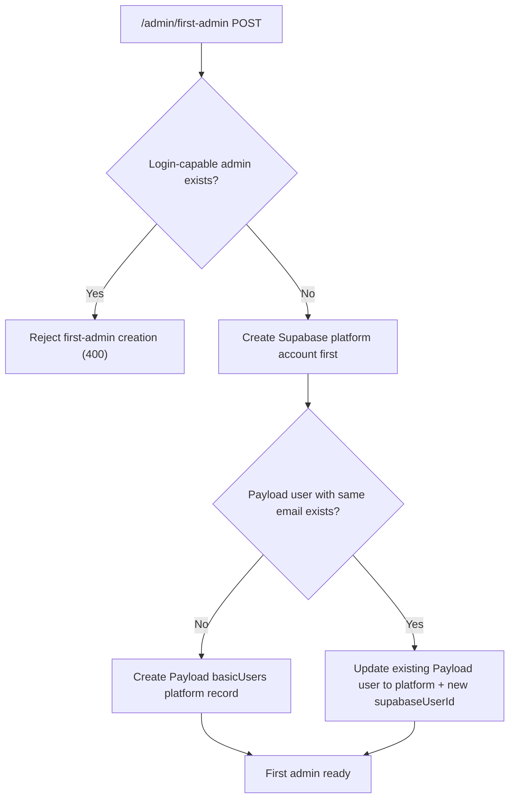

# Authentication System

A modular authentication system integrating Supabase Auth with PayloadCMS, designed for multi-tenant healthcare platform management.

## 🏗️ Architecture Overview

The authentication system follows a **utility-based architecture** that separates concerns into focused, testable modules:

```
src/auth/
├── config/           # Configuration and constants
├── strategies/       # PayloadCMS authentication strategies
├── types/           # Shared TypeScript interfaces
└── utilities/       # Core authentication logic
    ├── jwtValidation    # Token & user validation
    ├── userLookup       # User search operations
    ├── userCreation     # User creation logic
    └── accessValidation # Permission checking
```

### **Key Design Principles**

1. **Single Responsibility**: Each utility handles one specific aspect of authentication
2. **Testability**: 100% unit test coverage with comprehensive mocking
3. **Type Safety**: Strong TypeScript interfaces prevent runtime errors
4. **Modularity**: Easy to extend, modify, or replace individual components
5. **Configuration-Driven**: Centralized config supports multiple user types

## 🚀 Authentication Concepts

### User Types & Access Patterns

The system supports three user types with different access patterns:

| User Type          | Collection   | Profile Collection | Admin Access     | API Access    | Approval Required |
| ------------------ | ------------ | ------------------ | ---------------- | ------------- | ----------------- |
| **Clinic Staff**   | `basicUsers` | `clinicStaff`      | ✅ (if approved) | ✅            | Yes               |
| **Platform Staff** | `basicUsers` | `platformStaff`    | ✅               | ✅            | No                |
| **Patients**       | `patients`   | None               | ❌               | ✅ (own data) | No                |

### Authentication Flow Stages

1. **Token Validation**: Extract and verify JWT from authorization headers
2. **User Data Extraction**: Parse user metadata from Supabase session
3. **User Resolution**: Find existing user or create new user with profile
4. **Access Authorization**: Validate permissions based on user type and approval status
5. **Session Establishment**: Return authenticated user for PayloadCMS

## Preview Runtime Admin Recovery Flow

This flow is active when runtime resolves to `preview` (`VERCEL_ENV` -> `DEPLOYMENT_ENV` fallback).
`NODE_ENV` is not used as a preview or production deployment signal.

### Key Rules

- Supabase is the source of truth for login-capable admin users.
- Platform user reconcile by email (`allowEmailReconcile=true`) is enabled only in preview runtime.
- If a platform Supabase session exists but no Payload user exists yet, `/admin/login` redirects to `/admin` to trigger strategy provisioning.
- In preview runtime, first-admin unlock checks require a local Payload platform user that is also valid in Supabase.
- In preview runtime, first-admin registration can recover an existing local user by email and convert/update it to a platform user with a fresh `supabaseUserId`.

### Step-by-Step Branch Map (Works vs Blocked)

1. Enter `/admin/login` in preview runtime.
2. Branch: Supabase session exists?
3. If no session:
4. Branch: `hasLocalAdminUsers()` is true?
5. If yes, staff login form is shown (login can proceed with valid credentials).
6. If no, redirect to `/admin/first-admin` (login blocked until first admin is provisioned).
7. If session exists:
8. Branch: session `user_type` is `platform`?
9. If no (`clinic`/other), normal staff login rules apply unless the request is locked by the PostHog-controlled preview guard.
10. If yes, redirect to `/admin` to run strategy-based provisioning.
11. In strategy: find Payload user by `supabaseUserId`.
12. If found, login succeeds.
13. If missing, preview-only reconcile by email runs.
14. If email match is found, `supabaseUserId` is updated and login succeeds.
15. If email match is missing, Payload platform user + profile is created and login succeeds.
16. If strategy fails (Supabase/Payload error), login is blocked with an auth error state.

First-admin branch (preview):

1. POST `/admin/first-admin`.
2. Branch: login-capable admin already exists?
3. If yes, request is rejected (`400`), no second first-admin provisioning.
4. If no, create Supabase platform account first.
5. Branch: Payload user with same email exists?
6. If no, create new Payload platform admin record.
7. If yes, recover existing record by updating it to platform + new `supabaseUserId`.
8. Result: first admin is provisioned and can authenticate via Supabase.

### Decision Flow (Preview)



### First Admin Recovery Decision (Preview)



### Profile Management Strategy

- **Staff Users**: Automatically create both user record and corresponding profile
- **Atomic Operations**: User + profile creation happens in single transaction
- **Profile Recovery**: Missing profiles are automatically created during login
- **Approval Workflow**: Clinic staff require explicit approval for admin access

## 🔧 Configuration Concepts

### Environment Requirements

The system requires three Supabase environment variables for JWT validation and API communication.

### User Type Configuration

Each user type has specific configuration defining:

- Target collection for user records
- Profile collection (if applicable)
- Whether profile creation is required
- Whether approval is needed for access

### Access Control Strategy

- **Collection-Level**: Broad access defined in PayloadCMS collection configurations
- **Field-Level**: Granular field access based on user roles
- **Admin Interface**: Restricted to approved staff users only
- **API Access**: All authenticated users can access APIs with appropriate scope

## 📊 Business Logic

### User Creation Workflow

**New Staff Users**:

1. Create user record in `basicUsers` collection
2. Simultaneously create profile in appropriate staff collection
3. Both operations succeed together or fail together (atomic)

**New Patients**:

1. Create user record directly in `patients` collection
2. No additional profile creation needed

### Approval Process

**Clinic Staff Approval**:

- New clinic users created but marked as unapproved
- Platform administrators manually approve clinic staff
- Unapproved users cannot access admin interface
- API access remains available regardless of approval status

**Platform Staff**:

- Automatically approved upon creation
- Immediate access to all platform features

### Session Management

- **Token Lifecycle**: JWT tokens validated on each request
- **User Resolution**: Supabase ID used as permanent user identifier
- **Profile Consistency**: Missing profiles automatically restored
- **Access Validation**: Real-time permission checking

## 🧪 Testing Strategy

### Test Coverage Philosophy

- **Unit Testing**: Each utility module independently tested
- **Mock Strategy**: External dependencies (Supabase, PayloadCMS) fully mocked
- **Error Scenarios**: All failure modes and edge cases covered
- **Type Validation**: Interface contracts verified through tests

### Test Organization

The test suite covers four main areas:

- **JWT Processing**: Token extraction and validation logic
- **User Operations**: Lookup, creation, and profile management
- **Access Control**: Permission validation and approval workflows
- **Configuration**: User type mapping and environment validation

## 🛠️ Development Workflow

### Adding New User Types

1. **Update Configuration**: Define collection mappings and requirements
2. **Update Type Definitions**: Extend interfaces to include new user type
3. **Create Tests**: Verify new user type behavior
4. **Update Documentation**: Reflect new user type in business logic

### Debugging Strategy

- **VS Code launch configs**: Use the repository launch configurations in `.vscode/launch.json`.
  - `Next.js: debug server-side` starts `pnpm dev:debug`.
  - `Next.js: debug full stack` starts `pnpm dev:debug` and attaches Chrome when Next prints the local URL.
  - `Payload: attach to running server` attaches to an already-running inspector on `127.0.0.1:9229`.
  - `Payload: attach to Docker server` attaches to the `payload-debug` service with `/home/node/app` as the remote root.
- **Local debug command**: `pnpm dev:debug` starts Next with `--inspect --webpack` and sets `SERVER_LOG_LEVEL=debug`.
- **Docker fallback**: `docker compose --profile debug up payload-debug postgres` runs Node `24.14.0` and exposes the inspector on `9229`; use `Payload: attach to Docker server` after the service is ready.
- **Log level override**: `SERVER_LOG_LEVEL` accepts `trace`, `debug`, `info`, `warn`, `error`, or `fatal`; invalid values fall back to runtime policy defaults.
- **Error Classification**: Structured error handling with appropriate log levels.
- **Performance Tracking**: Authentication timing and success metrics.
- **Security Monitoring**: Failed authentication attempts and suspicious activity.

### Debugging Supabase and Payload Custom Auth

Payload custom authentication strategies run when Payload evaluates a request through its auth pipeline. The custom strategy is not the same request as the frontend login API.

Use these breakpoint targets:

- `src/app/api/auth/login/route.ts`: Supabase password sign-in and session cookie creation for `POST /api/auth/login`.
- `src/auth/strategies/supabaseStrategy.ts`: Payload custom auth strategy execution for Payload/Admin/API requests.
- `src/auth/utilities/jwtValidation.ts`: Supabase bearer-token and cookie-session extraction.

Use these trigger paths:

- `POST /api/auth/login` triggers only the login route and Supabase sign-in.
- `/admin`, `/api/basicUsers/me`, and `/api/patients/me` trigger Payload request authentication and can hit `supabaseStrategy`.
- Requests with `Authorization: Bearer <token>` exercise the header-token branch; browser Admin requests usually exercise the Supabase cookie-session branch.

Payload notes that changes to custom auth strategies require a full server restart; they are not hot-reloaded during development. This matters when moving breakpoints or editing `supabaseStrategy`.

Community guidance for external auth integrations is consistent with this setup: `disableLocalStrategy` plus a custom strategy can accept external access tokens or cookies, but Payload Admin and collection routes still need the strategy to return a persisted Payload user document with the correct `collection`.

References:

- [Next.js Debugging](https://nextjs.org/docs/app/guides/debugging)
- [Payload Custom Strategies](https://payloadcms.com/docs/authentication/custom-strategies)
- [Payload community discussion on Supabase Auth](https://payloadcms.com/community-help/discord/payload-w-supabase-auth)

## 🔐 Security Principles

### Token Security

- **JWT Verification**: All tokens validated against Supabase secret
- **Expiration Handling**: Expired tokens automatically rejected
- **Header Validation**: Secure Bearer token format required

### Access Boundaries

- **Principle of Least Privilege**: Users receive minimum necessary access
- **Role Separation**: Clear boundaries between clinic, platform, and patient access
- **Approval Gates**: Additional authorization layer for sensitive roles

### Error Handling Philosophy

- **Graceful Degradation**: Authentication failures result in access denial, not system errors
- **Information Hiding**: Error messages reveal minimal information to unauthorized users
- **Audit Trail**: All authentication events logged for security monitoring

## 📈 Operational Considerations

### Monitoring Metrics

- Authentication success and failure rates by user type
- User creation patterns and approval workflow efficiency
- System performance during authentication operations
- Error frequency and categorization

### Scalability Design

- **Stateless Authentication**: No server-side session storage required
- **Database Efficiency**: Optimized queries for user lookup operations
- **Caching Strategy**: Configuration and user data caching opportunities
- **Load Distribution**: Authentication workload distributed across utilities

## 🔄 Migration Considerations

### Architecture Evolution

The current modular design replaces a previous monolithic approach, providing:

- **Maintainability**: Easier to modify individual authentication aspects
- **Testability**: Comprehensive testing of isolated components
- **Extensibility**: Simple addition of new user types and workflows
- **Reliability**: Reduced complexity and improved error handling

### Integration Points

- **PayloadCMS Integration**: Seamless integration with collection access controls
- **Supabase Integration**: Leverages Supabase Auth without vendor lock-in
- **Frontend Compatibility**: Works with any client capable of JWT authentication
- **API Consistency**: Uniform authentication across all API endpoints

---

_This authentication system provides enterprise-grade security and reliability for the findmydoc healthcare platform, focusing on maintainable business logic rather than implementation details._
