# Supabase Authentication Flow

This diagram shows how users authenticate and get their accounts set up in the system.

```mermaid
sequenceDiagram
    participant User as 👤 User
    participant Frontend as 🌐 Next.js Frontend
    participant Supabase as 🔐 Supabase Auth
    participant Strategy as 🎯 Auth Strategy
    participant PayloadDB as 🗄️ PayloadCMS DB

    Note over User, PayloadDB: User Login Process
    
    User->>Frontend: 1. Enters email/password
    Frontend->>Supabase: 2. Sign in with credentials
    
    alt Login Success
        Supabase-->>Frontend: 3. Returns JWT token + user data
        Frontend->>Strategy: 4. Calls authenticate()
        
        Note over Strategy: Extract & Validate User Data
        Strategy->>Supabase: 5. Get user session & decode JWT
        Supabase-->>Strategy: 6. User metadata (email, user_type, names)
        
        Note over Strategy: Determine User Type & Collection
        Strategy->>Strategy: 7. Check user_type (clinic/platform/patient)
        Strategy->>Strategy: 8. Map to collection (basicUsers/patients)
        
        Note over Strategy, PayloadDB: Find or Create User
        Strategy->>PayloadDB: 9. Search for existing user by supabaseUserId
        
        alt User Exists
            PayloadDB-->>Strategy: 10a. Return existing user
            
            Note over Strategy, PayloadDB: Check Profile Exists (for staff)
            alt Staff User (clinic/platform)
                Strategy->>PayloadDB: 11a. Check for profile (clinicStaff/platformStaff)
                
                alt Profile Missing
                    PayloadDB-->>Strategy: 12a. No profile found
                    Strategy->>PayloadDB: 13a. Create missing profile
                    PayloadDB-->>Strategy: 14a. Profile created
                    Note right of Strategy: Ensures existing users<br/>get their profiles
                else Profile Exists
                    PayloadDB-->>Strategy: 12b. Profile found
                end
            end
            
        else User Doesn't Exist
            Note over Strategy, PayloadDB: Atomic Creation (Transaction)
            Strategy->>PayloadDB: 10b. Begin transaction
            Strategy->>PayloadDB: 11b. Create user record
            PayloadDB-->>Strategy: 12b. User created (ID: X)
            
            alt Staff User Needs Profile
                Strategy->>PayloadDB: 13b. Create profile record
                PayloadDB-->>Strategy: 14b. Profile created
            end
            
            Strategy->>PayloadDB: 15b. Commit transaction
            PayloadDB-->>Strategy: 16b. Both records saved
            Note right of Strategy: Atomic: Either both<br/>created or neither
        end
        
        Note over Strategy: Additional Checks for Clinic Users
        alt Clinic User
            Strategy->>PayloadDB: 17. Check if clinic staff is approved
            PayloadDB-->>Strategy: 18. Return approval status
            
            alt Not Approved
                Strategy-->>Frontend: 19a. Deny access (null user)
            else Approved
                Strategy-->>Frontend: 19b. Allow access
            end
        else Platform/Patient User
            Strategy-->>Frontend: 19c. Allow access
        end
        
        Frontend-->>User: 20. Redirect to dashboard/admin
        
    else Login Failed
        Supabase-->>Frontend: 3b. Authentication error
        Frontend-->>User: 4b. Show error message
    end

    Note over User, PayloadDB: Key Features
    Note right of Strategy: ✅ Atomic transactions<br/>✅ Missing profile detection<br/>✅ Detailed error logging<br/>✅ User type validation
```

## Key Concepts

### User Types & Collections
- **Platform Staff** → `basicUsers` collection + `platformStaff` profile
- **Clinic Staff** → `basicUsers` collection + `clinicStaff` profile  
- **Patients** → `patients` collection (no separate profile)

### Atomic Operations
When creating new staff users, both the user record and profile are created in a single database transaction. If either fails, both are rolled back.

### Profile Recovery
If an existing user is missing their profile (e.g., due to previous errors), the system automatically creates it during login.
